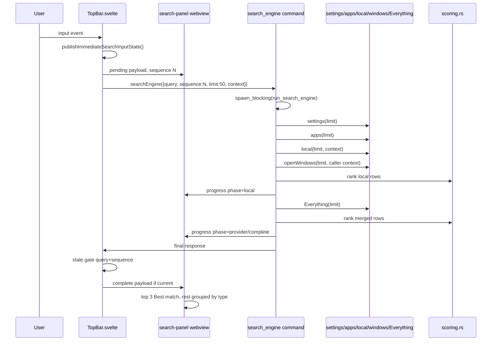

# JasonShell Search Functionality Investigation

Accessed/validated: 2026-08-19. Scope: research/documentation only.

## 1. Executive summary

### Primary root causes

| Priority | Finding | Classification | Evidence |
|---|---|---|---|
| P0 | Useful short-prefix matches are blocked or weakened before ranking. Settings provider rejects any query token shorter than 2 chars, so `w`, `control p` with `p`, and similar prefixes produce no settings rows before canonical ranking can help. | FACT | `src-tauri/src/search/providers/settings.rs:289-296` |
| P0 | Every input event starts immediate backend search without debounce/coalescing/cancellation. Stale gates prevent old responses from applying, but old Rust work still runs. | FACT | `src/components/TopBar.svelte:1540-1552`, `:1570-1574`, `src-tauri/src/search/mod.rs:32-44` |
| P0 | Canonical rank overwrites provider scores, discarding provider-specific priority/source/run-count work. This can erase app source priority and Everything run-count/app-like boosts. | FACT | `src-tauri/src/search/scoring.rs:48-56`, provider scores in `apps.rs`, `settings.rs`, `everything.rs` |
| P1 | Providers run sequentially: settings -> apps -> local -> open windows -> Everything. `spawn_blocking` protects async command thread, but not total work or stale work. | FACT | `src-tauri/src/search/mod.rs:56-136` |
| P1 | Everything overfetch is partially ineffective: request asks for `limit + 25`, but raw rows are mapped then `.take(limit)` before canonical rerank. | FACT | `src-tauri/src/search/providers/everything.rs:97-105`, `:328-332` |
| P1 | UI display reorders canonical rank after top 3 by grouping remaining rows by type. Good match at rank 4 can move below another group. | FACT | `src/features/search/searchUxState.ts:141-194` |
| P1 | Search panel has conflicting accessibility focus model: input lacks combobox attrs; listbox and options are all tabbable. | FACT | `src/components/SearchPanelSurface.svelte:437-555` |
| P1 | Broad PC coverage depends heavily on Everything. If Everything DLL/process/service unavailable, production no longer has Windows Search fallback. | FACT | `src-tauri/src/search/mod.rs:146-152`, `src-tauri/src/main.rs:159`, `src-tauri/src/search_sources.rs:95` legacy only |

### P0/P1 priorities

P0:

1. Fix short-prefix behavior for settings/apps/files without adding heavyweight providers.
2. Add frontend coalescing/debounce or latest-only backend queue with cancellation-aware stale work accounting.
3. Preserve provider signal in canonical rank instead of fully overwriting scores.

P1:

1. Make Everything overfetch feed canonical rerank.
2. Avoid rank-destroying display regroup after top 3 or make grouping opt-in/secondary.
3. Add accessible combobox/listbox pattern.
4. Add high-value low-risk PC coverage: saved Quick Commands definitions, pinned Stack Browser/workspace/recent folders, richer JasonShell settings/commands, recent docs.

## 2. Scope, methodology, evidence limits

### Scope

Audit covered current JasonShell production search path:

- TopBar query initiation and response gating.
- Rust `search_engine` command/coordinator.
- Current providers: settings, apps, local folders/one command, caller open windows, Everything.
- Canonical matcher/scorer/deduper.
- Search panel rendering/display transformations and fallback polling.
- Focused source-contract tests.
- Missing PC coverage and roadmap.

### Methodology

- Static source read with exact line refs.
- Focused tests:
  - `node --test --test-name-pattern=search tests/*.test.mjs`
  - `cargo test --manifest-path src-tauri/Cargo.toml search::`
- Existing performance-contract source review.
- External official docs bibliography listed in section 14.

### Evidence limits

- FACT: Static source/tests prove contracts and code paths, not user-perceived latency.
- FACT: No successful live UI dogfood in this investigation. Do not infer actual interactive p50/p95.
- FACT: `wmux` extracted package dogfood previously failed because packaged app resources were missing `app-update.yml`; not successful search UX evidence.
- FACT: Performance fixture budgets are contracts, not measurements. No measured search latency is claimed here.
- FACT: Focused Node search tests passed locally: 169 pass, 0 fail.
- FACT: Latest focused Rust `search::` rerun passed locally: 77 pass, 0 fail, 436 filtered. An earlier run reported one app-cache-state failure; latest evidence did not reproduce it.
- FACT: Full `npm run test` had known unrelated source-shape failures in dirty concurrent work per supplied context; not rerun/enumerated here.
- FACT: Source refs were validated against current dirty worktree, not clean `HEAD`. Existing unrelated dirty files were preserved and not modified by this investigation.

## 3. Architecture/data flow sequence



Key facts:

- TopBar request limit is hard-coded to 50 (`src/components/TopBar.svelte:1403-1410`).
- Open-window context maps only `id`, `title`, `appName`, `iconDataUrl`; no executable path is sent from TopBar (`src/components/TopBar.svelte:1410-1417`).
- Rust clamps request limit to 1..50 (`src-tauri/src/search/mod.rs:50-52`).
- Rust emits local progress before Everything and complete after final rank (`src-tauri/src/search/mod.rs:88-167`).

## 4. Matching/ranking exact math and result display transformations

### Matcher tiers

FACT (`src-tauri/src/search/matcher.rs:27-37`):

| Tier | Score |
|---|---:|
| exact | 2000 |
| prefix | 1650 |
| acronym | 1500 |
| token-prefix | 1200 |
| subsequence | 920 |
| edit distance | 760 |

FACT: Normalization trims, lowercases, replaces `_ - . / \ :` with spaces, splits whitespace, rejoins with single spaces (`matcher.rs:58-66`).

FACT: Subsequence requires query length >= 3; edit distance supports distance 1, and distance 2 only for query length >= 7 (`matcher.rs`, tests and implementation around matching helpers).

### Canonical visible ranking

FACT (`src-tauri/src/search/scoring.rs:35-86`):

1. Normalize query and tokens.
2. Classify intent.
3. For each provider row, compute fresh score from title/subtitle/hidden fields.
4. Overwrite `row.score` with canonical score.
5. Set highlight data from canonical match.
6. Dedup by `kind + normalized path` when path exists, otherwise action-specific key.
7. Sort and truncate.

Canonical formula:

```text
score = match_quality_score
      + kind_base
      + provider_base
      + intent_boost
      + open_window_match_boost
      + important_folder_boost
```

FACT bases (`src-tauri/src/search/scoring.rs:250-273`):

| Kind | Base |
|---|---:|
| setting | 700 |
| app | 650 |
| command | 550 |
| folder | 500 |
| window | 450 |
| file | 200 |
| calculator | 180 |
| web/bookmark | 120 |

| Provider | Base |
|---|---:|
| settings | 200 |
| apps | 180 |
| commands | 150 |
| local folders | 140 |
| open windows | 120 |
| Everything | 80 |
| calculator | 40 |
| web/bookmarks/diagnostics | 0 |

FACT intent boosts (`src-tauri/src/search/scoring.rs:196-208`, `:276-311`):

| Condition | Boost |
|---|---:|
| setting kind + setting intent | 2200 |
| app kind + app intent | 2000 |
| folder kind + folder intent | 1900 |
| command kind + setting intent | 1100 |
| folder default | 300 |
| app default | 450 |
| setting default | 500 |
| command default | 350 |

FACT open-window exact/prefix/acronym/token boosts add 900/650/500/300 (`scoring.rs:211-222`).

FACT important-folder boosts add +1000 for `C:\dev`/`dev`, plus +1200 if local provider; +900 for JasonShell/repo paths (`scoring.rs:224-248`).

FACT tie-break: score descending, provider order, title, record key (`scoring.rs:314-335`).

### Display transformations

FACT: Backend returns canonical rank, but `buildVisibleSearchRows` renders top 3 as `Best match`, then renders remaining rows by visible group order `apps`, `folders`, `files`, `settings`, `windows`, `commands`, 7 per group by default (`src/features/search/searchUxState.ts:111-120`, `:141-194`).

INFERENCE/HYPOTHESIS: This improves scannability but can hide a rank-4 setting below many app/folder/file rows if it falls outside Best match. It can make ranking feel inconsistent for users expecting strict relevance order.

FACT: Existing Node test text says “flat visibleRows”; source means flat render model after grouping, not no grouping (`searchUxState.ts:141-194`).

## 5. Short-query symptom root-cause analysis

User symptom: useful matches require too many chars.

### Settings

FACT: Settings provider has 16 static rows (`src-tauri/src/search/providers/settings.rs:27-266`).

FACT: `search_settings_for_build` returns no results if any normalized token length is < 2 (`settings.rs:289-296`). Effects:

| Query | Expected user intent | Settings provider behavior |
|---|---|---|
| `w` | Windows Settings/Windows Update/Windows Security | no settings rows |
| `wi` | likely Windows rows | can match |
| `windows s` | Windows Settings/Security | no rows because `s` len 1 |
| `control p` | Control Panel | no rows because `p` len 1 |
| `display s` | Display Settings | no rows because `s` len 1 |

FACT: Matcher supports acronym and token-prefix scoring, but settings provider prefilter prevents those cases from reaching matcher when any token is one char.

RECOMMENDATION P0: Remove blanket any-token `<2` rejection. Replace with provider-local guard that permits known safe prefix/acronym intent patterns (`w`, `wi`, `windows s`, `control p`, `display s`) while still avoiding noisy single-letter full catalog floods.

### Apps

FACT: Apps provider searches only cached app index; cold empty cache returns no app results and warms asynchronously (`src-tauri/src/search/providers/apps.rs:120-128`, `:240-289`).

FACT: App index TTL is 60 seconds and persisted at `search-app-index-v1.json` (`apps.rs:20-22`).

FACT: Roots cover current-user Start Menu, pinned taskbar, all-users Start Menu, WindowsApps, and `Programs` under LOCALAPPDATA/ProgramFiles/ProgramFiles(x86) (`apps.rs:292-344`).

FACT: Source priorities/source ranks exist while indexing (`apps.rs:300-339`, `:513-520`), but canonical scoring overwrites provider row scores later (`scoring.rs:48-56`).

INFERENCE/HYPOTHESIS: Prefixes `b`, `br`, `bra`, `f`, `fi`, `sp`, `spo` can fail or rank poorly when app cache is cold/stale, when target app lacks indexed shortcut/exe, or when canonical rank discards pinned/source priority. Exact behavior depends on local cache and installed apps; no live measurement here.

RECOMMENDATION P0: Keep app cache warm on startup and include cache state in visible diagnostic affordance when empty/indexing.

RECOMMENDATION P0: Carry provider priority/source into canonical score as bounded additive signal.

### Files/folders

FACT: Local provider covers fixed important folders plus one command only; it does not crawl user files (`src-tauri/src/search/providers/local.rs:64-158`).

FACT: Everything provider is broad file/folder/app source when SDK/process/service available (`src-tauri/src/search/providers/everything.rs:160-207`).

FACT: Everything content search is disabled for realtime search (`everything.rs:219-223`, `:251-257`).

INFERENCE/HYPOTHESIS: Path-like queries can feel like they need more chars when Everything is unavailable/degraded or when initial Everything raw order excludes useful rows before canonical rerank due `.take(limit)`.

RECOMMENDATION P1: Fix Everything overfetch consumption before broadening file providers.

## 6. Performance analysis

No measured latency claimed.

| Issue | Evidence class | Source | Perf implication |
|---|---|---|---|
| Every-keystroke immediate execution | FACT | `TopBar.svelte:1570-1574`, `:1540-1552` | More backend work for rapid typing; stale responses ignored but work continues. |
| No query debounce/coalescing | FACT | No delay between input and `void loadSearchEngineResults(request)` in `TopBar.svelte:1540-1552` | Prefix storm for `f` -> `fi` -> `firefox`. |
| Stale gates without cancellation | FACT | `invalidateSearchEngineResponses()` in `TopBar.svelte:1497-1505`; Rust command has no cancellation token (`search/mod.rs:32-44`) | Old work can occupy blocking pool/provider locks. |
| `spawn_blocking` boundary | FACT | `search/mod.rs:32-44` | Protects async runtime responsiveness; not total CPU/I/O load. |
| Sequential providers | FACT | `search/mod.rs:56-136` | Slow provider delays final response; local progress mitigates only first payload. |
| Everything query lock | FACT | `everything.rs:209-227` | Serializes Everything queries; stale query can block latest Everything query. |
| Synchronous icon extraction in result mapping | FACT with caveat | `icons.rs:3-13`, `:29-49`, `local.rs:216-249`, `everything.rs:338-397`, `apps.rs:547-570`; `open_windows.rs:80-124` only falls back to shell icon extraction when caller supplies `executablePath` and no `iconDataUrl` | Apps/local/Everything can add cached sync shell icon work per mapped result; open-window production path normally uses caller icon because TopBar omits `executablePath`. Exact cost unmeasured. |
| App cache state | FACT | `apps.rs:120-128`, `:240-289` | Cold cache returns empty + async warm; stale cache returns existing rows + refresh. |
| Effective overfetch request | FACT | `everything.rs:328-332` | SDK can fetch limit+25 bounded to 200. |
| Ineffective overfetch before canonical rank | FACT | `everything.rs:101-105` | Only first `limit` raw rows are mapped/ranked; overfetched rows discarded before canonical rerank. |
| Search-panel fallback polling contract | STATIC RISK / FACT contract | `searchUxState.ts:363-374` | Delay sequence is 120, 240, 500, 1000, 2000 ms, then 2000 ms while no event payload has arrived or while a visible payload remains. Source contract alone does not prove actual idle runtime polling cost; lifecycle trace needed. |
| Performance budgets 50ms first payload/8ms renderer | FACT as contract only | Performance fixture/contracts | Not live measurements. |

RECOMMENDATION P0: Add latest-only coalescing for backend execution. Maintain immediate input/pending UI, but only run final stable query after short delay or abort stale work at provider boundary.

RECOMMENDATION P1: Move icon hydration out of search result production for broad providers or cap sync icon work for first payload.

## 7. UI/UX + accessibility audit

### UX facts

- FACT: Centered panel input placeholder/label is “Search Everything” (`SearchPanelSurface.svelte:444-450`), but production searches settings/apps/local/windows/Everything. Label undersells coverage and can mislead when Everything is degraded.
- FACT: Header says `Enter opens` (`SearchPanelSurface.svelte:468`).
- FACT: Click selects; double-click activates (`SearchPanelSurface.svelte:488-489`).
- FACT: Result primary action text is based on kind: Launch/Focus/Open/Run/etc (`searchUxState.ts:316-339`).
- FACT: Dense fallback icon uses first letter of kind when no icon data URL (`SearchPanelSurface.svelte:493-498`).
- FACT: Status message is visible only when there are zero results (`SearchPanelSurface.svelte:541-543`). Progress/errors are less visible when stale/partial rows remain.

### Accessibility facts

- FACT: Plain input lacks `role="combobox"`, `aria-expanded`, `aria-controls`, and `aria-activedescendant` (`SearchPanelSurface.svelte:444-453`).
- FACT: Result list has `role="listbox"`, `tabindex="0"`, and `aria-activedescendant` (`SearchPanelSurface.svelte:471-472`).
- FACT: Every option also has `tabindex="0"` (`SearchPanelSurface.svelte:479-486`).
- INFERENCE/HYPOTHESIS: This mixes two focus models: composite listbox focus and roving focus on each option. WAI-ARIA combobox APG expects DOM focus to remain on input while active option is exposed through `aria-activedescendant` when popup is listbox.

RECOMMENDATION P1:

1. Convert centered search to combobox pattern: input owns popup with `role="combobox"`, `aria-expanded`, `aria-controls`, `aria-activedescendant`.
2. Keep DOM focus on input for arrow navigation; remove option tab stops or implement true roving tabindex, not both.
3. Add polite status live region for provider state even when results exist.
4. Rename label to “Search apps, settings, files” or expose provider health text.

## 8. Current provider/coverage matrix

| Provider | Source | Cache/freshness | Kinds | Limits | Degradation |
|---|---|---|---|---|---|
| Settings | 16 static Rust rows | Always hit if rows exist | setting | request limit 1..50; rejects any token <2 | Missing many Windows/PC settings; short-token suppression. |
| Apps | Start Menu, pinned taskbar, WindowsApps, Programs dirs | Runtime + persisted `search-app-index-v1.json`, TTL 60s | app | 4000 apps, 8000 dirs | Cold empty returns no apps + async warm; stale returns old rows + refresh. |
| Local | Existing `C:\dev`, cwd, profile Desktop/Downloads/Documents, workspace roots from context, Control Plane command | Per-call bounded rows | folder, command | small fixed set | No general file crawl; missing many user locations. |
| Open windows | Caller-supplied context from TopBar openWindows | Current frontend snapshot | window | request limit | Uses caller context, not OS enumeration. TopBar omits executablePath. |
| Everything | Everything SDK via detected DLL + running process/service | Health TTL 30s | file, folder, app candidates | request limit+25 to max 200, then current `.take(limit)` | Degraded/unavailable if SDK/process/service missing; content disabled. |
| Legacy Windows Search | `search_sources` legacy module | Not production hot path | file/folder/app legacy | legacy only | Production removed fallback. |
| TS calculator/web/bookmarks | Type contracts/helpers | Not emitted by Rust search_engine | calculator/web/bookmark contract kinds | none current | Kinds are contracts only, not current providers. |

FACT: Production command registration includes `search::search_engine` (`src-tauri/src/main.rs:159`). Legacy `search_system` exists in `src-tauri/src/search_sources.rs:95` but is not registered in production command maps per tests and source comments.

## 9. Missing PC search coverage matrix

| Candidate coverage | User value | Cost | Privacy | Perf risk | Recommendation |
|---|---:|---:|---:|---:|---|
| Saved Quick Commands definitions | High | Low | Low | Low | P1 default. Search names/descriptions only. Avoid transcripts/history by default. |
| Pinned Stack Browser folders | High | Low | Low | Low | P1 default. Already user-curated. |
| Workspace/recent folders | High | Low-Med | Low-Med | Low | P1 default with bounded MRU and clear labels. |
| Richer JasonShell commands/settings | High | Low | Low | Low | P1 default. Add terminal, quick launch, process manager, audio, calendar, taskbar actions. |
| Recent docs | Med-High | Med | Med | Med | P2 opt-in or bounded default from known user docs dirs. |
| Calculator | Med | Low | Low | Low | P2; pure local provider. |
| System actions (shutdown/restart/lock, network, display) | Med | Med | Med | Low | P2 with guard/destructive confirmation. |
| Processes/services | Med | Med | Med | Med | P2/P3, likely opt-in; useful for “kill/focus service” workflows. |
| Browser bookmarks/history | High for some | Med | High | Med | P3 opt-in only. Bookmarks safer than history. |
| Terminal command history | Med | Med | High | Low-Med | P3 opt-in only; never default. Current terminal recent commands are in-memory only. |
| File content search | High but narrow | High | High | High | P3 opt-in/deferred. Everything docs warn content is slow because not indexed. |
| Full Windows Search fallback | High when Everything missing | High | Med | Med-High | P2 after P0/P1. Existing legacy code exists, but production removed it; reintroduce carefully with stale/cancel limits. |

## 10. Prioritized roadmap

### P0 minimal

1. Prefix corpus tests first for `w`, `wi`, `windows s`, `control p`, `display s`, `b/br/bra/brave`, `f/fi/firefox`, `sp/spo`, and path-like queries.
2. Relax settings short-token suppression with explicit short-prefix handling.
3. Add latest-only query execution: immediate UI state stays, backend work coalesced/cancellable.
4. Preserve bounded provider score signal in canonical rank. Start with additive `provider_signal = clamp(row.score-derived-signal, 0..300)` or explicit fields; avoid unbounded legacy score domination.

### P1

1. Fix Everything overfetch: map all overfetched rows, canonical-rank merged rows, then truncate.
2. Review display grouping: keep strict rank for top N more than 3, or group only after visible separator that does not reorder top page.
3. Accessibility combobox/listbox refactor.
4. Add default low-risk coverage: Quick Command definitions, pinned/workspace/recent folders, richer JasonShell commands/settings.
5. Add provider health/status row visible during partial results.

### P2

1. Recent docs bounded provider.
2. Calculator provider.
3. System actions with safeguards.
4. Optional Windows Search fallback when Everything degraded, with cancellation/timeout.

### P3

1. Browser bookmarks/history opt-in.
2. Terminal history opt-in.
3. Content search opt-in/deferred/non-realtime.

Avoid overdesign:

- Do not build a full plugin platform before fixing short prefixes and stale work.
- Do not default-enable high-privacy sources.
- Do not claim performance wins without live p50/p95.

## 11. Concrete benchmark/test plan

### Corpus

Use deterministic fixture plus live-machine marked optional.

Required prefix corpus:

- Settings: `w`, `wi`, `windows s`, `control p`, `display s`
- Apps: `b`, `br`, `bra`, `brave`, `f`, `fi`, `firefox`, `sp`, `spo`
- Paths/files: `c`, `c:`, `c:\`, `c:\dev`, `dev`, `doc`, `downloads`, `~`, `.`, `src/`, `src\`

Fixture rows:

- Settings rows matching current static catalog.
- Apps: Brave, Firefox, Spotify, Visual Studio Code, Windows Terminal, PowerToys.
- Files/folders: C:\dev, C:\dev\jasonshell, Desktop, Downloads, Documents, a repo file, a recent document.
- Open windows: Brave window, Firefox window, terminal window, Settings window.
- Everything raw rows intentionally ordered poorly to test overfetch/rerank.

### Ranking quality metrics

| Metric | Definition |
|---|---|
| MRR@k | Reciprocal rank of first relevant row in top k. |
| Recall@k | Any expected relevant target appears in top k. |
| Top-1 stability | For monotonic prefix sequence, target does not bounce out once it reaches top 1 unless stronger exact match appears. |
| Prefix acquisition length | Minimum chars needed to place expected target top 3/top 1. |
| Grouping loss | Rank delta between backend canonical order and rendered visible order. |

### Latency/responsiveness metrics

No current measurements. Proposed metrics:

| Metric | Meaning |
|---|---|
| input-to-local p50/p95 | Input event to local progress payload displayed. |
| input-to-final p50/p95 | Input event to complete payload displayed. |
| stale work count/duration | Superseded backend requests that still run. |
| queue wait | Latest query wait behind Everything lock/stale providers. |
| icon extraction time | Time spent synchronously resolving icons per provider. |
| cold/warm apps | Empty/miss/indexing vs persisted/fresh cache result timing and quality. |
| cold/warm Everything | Health miss vs hit; process/service ready/degraded. |
| renderer update cost | Payload-to-visible rows time; compare grouped vs strict rank. |

### Test layers

1. Rust unit tests for matcher/scoring/provider fixtures.
2. Node source-contract tests for TopBar scheduling, panel ARIA, grouping behavior.
3. Integration harness with fake providers to deterministically simulate slow/stale Everything.
4. Live dogfood only after package resources fixed; report measured p50/p95 separately.

## 12. Risks/non-goals

Risks:

- Privacy leak if browser/terminal/history/content sources default on.
- Query storms can create stale work and worsen perceived lag if not coalesced.
- Provider score preservation can reintroduce provider-specific bias if unbounded.
- Accessibility refactor can break keyboard muscle memory if not source-tested.
- Windows Search fallback may add COM/OLE DB complexity and latency.

Non-goals:

- No product code changes in this investigation.
- No `master_spec.md` update because investigation did not change current product behavior or architecture.
- No invented latency numbers.
- No default content search.
- No full plugin architecture.

## 13. Validation evidence

Commands run:

```text
node --test --test-name-pattern=search tests/*.test.mjs
```

Result:

```text
tests 169
pass 169
fail 0
```

Command run:

```text
cargo test --manifest-path src-tauri/Cargo.toml search::
```

Result in latest rerun:

```text
running 77 tests
test result: ok. 77 passed; 0 failed; 0 ignored; 0 measured; 436 filtered out
```

Warnings were unrelated Rust warnings from other modules. Earlier run reported `search::providers::apps::tests::fresh_cache_reports_refresh_while_startup_warm_is_running` failing once; latest rerun passed it. Treat failure as non-reproduced, not disproven.

## 14. Repo source index and external bibliography

### Repo source index

| Area | Source refs |
|---|---|
| TopBar search request/context | `src/components/TopBar.svelte:1403-1418` |
| TopBar immediate input execution/stale gates | `src/components/TopBar.svelte:1493-1574` |
| Rust search command/coordinator | `src-tauri/src/search/mod.rs:32-167` |
| Matcher tiers/normalization | `src-tauri/src/search/matcher.rs:27-66` |
| Canonical ranking/dedup | `src-tauri/src/search/scoring.rs:35-86`, `:250-354` |
| Settings provider | `src-tauri/src/search/providers/settings.rs:27-395` |
| Apps provider | `src-tauri/src/search/providers/apps.rs:20-24`, `:120-128`, `:240-344`, `:353-520` |
| Everything provider | `src-tauri/src/search/providers/everything.rs:17-19`, `:72-132`, `:160-227`, `:246-332`, `:338-397` |
| Local provider | `src-tauri/src/search/providers/local.rs:31-158`, `:216-260` |
| Open windows provider | `src-tauri/src/search/providers/open_windows.rs:17-124` |
| Search panel markup | `src/components/SearchPanelSurface.svelte:437-555` |
| Search UX grouping/fallback polling | `src/features/search/searchUxState.ts:111-232`, `:363-374` |
| Legacy source presence | `src-tauri/src/search_sources.rs:95`, `src/lib/searchCatalog.ts:68`, `src/lib/searchRanking.ts:20` |
| Production command registration | `src-tauri/src/main.rs:159`, `src/ipc/commands.ts:19` |
| Performance contracts | `tests/performanceBaselineContract.test.mjs` |

### External official bibliography

Official docs, accessed 2026-08-19:

- PowerToys Run: <https://learn.microsoft.com/en-us/windows/powertoys/run> — input smoothing, immediate/background plugin waits, slower-plugin wait, result order tuning, selected-item weight, plugins including calculator/system/windows/services/settings/files.
- Everything HTTP: <https://www.voidtools.com/support/everything/http/> — offset/count/sorts/path/regex/case/wholeword/diacritics; security scope.
- Everything SDK: <https://www.voidtools.com/support/everything/sdk/> — SDK usage surface.
- Everything searching/content: <https://www.voidtools.com/support/everything/searching> — content search extremely slow because content is not indexed; apply last.
- Everything what’s new: <https://www.voidtools.com/support/everything/whats_new>
- WAI-ARIA combobox APG: <https://www.w3.org/WAI/ARIA/apg/patterns/combobox/> — combobox owns popup, DOM focus remains input, active option via `aria-activedescendant`, arrows/Enter/Escape behavior.
- Tauri calling Rust: <https://github.com/tauri-apps/tauri-docs/blob/v2/src/content/docs/develop/calling-rust.mdx> — async command guidance and heavy work considerations.

## Conclusion: why “many chars” happens

FACT: For settings, “many chars” is directly caused by provider prefilter: any token shorter than 2 chars returns no settings rows before matcher/ranker can help. That explains `w`, `windows s`, `control p`, and `display s` pain.

FACT: For apps/files, short prefixes depend on cache/provider availability and canonical rank. Apps can be empty while cold cache warms; Everything can be degraded/missing; provider priority/run-count signals are discarded by canonical ranking; display grouping can move useful rank-4+ rows lower.

RECOMMENDATION: Fix short-token matching, stale-work coalescing/cancellation, provider-signal preservation, and Everything overfetch before adding broad new sources. Then add low-risk PC coverage from existing JasonShell data.
