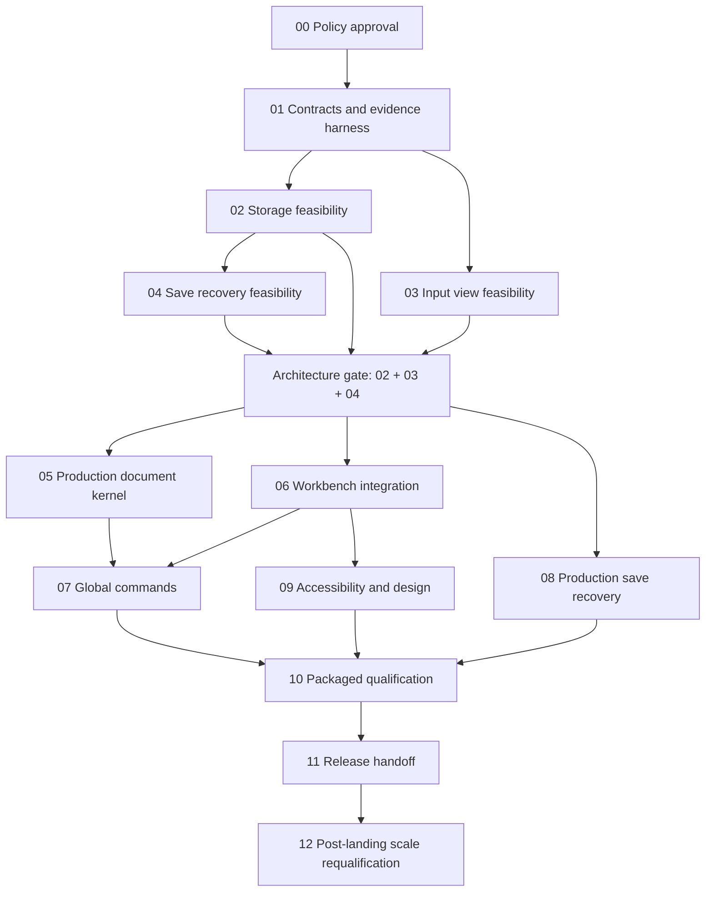

# Stack Browser Quick View / Quick Edit — Phased Implementation Plan

**Document ID:** STACK-TEXT-PLAN-2026-09-07  
**Date:** 2026-09-07  
**Status (updated 2026-09-16):** P00 policy and P01 v2 contract acceptance remain recorded; `stack-text-editor.v2` is canonical. P02 is **Accepted for canonical-v2 non-scale storage exit only** after technical review PASS, named independent storage/safety ACCEPT, named independent security/privacy ACCEPT, and coordinator ACCEPT against packet `P02/20260916-p02-rb02-nonscale-05`. This authorizes P04 entry only. P03 remains **Blocked**; P04 is eligible to start but has not passed; P05–P12 remain **Not started**. P04 owns recovery-root/saving/recovery-security proof. Populated scale remains post-landing P12 NFR-6 debt/risk. No scale result, huge-file readiness, recovery, product integration, or production success is claimed.
**Owner:** Repository owner / implementation lead.  
**Reviewers:** frontend, Rust/storage, Windows safety, QA/performance, and accessibility owners.  
**Basis:** [Technical research and design review](stack-browser-quick-view-editor-research.md), with its FR-1–FR-12, NFR-1–NFR-9, AC-1–AC-12, and EC-1–EC-24 identifiers preserved.  
**Current-behavior authority:** [`master_spec.md`](../master_spec.md). Proposed behavior here does not supersede current behavior until implemented and verified.

**Reading guide:** Start with [2026-09-15 Re-baseline](#2026-09-15-re-baseline), then [worker instructions](#how-workers-execute-this-plan), [shared contracts](#api-contracts), and the [dependency graph](#acceptance-criteria-and-dependency-graph). P00 policy approval is recorded; do not restart broad discovery. The critical remaining gates are [storage](#phase-02--stable-source-and-paged-storage-feasibility), [input/view](#phase-03--bounded-editor-view-feasibility), and [Windows save/recovery](#phase-04--windows-save-and-recovery-feasibility). Historical execution records retain their original revisions and results; they do not override the re-baseline.

## Context

Build an editor in the existing Stack Browser content slot that currently alternates between the file grid and Git. A user explicitly invokes **Quick Edit**, sees a bounded region promptly, and can edit that region while the rest of a huge file is still unread. File-sized reads, decoding, indexing, searching, history storage, and saving must not block the webview or shell.

The intended architecture is a **Rust-owned, disk-backed logical document with a bounded CodeMirror input/view projection**. CodeMirror is a candidate to prove, not an asynchronous full-file storage API. A complete resident editor model, fake placeholders for unloaded text, or a huge-file viewer that only becomes editable after full load is not an acceptable substitute.

This plan turns the research into worker-sized execution instructions. Read the research for rationale and primary-source evidence; use this document for sequence, ownership, deliverables, tests, and permission to advance. Plan confidence is sufficient for targeted feasibility work, not a promise that CodeMirror projection or universal Windows save exclusion will succeed. The research's approximately 75% architecture confidence remains unchanged until those experiments produce evidence.

**Enabled landing requires P00–P11 except only populated scale evidence reassigned to P12. Full core acceptance means P00–P12 pass.** P12 debt forbids huge-file-readiness, NFR-6-pass, or unqualified production-success claims. No other editing, safety, authorization, privacy, recovery, input, or accessibility requirement is deferred.

## 2026-09-15 Re-baseline

**Decision ID:** STACK-TEXT-RB-2026-09-15. **Owner:** Planning/documentation lead; Integrator/coordinator owns future gate decisions. **Disposition:** Current planning baseline recorded; verification subgates below remain open. This is not implementation authorization, fresh runtime validation, reviewer signoff, or phase promotion.

**User decision B — enabled landing with post-landing scale debt (2026-09-15):** User accepts shipping Quick Edit enabled before the multi-hour populated 1 MiB/100 MiB/1 GiB/multi-GiB/over-RAM runner completes. Only that scale campaign and NFR-6 acceptance/refutation move to P12. Canonical-v2 RB-02 compatibility/revalidation, fresh required non-scale P02 evidence, actual native authorization, independent storage/security/privacy review, coordinator disposition, P03 native IME/AT/giant-grapheme proof, P04 recovery-root proof, safe refusal, and all other gates remain pre-landing obligations. Landing must identify unresolved NFR-6 scale risk.

**Precedence and scope:** This record and the current phase-status table govern the next handoff. P00 policies, FR/NFR/AC/EC identifiers, phase test recipes, budgets, and the dependency graph remain binding. Dated P01 v1, P02, P03, and original planning records below are preserved as historical evidence, including failures and old approval labels. Their words “current”, “accepted”, “draft”, and “next” describe their own wave only. Do not rewrite their artifacts or infer current acceptance from historical PASS counts.

### RB-01 — Contract authority and evidence lineage

| Boundary | Evidence anchor | Current interpretation |
|---|---|---|
| Editor source baseline | Editor commit `e00ceee` (2026-09-09); later HEAD work concerns unrelated Git/Quick Commands/task-gallery changes | Later shell work does not implement or promote the editor. |
| Canonical future-facing contract | `src-tauri/src/stack_popup/text_document/protocol.rs:7`; `src/features/stack-browser/textEditorProtocol.ts:2`; [P01 v2 evidence, Scope and Contract](stack-text-editor-p01-v2-evidence.md) | `stack-text-editor.v2` governs future consumers. P01 v2 acceptance is recorded, not rerun here. |
| Isolated P02 lineage | `src-tauri/src/stack_popup/text_document/feasibility/contract.rs:13-15`; `scripts/stack-text-editor/p02-run.mjs:69,379`; `tests/fixtures/stack-text-editor-protocol.json:4-5` | Base `stack-text-editor.v1` plus local `stack-text-editor.p02-feasibility.v2`; the local suffix is not canonical v2 compatibility. Sources remain debug/test-only. |
| Latest recorded P02 run | 2026-09-09 revalidation below; `changelog.md` 2026-09-09 TOOL entries | 31 Rust PASS / 2 ignored; runner 20 PASS / 6 explicit BLOCK, including actual `stack-popup` authorization and `top-bar` rejection. Recorded results, not fresh validation or a phase pass. |
| Current implementation boundary | `src-tauri/src/stack_popup/text_document/mod.rs`; P01 v2 evidence Scope | Only protocol and test/debug feasibility modules; no production editor IPC, document actor, file provider, UI, save/recovery engine, or CodeMirror product route. TypeScript contract has no production imports. |
| P03 evidence boundary | Historical 2026-09-08 blocked handoff and T03-04/06/07/08 below | No current P03 projection experiment source is present. P01's isolated probe is not a replacement P03 harness or projection pass. |

Line references identify inspected baseline locations, not immutable line numbers. The older v1 acceptance and draft-v2 language below is historical; it MUST NOT displace current canonical v2.

### RB-02 — P02 compatibility/revalidation subgate (accepted, non-scale test-only)

**2026-09-16 coordinator disposition:** `P02/20260916-p02-rb02-nonscale-05` records 25/25 executed checks passing, including four isolated canonical-v2 checks and actual WebviewWindow authorization, with nonzero discovery and exact source/fixture hashes. Native command `025` is present in `commands.json` and matches `matrix.json`. Technical review returned PASS; named independent storage/safety and security/privacy reviewers each returned ACCEPT; coordinator accepted canonical-v2 non-scale P02/RB-02 storage exit. P04 entry is authorized, but P04 recovery and six omitted P12/NFR-6 populated-scale rows remain open.

**Preflight packet:** [`stack-text-editor-p02-rb02-contract-delta.md`](stack-text-editor-p02-rb02-contract-delta.md) records current delta analysis, artifact/hash limits, per-claim proposed dispositions, non-runnable v2 check targets, and ordered rerun handoff. It does not close this subgate or record reviewer/coordinator approval.

**Owner:** Integrator/contract owner with Rust storage owner. **Required reviewers:** independent storage/safety and security/privacy reviewers; coordinator records disposition. P02 MUST NOT promote on v1 evidence alone.

Before reuse or rerun, produce a **v1 → canonical v2 contract-delta table**. Each row MUST name old/new fields and semantics, actual producer/consumer paths, impacted T02/T03 claims, source/fixture hashes and original run IDs, proposed compatibility check, and reuse/rerun rationale. Cover at least lease mapping and bounds; `sourceState`/`invalidAt` outcomes; selections/ownership/expiry; incomplete grapheme context; input barriers/revisions/replay; errors/cancellation/publication; transport credits and resource limits. Unknown impact is not “unchanged”. This record requires that analysis; it does not claim to have completed it.

Permitted decisions, made per evidence claim:

- **REUSE ISOLATED:** Only when schema impact is demonstrably isolated from the measured storage behavior, the source/inputs/environment remain applicable, and original artifacts plus hashes are available for independent inspection. Supply fresh v2 boundary/consumer checks showing that any proposed seam preserves semantics and bounds. Reviewers must explicitly approve the isolation argument. Reused artifacts retain their v1/local-v2 labels; the new compatibility report links them rather than relabeling them.
- **RERUN AFFECTED:** If mapping, validation, errors, ownership, scheduling, bounds, or any measured behavior changes, rerun all affected non-scale tests and native evidence against the reviewed v2-compatible test-only path. Preserve original outputs and failing cases; use a new run directory and exact source/fixture manifest. Route populated scale evidence to P12; an adapter is not evidence of isolation by itself.
- **BLOCK / RETURN TO DESIGN:** Missing provenance, unavailable artifacts, unknown impact, semantic mismatch, or unsafe compatibility means no reuse/pass. Reconstruct reproducible evidence or return the conflicting guarantee to P00/P01; do not add a silent same-version shim, merely change revision strings, or weaken a budget/test to pass.

**Acceptance:** Met for canonical-v2 non-scale P02/RB-02 only. Every delta and affected non-scale T02 claim has reviewed disposition and required observed evidence; discovery counts are nonzero, and skipped/ignored/P12 rows remain explicit. Technical review PASS, named independent storage/safety ACCEPT, named independent security/privacy ACCEPT, and coordinator ACCEPT are recorded. P04 recovery-root/saving/recovery-security remains a separate pre-landing obligation; populated multi-GiB/over-RAM proof remains unresolved P12 debt.

### RB-03 — P03 remains blocked; contract repair is not projection proof

Canonical v2 structurally addresses the v1 combined cross-lease selection gap through `create_stack_text_selection` and Rust test `combined_cross_lease_selection_checks_ownership_revision_direction` (`protocol.rs:219,1074`). That establishes a contract-level representation/validation path, not working cross-lease selection, mutation/export, history, IME, or AT in a mounted projection. Explicit incomplete grapheme context likewise does not solve bounded renderer continuation.

**Owner:** Editor-engine/input-feasibility lead with QA/performance and accessibility/design owners. Before any current P03 pass claim, reproduce/reconstruct a **test-only P03 harness against canonical v2**. Recover historical source by verified provenance if available; otherwise record reconstruction explicitly, including missing artifacts. Record exact source/dependency versions, fixture seeds/hashes, commands, native runtime/input profiles, and test isolation. Preserve the original blocked record and rerun T03-01–T03-09; do not transfer historical partial PASS labels to new source.

Required unresolved witnesses remain:

- **T03-06:** Real combined cross-lease selection/mutation/export and undo/redo against the reference oracle; stale/released/expired ownership and delayed ACK/paging interleavings must reject safely without losing text.
- **T03-04:** Actual non-Latin native IME composition/candidates in the editor input thread while an adjacent lease arrives; exactly one commit and sensible undo. Synthetic composition and Latin fallback do not pass.
- **T03-07:** Retain/reproduce `a` + 20,000 combining acute accents: historical complete boundary 20,001 versus bounded boundary 16,384. Require correct giant-line/grapheme/bidi caret, selection and copy under unchanged bounded-memory/foreground budgets. A passing negative regression documenting failure is not gate closure; no fake newline, hidden whole-file buffer, or raised cap.
- **T03-08:** Listening-capable human reviewer using actual WebView2 with NVDA/Narrator across leases/continuation; no skipped/duplicated speech/text, selection loss, or focus reset. DOM/automation/basic P01 accessibility evidence is insufficient.

**Acceptance:** All T03-01–T03-09 have fresh v2 harness evidence and engine/accessibility reviewer signoff. Missing harness/native capability/human AT evidence or an unresolved counterexample keeps P03 Blocked and the architecture gate closed.

### RB-04 — Architecture and product boundary

The target remains the existing `stack-popup` content region alternating file grid/Git, eventually adding explicit Quick Edit in that same slot. Terminal belongs to the separate `terminal-panel`; no embedded CLI/terminal UI revival or Stack Browser terminal ownership assumption is permitted.

P05/P06/P08 cannot start before the joined P02/P03/P04 architecture gate passes; their existing additional exit dependencies remain unchanged. P04 entry is now authorized by coordinator acceptance of the P02 **non-scale storage exit** (RB-02, T02-01–T02-05 except P12-owned populated scale, target/resource evidence, and named independent storage/safety and security/privacy signoffs). P04 itself is not passed. P04 recovery-root proof remains open: `snapshotComplete` is not `recoveryComplete`. P12 does not weaken or defer P04.

**This request authorizes canonical documentation changes only.** No production or feasibility implementation, editor route/IPC/provider/actor, save/recovery engine, UI, source/script/test/manifest/Cargo/capability change, generated evidence update, phase commit, or terminal UI revival is included. Future experiments require a separate scoped handoff and must stay test-only; product implementation remains behind the hard gate.

### RB-05 — Ordered next planning and verification handoff

These are future actions, not executed work. Role assignments are responsibilities, not invented personal approvals. Each owner records commands/procedures, expected versus observed results, hashes/run IDs, reviewer identity, date, and explicit ACCEPT/REJECT/BLOCK in the phase evidence convention.

| Order | Owner / action | Required evidence and acceptance | Reject / remain blocked when |
|---|---|---|---|
| 1 | Planning lead + Integrator: acknowledge RB-01 inventory, assign actual workers/reviewers and scope a separate test-only verification wave. | Handoff names canonical v2, isolated v1 P02, absent P03 harness, unchanged budgets/target slot and excluded production paths. | Any historical PASS becomes current by assertion; source/evidence ownership is unclear. |
| 2 | Contract + storage owners: complete RB-02 delta table before selecting P02 reuse or reruns. | Independent reviewers approve per-claim REUSE ISOLATED / RERUN AFFECTED / BLOCK decisions with provenance and concrete v2 boundary test recipes. | Unmapped delta, unavailable evidence, revision relabel, or unproved consumer compatibility. |
| 3 | QA/performance + storage owner: execute RB-02 v2 boundary checks and affected non-scale P02 tests/native probes. | T02 matrix, manifests, commands/exits, byte oracle, actual authorized/unauthorized windows; independent storage/security/privacy review and coordinator disposition. | Missing native/privacy review, zero discovery, unexplained non-scale failure, or unresolved compatibility; P02 remains In review. Populated scale belongs to P12. |
| 4 | Frontend/input + QA/accessibility owners, after separate authorization: recover/reconstruct v2 P03 harness, reproduce failures, then execute T03-01–T03-09. This lane may run alongside step 3 once step 2 identifies shared-contract impact. | Harness provenance/isolation, oracle traces, withheld-read/ACK cases, giant combining/grapheme evidence, native IME and human AT signoff per RB-03. | Contract tests alone, missing harness, unobserved IME/AT, or unresolved T03-07 failure; P03 remains Blocked. |
| 5 | Coordinator + Windows save/recovery owner: review bounded non-scale P02 storage exit and recovery debt; only then issue P04 handoff. | Entry decision lists accepted non-scale P02 evidence, P12 debt, and open recovery obligation. T04-01–T04-05 still prove R/R+1 bytes, publication races/failpoints, restart classification, private roots and retention. | Historical P02 PASS, unresolved RB-02/storage/native/security signoffs, snapshot=recovery claim, or unsafe publication loss. |
| 6 | Integrator/coordinator + Product/review owner and independent gate reviewers: review joined packet. | Accept only when compatible non-scale P02 storage, P04 recovery, and all P03/P04 tests/signoffs close every pre-landing architecture obligation; record P12 debt. | Missing/BLOCK pre-landing evidence, native IME/AT gap, security/storage/coordinator gap, or recovery failure. |

**Verification commands:** For a separately authorized wave, use the existing [P01 v2 reproduction](stack-text-editor-p01-v2-evidence.md#reproduction) and P02 runner as inspected at handoff. Capture `cargo test --manifest-path src-tauri/Cargo.toml stack_popup::text_document::feasibility -- --nocapture` as P02-lineage evidence only; it cannot certify v2 compatibility. RB-02 must specify additional affected tests and runner arguments before execution. No current runnable P03 command is claimed: step 4 must deliver an exact recipe with its reconstructed harness. Never rerun an absent historical command by guessing or overwrite an old evidence directory. Documentation-only hygiene is `node --test tests/changelogPolicyHygiene.test.mjs` plus scoped `git diff --check`; neither proves runtime feasibility.

## How workers execute this plan

1. Read the current master spec, this plan, the cited research sections, and the actual files owned by the step. Resolve symbols/callers with the available language server before changing exported APIs. Source locations below are navigation guidance, not immutable line numbers.
2. Check the phase's **entry dependencies** and assigned file ownership. Do not start a dependent phase against a failed or merely compiling prerequisite. P02/P03 may run concurrently; P04 now has the separately accepted P02 non-scale storage-exit handoff under RB-02/RB-04. P04-owned recovery proof stays open until demonstrated. Their join remains a hard architecture gate.
3. Take one `PNN-xx` step. Implement its stated output and failure behavior, not an inferred smaller feature. Write meaningful regression tests RED-first where practical; prove the consumer-visible behavior. A missing import or an unconditional “not implemented” assertion is not useful RED evidence.
4. Use the phase's `TNN-xx` test recipes. They are planned tests, not existing commands or completed results. Keep unit/integration tests for plausible regressions; use executable experiments and packaged/manual scenarios for engine feasibility, timing, native focus, IME, and assistive technology. Do not generate source-string tests just to prove wiring.
5. During a shared-worktree parallel wave, workers do **not** run overlapping formatters, builds, linters, or project-wide suites. The integration/QA owner validates the stable combined wave once; isolated focused RED/GREEN runs are allowed only when they cannot race shared generated output. `dist-tests` is shared generated output.
6. Update step status, outputs, tests, and gate evidence. `Not run`, `blocked`, `skipped`, browser-only proof for a native behavior, or an unexplained failing regression does not equal `passed`.
7. Hand off the exact API/schema revision, owned paths, test evidence, outstanding risks, and the next unblocked steps. Never make the next worker rediscover an implicit coordinate system, missing save guarantee, or unmeasured limit.
8. After a phase gate is accepted, create that phase's own commit containing only the approved phase scope and evidence. The commit MUST land before any dependent phase is promoted; keep pending-phase work uncommitted or separately scoped until its own gate passes, so every promotion remains retraceable.

**Gate failure rule:** retain the failing fixture/trace, identify the violated FR/NFR/AC/EC, and redesign the relevant phase. Changing a product guarantee, supported target matrix, or accepted budget requires an explicit owner decision. Do not weaken a test, raise a cap until one fixture fits, or advertise a read-only/small-file fallback as successful implementation. Unaffected independent work may continue; descendants remain blocked.

### Status and evidence convention

Each phase begins **Not started**. At execution time track `Not started → In progress → In review → Passed`, or `Blocked`. A gate record MUST contain:

- phase and step IDs, actual owner/reviewer, date, source revision or reproducible patch identifier;
- dependency versions, fixture seed/hash, approved policies/budgets, and hardware/runtime details where relevant;
- actual commands or manual procedure, complete output/artifact location, expected versus observed results, and test status;
- explicit coverage of every step and required test, including negative/error cases;
- unresolved issues, affected descendants, and approval/rejection with rationale.

Use one evidence directory per run, proposed as `test-results/stack-text-editor/<phase>/<run-id>/`. Store synthetic data and bounded diagnostics there; do not commit huge fixtures, copied user documents, secrets, or crash-recovery contents. Follow existing artifact/ignore conventions before creating it. Evidence records may reference screenshots/traces; terminal success alone cannot prove UI or assistive-technology behavior.

## Functional Requirements

These are the research requirements, summarized without changing their IDs or scope. The research contains the full EARS wording. The final traceability section assigns each to phases and test groups.

| Requirement | Required delivered behavior |
|---|---|
| FR-1 | Explicit Quick Edit opens inside the existing Git/file-grid slot, without another app. |
| FR-2 | First available region is editable before EOF, complete indexing, snapshot completion, or syntax work. |
| FR-3 | Background work preserves visible text, selection, edits, and shell responsiveness. |
| FR-4 | Indexed lines have exact one-based logical numbers; unindexed positions show honest uncertainty. |
| FR-5 | Normal editing, navigation, selection, undo/redo, clipboard, find, and save have document-wide semantics. |
| FR-6 | Paging/hydration preserves global selections, history, and composition; it is not an edit. |
| FR-7 | Save writes the requested full-document revision, including unread original ranges. |
| FR-8 | Failures/conflicts preserve edits and recovery information; no silent overwrite/retry. |
| FR-9 | Hide/suspend retains dirty state; explicit discard/replacement requires disposition. |
| FR-10 | Unchanged bytes retain encoding/BOM/newlines/final-newline fidelity; conversions are explicit. |
| FR-11 | Editor keys and drops cannot trigger unrelated grid/file commands; shell precedence is documented. |
| FR-12 | Appearance follows JasonShell and changes live without reconstructing the document. |

Save As, Reload, literal find/replace, Go to line/byte, encoding/newline status, wrap, font zoom, and a safe external-open escape are part of the selected core workflow below. Advanced multi-cursor/rectangular selection, regex replacement, language-server services, folding/minimap, live tail, and historical-blob editing are not silently added to that commitment.

## Non-Functional Requirements

The following are **starting targets from the research**, not measured results. P00 approves the target matrix; P01 makes measurements reproducible. If a target cannot be met, the worker must return to the gate rather than quietly changing it.

| ID | Target to prove | Measurement / failure condition |
|---|---|---|
| NFR-1 | Loaded-region input-to-paint p95 ≤16 ms, p99 ≤32 ms at 60 Hz. | Include engine/layout/GC, report max and all >50 ms events; input must not wait for IPC acceptance. |
| NFR-2 | Editor-controlled main-thread work slices target ≤4 ms. | Include import/model construction, selection, decoration, paste, and reconfiguration. No file-sized foreground work. |
| NFR-3 | First readable/editable prefix p95 ≤100 ms warm, ≤250 ms cold local SSD under declared conditions. | Start at Quick Edit intent, include lazy import, separate first paint/local edit/backend acceptance. No EOF prerequisite even when a device is slow. |
| NFR-4 | Loaded scroll p95 frame interval ≤16.7 ms at 60 Hz. | Report missed frames and giant-line behavior; never blank already displayed content while paging. |
| NFR-5 | Cancel UI acknowledgement ≤50 ms. | Distinguish local acknowledgement, scheduler removal, actual I/O cancellation, and non-cancellable publication. |
| NFR-6 | Bounded resident memory and queues; no file-size-proportional renderer/backend text growth for a 10× larger original. | Count caches, maps, pieces, history, pending edits, engine memory, process private bytes, and disk use. Include a file larger than available RAM. |
| NFR-7 | No silent byte corruption, lost/duplicated edits, partial-source truncation, or dirty-state loss. | Differential byte oracle, failure injection, concurrent R/R+1 save, crash restart. |
| NFR-8 | Research Section 12 accessibility and application-design criteria pass. | Actual packaged surface, keyboard/IME/AT, contrast, forced colors, themes, DPI and 320px reflow. |
| NFR-9 | Authorized owned sessions; inert file text; private recoverable data; safe target rejection. | Cross-window/forged requests, malicious content, target races, and recovery exposure tests. |

**Initial experiment ceilings:** first read 32–64 KiB; regular I/O blocks 64–256 KiB; projection ceiling 128 Ki UTF-16 units plus row/segment limits; overscan about 1–2 screens; 1–2 demand reads and one latest pending seek; at most four bounded range payloads in flight; illustrative 32 MiB hot byte/text cache plus 16 MiB index cache; illustrative 1 MiB speculative-input high water. These are allocation hypotheses, not fixed safe defaults. P01 must account for the entire memory/queue envelope; P02/P03 tune it downward where a pathological sequence exceeds foreground limits. Bulk paste is streamed/spooled, not limited to the input queue size. Initially retain one editable session, with a global quota and no dirty eviction.

## Worker ownership and file boundaries

| Role | Exclusive responsibility | Existing integration points / proposed locations |
|---|---|---|
| Integrator | Freeze contracts; own shared command registries, manifests, root orchestration, cross-phase integration and canonical docs. | Existing `src/components/StackPopupSurface.svelte`, `src/lib/stackPopup.ts`, `src/ipc/commands.ts`, `src-tauri/src/main.rs`, `src-tauri/src/contracts.rs`, `src-tauri/src/stack_popup.rs`, `src-tauri/src/stack_popup/auth.rs`, dependency/capability/CSP files. |
| Storage owner | Stable source, document model, codecs, index, history, scheduling. | Proposed cohesive modules under `src-tauri/src/stack_popup/text_document/`. Do not grow the generic command hub into a text engine. |
| Windows safety owner | Publication, save/recovery, text clipboard, native handle/metadata semantics. | Proposed save/recovery/clipboard areas within the same backend feature boundary; coordinate shared `mod.rs` edits through Integrator. Do not change the file-clipboard schema. |
| Frontend owner | Projection engine, immediate input/reconciliation, session controller, workbench UI. | Proposed `src/components/StackTextEditorPanel.svelte` and `src/features/stack-browser/textEditor*.ts`; styles alongside the component under existing conventions. |
| QA/performance owner | Corpus, byte oracle, controlled failure scheduler, release measurements and shell regression scenarios. | Existing `tests/*.test.mjs` and Rust `#[cfg(test)]` patterns; proposed editor-focused cases/harness. |
| Accessibility/design owner | Native keyboard/AT behavior, appearance review and measured accessible states. | Existing Melt/Material Symbols/theme patterns, scoped editor UI; not an unrelated global styling rewrite. |
| Product/review owner | Approve policy decisions and promotion gates; resolve scope/guarantee tradeoffs. | Decision/status records in this plan and phase evidence. |

Names of new files are **proposed destinations**, not files created by this planning task. Extract by coherent responsibility; do not pre-create empty modules or a generic plugin framework. A single person may cover several roles, but each shared file still has one integration owner. Workers propose registry changes to that owner rather than editing the same registry concurrently. Test assertions must target public behavior, not these suggested filenames.

## API Contracts

Canonical `stack-text-editor.v2` is the current P01 field-level boundary; see RB-01/RB-02 and the P01 v2 evidence. The following semantic contract remains binding. Older frozen-v1 execution records are historical, not an alternative contract for new consumers.

### Message and coordinate contract

| Field / concept | Required representation and behavior |
|---|---|
| `sessionId` | Opaque backend-issued ID, owned by the actual authorized `stack-popup` caller. Never trust a caller-supplied window label. |
| `sourceGeneration` | Changes when immutable source/encoding interpretation changes; not merely mtime/file ID. |
| `documentRevision` / `expectedRevision` | Unsigned 64-bit sequence, decimal string on JSON wire. Rejected mutations do not advance it. Undo/redo produce new revisions. |
| `viewGeneration`, `leaseId` | Bind response/local offsets to the requested projection and its base revision; stale/cross-session use is rejected. |
| `operationId` | Unique mutation ID with exact-once effect; duplicate returns the original result. IDs are scoped to the session and checked against identical request content. Changed content under the same ID is rejected. |
| `jobId` / progress | Owned, bounded, revision-tagged status; reconnect queries authoritative status rather than assuming every message arrived. |
| Global bytes/counts/line numbers | Checked `u64` decimal strings or a separately specified binary field; never an unconstrained JS number. |
| Local offsets | Bounded safe integer UTF-16 units in a particular lease; translate through segment maps, never `fileByteStart + localOffset`. |
| Unknown metrics | Explicit unknown/indexing state with nullable count. Unknown does not mean zero; one-based exact line numbers only when known. |
| Stable selection | Document-owned anchor/head with direction and boundary affinity; preserve across piece splits/deletion/undo/viewport rebases. P01 specifies creation/remapping/release rules, including bounded lifetime. |
| Accepted/durable/saved | Separate revision/status facts. Immediate local echo is neither backend acceptance nor crash durability nor save completion. |

**Mutation and snapshot ordering:** one in-flight edit batch per session/controller plus a bounded local speculative queue. Submit subsequent edits against the accepted base/mapping; do not reuse an old lease after a rebase. P01 specifies mapping/composition of queued local changes and ACKs. Rejection preserves pending text and suspends unsafe mutation until reconciliation; no silent rollback. Idempotency records/history are disk-backed or bounded with an explicit acknowledged retirement protocol—never an unbounded RAM map, and never reapply an expired retry as a new operation. Every document-wide command observes the visible input preceding its intent: Save/Save As, close/disposition, undo/redo, find/replace, full-selection copy/cut/export, and global line/byte navigation first establish an ordered input barrier and drain/reconcile those preceding edits before choosing a backend revision/selection. Local caret motion within the existing lease does not require a round trip. Later typing may continue in the bounded queue but cannot silently change the frozen command snapshot. If acceptance is delayed/rejected, show the command as pending/failed and retain text; do not search, copy, or save an older backend revision as if it contained the latest visible input.

### Command responsibilities

Reuse the proposed research command names; do not invent a parallel second family. These commands do not exist merely because they appear here.

| Command family | Required action and response contract | Delivery phase |
|---|---|---|
| `open_stack_text_document`, `read_stack_text_window`, `get_stack_text_session` | Off-thread open; bounded region with mapping/lease and exact/unknown metadata; authoritative reattachment status. | P05/P06 |
| `apply_stack_text_edits`, `undo_stack_text_edit`, `redo_stack_text_edit` | Ordered/idempotent document-wide mutation; accepted revision or typed failure, bounded view update. | P05/P06 |
| `search_stack_text_document`, `replace_stack_text_matches` | Revision-scoped global search with bounded result pages; atomic logical replacement or stale conflict. | P07 |
| `save_stack_text_document`, `save_stack_text_document_as` | Freeze accepted revision; owned target or explicitly validated destination; job/result reports saved revision and publication phase. | P08 |
| `close_stack_text_document` | Explicit dirty disposition/expected revision; never called merely because the popup hides. | P08 |
| `cancel_stack_text_job` | Generic owned job cancellation backed by P05 scheduling; distinguish queued removal from driver-dependent in-flight cancellation. P08 adds save/publication outcomes without a second cancellation API. | Integrator delivers generic route by P07; save extension P08 |
| Text selection export / clipboard import | P01 names a minimal authorized contract for global text ranges and spooled paste. It is separate from `copy_stack_items`/CF_HDROP. Cut mutates only after successful clipboard transfer. | P07 |
| Reload / reopen with encoding | P01 chooses a minimal explicit operation or owned close-and-open sequence; flush/disposition, source generation, view invalidation, and error retention are mandatory. | P08 |

Use a scoped structured editor error response compatible with the surrounding Rust/Tauri boundary; do not refactor unrelated command error contracts. Enumerate `Unauthorized`, `UnsupportedTarget`, `EncodingRequired`, `InvalidTextBoundary`, `StaleRevision`, `SourceChanged`, `SharingViolation`, `Readonly`, `ResourceLimit`, `Cancelled`, `IoFailure`, and `PublicationAmbiguous`; distinguish successful publication from cancellation. Include actionable bounded text without file contents or secrets. Every implemented command is registered in Rust handler/constants/authorization and frontend constants/wrapper; permissions are changed only where the real capability architecture requires it.

**Transport:** bounded request/response or credit-controlled owned channel, no content-bearing broadcast. `tauri::ipc::Response` may carry a bounded binary payload; P01 documents its frame/map schema if used. Ordered channels do not supply application backpressure automatically. Transferables do not prove zero-copy Rust-to-WebView. Worker-to-Tauri access must be demonstrated, not assumed. Close/disposal returns buffer credits and invalidates outstanding view generations.

## Data Models

Implement the research entities, not a second full-document frontend store.

| Entity | Minimum data and invariant | Owner |
|---|---|---|
| Session | Source identity/generation, accepted/durable/clean state, encoding, document root, jobs, owned selections; dirty survives hidden UI. | Storage |
| Source backing | Protected authoritative handle while an immutable private snapshot is built; references remain reconstructable across handoff. | Storage / Windows |
| Piece/index/checkpoint | Immutable store byte extents; aggregate known/unknown counts; boundary decoder/CRLF state; paged nodes and bounded caches. | Storage |
| View lease | Real bounded text, segment mappings, source/revision/view tags, line certainty and pinning information. | Storage + Frontend |
| Transaction/history | Operation ID, expected base, edits, grouping and reversible byte extents; hydration is not history. | Storage |
| Save job | Frozen root/revision, expected target identity, temp/backup ownership and explicit publication phase. | Windows |
| Recovery manifest | Version, immutable backing references, durable edit sequence, integrity/authentication metadata and interrupted-save phase. | Windows |

Memory reclamation must understand reachability from current root, undo/redo, active views, save/search jobs and durable recovery—not just the active viewport. Dirty state includes unacknowledged local input and compares the current logical root/history savepoint with the saved root, not merely unequal monotonic revision numbers. Undo can restore the saved content and become clean while still creating a new document revision; do not scan/hash the entire file per keystroke to determine this. File identity proves an opened object, not unchanged content or race-free publication. Recovery before the base snapshot and edits are durable is explicitly incomplete.

## Acceptance Criteria and dependency graph

All phase step criteria and test tables below are required. The research AC-1–AC-12 remain end-to-end release criteria; the final mapping gives their owning phases. The graph permits concurrency without hiding dependencies.

**Additional exit dependencies:** P06 can develop alongside P05 against the frozen contract, but P06 cannot pass without P05 and the actual Rust bridge. P08 can develop alongside P05/P06, but cannot pass without both. P09 may develop and evaluate completed UI portions while P07/P08 run, but its final exit requires both P07 and P08 so every final control/dialog is covered. P10 then retests the combined feature. A parallel start does not authorize a mocked integration gate.

| Phase | Current status | Promotion proof |
|---|---|---|
| P00 | Passed | T00-01/T00-02/T00-03 policy review PASS recorded 2026-09-07 by PolicyGateReview after the five bounded corrections; no runtime/filesystem proof implied. |
| P01 | Passed (v2 contract scope) | Current P01 v2 evidence records independent code/artifact/documentation acceptance. Older v1 gate/commit narratives remain historical; no later phase is promoted. |
| P02 | Accepted — non-scale storage exit only | Technical PASS, named independent storage/safety ACCEPT, named independent security/privacy ACCEPT, and coordinator ACCEPT recorded against `P02/20260916-p02-rb02-nonscale-05`. P04 recovery-root/saving/recovery-security proof and P12 populated scale remain open; no product or huge-file PASS. |
| P03 | Blocked | V2 structurally repairs the historical v1 selection gap, not actual projection behavior. No current P03 harness; RB-03 requires reproduction/reconstruction against v2 and all T03 evidence. Native IME/AT and the 20,000-combining-mark failure remain unresolved; no P06 promotion. |
| P04 | Blocked | Packet 08 passes exact test-only recovery ACL allowlist/ownership/rights checks, bounded redacted ACL/path diagnostics, metadata, process-child restart, and simulated limiter evidence; native successful oplock, forced crash, real disk-full, complete retention, and named reviews remain open. |
| P05 | Not started | Production byte model, index, history, authorization and scheduler pass. |
| P06 | Not started | Actual slot/engine/IPC integration and persistent session behavior pass. |
| P07 | Not started | Global navigation, search/replace and text clipboard pass. |
| P08 | Not started | Save/Save As/Reload/disposition and durable recovery pass in actual app. |
| P09 | Not started | Packaged design, ergonomics, reflow and accessibility workflows pass. |
| P10 | Not started | All pre-landing scenarios/budgets pass; P12-owned populated scale/NFR-6 proof remains explicitly open. |
| P11 | Not started | Packaged enabled smoke, recovery-compatible handoff, owner acceptance, and explicit unresolved P12/NFR-6 risk. |
| P12 | Not started | Post-landing populated multi-hour scale requalification accepts/refutes NFR-6; failure triggers scoped disablement and retained evidence. |

## Phase 00 — Policy and approval

**Goal:** Convert research recommendations into explicit implementation decisions without treating the request for a plan as approval of risky product tradeoffs.  
**Owner:** Product/review owner, advised by Integrator and Windows/accessibility owners.  
**Entry dependencies:** This plan and the research.  
**Owned paths:** This plan's decision/status records; no product changes.  
**Required outputs:** Recorded decision matrix with explicit authorization provenance, supported-environment matrix, experiment authorization, and named gate reviewers; no invented person signature or runtime acceptance.
**Trace:** All FR/NFR/AC requirements; research G1.

### P00 authorization boundary and decision-state vocabulary

The user's full implementation request is treated as authorization to investigate and implement the complete requested Quick View / Quick Edit behavior, including huge-file editing, byte-preserving save, recovery, and accessibility. It is **not** permission to silently narrow those guarantees. P00 authorizes the conservative baseline below and the dependency-ordered P01–P04 feasibility gates; production promotion remains behind the architecture gate after P02, P03, and P04.

Each record below uses three separate states:

- **Accepted scope:** a requirement or safety invariant fixed by the request/research and carried into every phase.
- **Authorized baseline:** the conservative implementation policy the user has authorized for feasibility and implementation work. Authorization is not proof that the policy has passed its runtime gate.
- **Unresolved owner choice:** only a material trade-off that cannot be settled conservatively from the request and would change the promised guarantee. Ordinary implementation defaults and future QA wording are not P00 blockers.

Role names below are ownership assignments, not invented person approvals. Reviewers sign the relevant feasibility/release evidence; no document-only claim substitutes for native, security, accessibility, or release proof.

**Current P00 result:** P00-01, P00-02, and P00-03 passed policy review on 2026-09-07. `PolicyGateReview` recorded final PASS for T00-01, T00-02, and T00-03 after the five bounded corrections, and Main approved the phase promotion. This authorized P01 to start at that time; P00 remains a policy gate result, not runtime/filesystem/accessibility proof. The statement is historical and does not newly verify later P01/P02/P03 assertions or generated artifacts.
No unavoidable material owner choice remains at this baseline: strict refusal/read-only outcomes settle unsupported targets, uncertain publication, and quota pressure without weakening the requested guarantees. A future request to support arbitrary non-cooperating writers, broaden target classes, or relax recovery/privacy rules would require a new owner decision and a return to P00.

### P00-01 review packet — D-1 through D-10

#### D-1 — Entry and lifecycle

- **Accepted scope:** Quick Edit is an explicit action in the existing Stack Browser content slot. Ordinary Open/default-application behavior is unchanged. Hide, Alt+1, pin navigation, Files, and Git changes MUST retain a dirty session; they MUST NOT silently discard it.
- **Recommended baseline:** Keep one retained editable session owned by Rust while the webview is hidden or another workbench is shown. Explicit replacement, Reload, Close document, and application-exit disposition use Save / Discard / Cancel, with the non-destructive choice focused first.
- **Rejected alternative:** Treating popup visibility or component unmount as document disposal; changing ordinary Open into an editor entry point without a separate product decision.
- **Authorized baseline:** Save / Discard / Cancel governs explicit close, reload, switching files, and graceful exit; a bounded shutdown recovery attempt is best-effort and is never described as lossless. Forced OS termination is handled by recovery classification on restart, not an invented dialog guarantee.
- **Unresolved owner choice:** None for P00. Any later change that discards drafts, changes the default disposition, or claims forced-shutdown losslessness requires a new product decision.
- **Reviewers:** Product/review owner; frontend owner; accessibility/design owner.

#### D-2 — Meaning of immediate

- **Accepted scope:** “Immediate” means the first available bounded region becomes readable and locally editable without waiting for EOF, complete line indexing, a full resident snapshot, or syntax analysis. File-sized work MUST stay off the renderer/UI thread, and a slow or unavailable source MUST be reported honestly.
- **Recommended baseline:** Use the initial P01 hypotheses of a 32–64 KiB first read, 64–256 KiB regular blocks, a bounded projection, latest-only demand seeks, and cancellable background work. These are experiment ceilings, not a hidden file-size limit.
- **Rejected alternative:** A full-file `read_to_string`, resident whole-file editor model, fake unloaded text, or a read-only viewer presented as successful Quick Edit.
- **Authorized baseline:** The bounded-work interpretation and these initial ceilings are authorized for P01–P04 feasibility and later implementation; they are not measured guarantees or a license to create a silent small-file fallback.
- **Unresolved owner choice:** None for P00. QA/performance must confirm the target interpretation and return any missed budget to the decision gate; workers MUST NOT relax the interpretation to make a fixture pass.
- **Reviewers:** QA/performance owner; Rust storage owner; frontend owner.

#### D-3 — Line-number uncertainty

- **Accepted scope:** Exact one-based logical line numbers are shown only where prefix/index metadata is known. Unknown positions MUST expose explicit byte/indexing status and MUST NOT receive invented line numbers.
- **Recommended baseline:** A far seek may display text with an “indexing/line unavailable” status; Go to line waits, cancels, or reports unavailable rather than guessing. Exact lines replace the status after indexing without moving text, caret, or selection anchors.
- **Rejected alternative:** Blocking every first paint on a complete line index or displaying guessed line numbers as exact.
- **Authorized baseline:** The wording and focus behavior are implementation details of the accepted “explicit uncertainty, never guessed lines” policy. P03/P09 must verify keyboard and AT behavior on the real surface; failure changes the implementation or blocks promotion, not the D-3 guarantee.
- **Unresolved owner choice:** None for P00.
- **Reviewers:** Product/review owner; accessibility/design owner; frontend owner; QA/performance owner.

#### D-4 — Targets, encodings, and byte fidelity

- **Accepted scope:** Unchanged source byte ranges, BOM choice, newline style, mixed endings, and final-newline state MUST survive save. No implicit encoding conversion, newline normalization, repair, or binary reinterpretation is allowed.
- **Recommended baseline:** The exact target and encoding matrices in P00-02 are the initial supported-policy candidate. The first writable encodings are valid UTF-8 (with or without BOM) and UTF-16LE/BE with explicit endianness/BOM handling. New inserted line breaks use the first observed EOL in the loaded region; if none is observed, freeze the session’s CRLF fallback (including an empty/no-EOL document), and late EOL discovery never rewrites already inserted breaks or changes that session policy. CodeMirror’s LF view representation is never a save-normalization permission.
- **Rejected alternative:** “Any file” support, extension-based text classification, treating a successful prefix decode as proof for the unread tail, or silently replacing invalid bytes.
- **Authorized baseline:** The P00-02 target and encoding matrices are the initial supported-policy boundary. Unsupported rows refuse Quick Edit or expose an explicitly read-only/export path; they do not erase the core supported-file behavior.
- **Unresolved owner choice:** None for P00. P02/P04 may prove that an initially supported row is infeasible, but may not silently add a weaker guarantee; any scope change returns to this decision record.
- **Reviewers:** Product/review owner; Rust storage owner; Windows safety owner; security/privacy owner.

#### D-5 — Stable source and snapshot handoff

- **Accepted scope:** Mutable source bytes MUST NOT be treated as an immutable backing. Size, mtime, file ID, or a hash sampled before publication is evidence only; none alone is a compare-and-swap guarantee.
- **Recommended baseline:** Acquire a protected source handle using an explicit sharing policy, start a private immutable background snapshot, and allow bounded prefix editing before the snapshot completes. Release source restrictions only after the snapshot and integrity metadata are verified. If protection cannot be acquired, expose a read-only/live-file state rather than silently entering mutable-base editing.
- **Rejected alternative:** Copying while arbitrary writers continue and calling a later mtime/hash check a point-in-time snapshot; memory mapping an unprotected file; force-closing another process's handle.
- **Authorized baseline:** The protected-handle/private-snapshot policy is authorized as the safety baseline. If a target cannot establish it, Quick Edit refuses editing or remains explicitly read-only; it never falls back to an unprotected mutable base.
- **Unresolved owner choice:** None for P00. P02 must prove the behavior on the declared supported filesystem; a failed proof blocks that target row rather than weakening the source guarantee.
- **Reviewers:** Windows safety owner; Rust storage owner; Product/review owner; QA/performance owner.

#### D-6 — Publication and external-writer concurrency

- **Accepted scope:** A detected conflict, sharing violation, read-only target, or ambiguous publication MUST retain the user's edits and recovery assets. Delete-original-then-rename is prohibited. A cancelled job MUST remain distinguishable from an already-published or publication-ambiguous job.
- **Recommended baseline:** Stage on the target volume, flush/close as required, revalidate immediately before publication, and investigate `ReplaceFileW` with an attributable backup. Refuse uncertain in-place publication and offer Save As. Coordinate JasonShell writers, but do not claim coordination with arbitrary applications.
- **Rejected alternative:** Blind retry, delete-first replacement, force-closing handles, or advertising “atomic save” as a race-free no-overwrite contract.
- **Authorized baseline:** Use the strict conservative option: in-place publication is allowed only where the protected-source and publication protocol establish the approved guarantee; otherwise Save/Save As refuses the uncertain operation, preserves edits, and exposes a safe alternative. No claim is made for arbitrary non-cooperating writers, and no best-effort race is advertised as safe.
- **Unresolved owner choice:** None for P00. P04 must discover and document the actual supported filesystem/writer subset. If the requested guarantee cannot be established, in-place publication stays unsupported for that row.
- **Reviewers:** Windows safety owner; Product/review owner; security/privacy owner; QA/performance owner.

#### D-7 — Recovery privacy, durability, retention, and cleanup

- **Accepted scope:** Dirty work MUST NOT be evicted to satisfy a quota. Recovery is separate from visibility and must distinguish visible, accepted, durable, clean, saved, cancelled, and ambiguous states. Diagnostics/events MUST NOT contain source text, secrets, or clipboard payloads.
- **Recommended baseline:** Store versioned backing/edit records under the per-user application-data boundary with restrictive ACLs; use an established Windows-protected key plus a vetted authenticated-encryption implementation, never homegrown crypto. Keep same-volume staging/backup handles private and minimize plaintext lifetime. Retain dirty, incomplete, and ambiguous assets until explicit user disposition or a verified recovery transition; reclaim only clean, verified assets after publication inspection and restart classification.
- **Rejected alternative:** Plaintext journals, treating a hidden popup as recovery, timer-deleting ambiguous backups, or claiming lossless keystroke persistence for a periodic flush.
- **Authorized baseline:** Use a Windows user-bound protected key (DPAPI or the equivalent established platform protection) to protect an AES-256-GCM key supplied by a vetted cryptographic implementation; each recovery chunk carries a unique nonce and authenticated metadata. Keep versioned backing/edit records in the private per-user application-data boundary with restrictive ACLs. Retain dirty, incomplete, and ambiguous assets until explicit user disposition or a verified recovery transition; reclaim clean verified assets only after publication inspection and restart classification. Resource pressure returns `ResourceLimit` and never evicts dirty work.
- **Unresolved owner choice:** None for P00. P01 records the exact vetted dependency/version and key metadata schema; it may not substitute homegrown crypto, plaintext recovery, timer deletion of ambiguous assets, or dirty eviction.
- **Reviewers:** Security/privacy owner; Windows safety owner; Product/review owner; QA/performance owner.

#### D-8 — Large operations and clipboard

- **Accepted scope:** Copy failure MUST leave the document unchanged. Cut removes text only after successful publication and revision revalidation. There is no silent truncation, unbounded renderer materialization, or accidental file-drop fall-through to folder copy/move.
- **Recommended baseline:** Keep the illustrative 1 MiB speculative-input high-water mark as a queue budget, not a content-size limit. Stream/spool larger paste, copy, and export operations through private bounded storage; apply explicit handling for NUL/unrepresentable clipboard text; report quota/resource failure before mutation.
- **Rejected alternative:** Calling `getData()` for an arbitrarily large selection, limiting all transfers to the speculative queue cap, truncating at NUL, or deleting on a failed clipboard publish.
- **Authorized baseline:** There is no fixed content-size cap hidden behind the 1 MiB speculative-input queue budget. Large paste/copy/export spools through private bounded storage under the quota formula in P00-02; inability to spool returns an explicit resource error before mutation. NUL/unrepresentable text uses explicit export or refusal, never truncation.
- **Unresolved owner choice:** None for P00. P01 may select the concrete spool transport and user-facing threshold while preserving these invariants.
- **Reviewers:** Product/review owner; QA/performance owner; Windows safety owner; frontend owner.

#### D-9 — Keyboard, drops, and design system

- **Accepted scope:** Native reserved shell chords retain precedence. Ctrl+Space remains JasonShell search; Alt+1 hides Stack Browser without discarding the session. Editor focus owns text clipboard/edit commands and MUST NOT trigger file-grid selection, deletion, or filesystem paste. Text drops insert text; file drops request opening; folder drops return to browsing.
- **Recommended baseline:** Use the existing Melt/action-button, theme-token, focus, forced-colors, and density patterns. Editor Escape dismisses editor auxiliary UI before returning focus; Tab indentation has an explicit Escape-then-Tab escape path. No editor dependency may require a hidden whole-file accessibility buffer.
- **Rejected alternative:** DOM-only cancellation of native/global chords, a second button framework, canvas-only text, or global popup focus suppression for the lifetime of a dirty editor.
- **Authorized baseline:** The existing shell precedence, Melt/theme-token patterns, and Escape/Tab escape behavior are fixed implementation constraints. P03/P09 verify the actual editor, focus, forced-colors, contrast, reflow, and AT outcomes; an inaccessible engine fails the gate rather than changing the requirement.
- **Unresolved owner choice:** None for P00.
- **Reviewers:** Frontend owner; accessibility/design owner; Product/review owner; QA/performance owner.

#### D-10 — Measured limits and promotion

- **Accepted scope:** NFR-1 through NFR-9 remain the starting service objectives. A passing experiment is not product completion, and a failed target cannot be hidden by raising a cap or narrowing the fixture.
- **Recommended baseline:** P01 freezes reproducible hypotheses: 60 Hz p95/p99 input budgets, first-prefix warm/cold targets, ≤4 ms foreground slices, ≤50 ms local cancel acknowledgement, bounded projection/cache/queue limits, one retained editable session, and no dirty eviction. Measure packaged WebView2/native process behavior on declared reference and constrained hardware.
- **Rejected alternative:** Browser-only proof for native behavior, dev-mode timing as release evidence, unbounded queues, or silently changing NFRs after a failure.
- **Authorized baseline:** Freeze the NFR-1 through NFR-9 targets and the resource ceilings as experiment objectives. Use the declared reference/constrained hardware matrix in P00-02; a target change requires a new decision record and cannot be made by a phase worker.
- **Unresolved owner choice:** None for P00. QA may report a failed target; Product/review decides only whether to redesign, stop, or explicitly revise the requirement after evidence.
- **Reviewers:** QA/performance owner; Product/review owner; frontend owner; Rust storage owner; accessibility/design owner.

### P00-02 supported-target, encoding, publication, privacy, retention, and quota matrix

This matrix is the authorized conservative baseline. “Supported” means eligible for P02/P04 proof; it does not claim that proof has passed. Any row that cannot establish its stated guarantee is refused or reduced to the explicitly stated safe outcome. The current Stack Browser path layer canonicalizes existing paths (`src-tauri/src/stack_popup/paths.rs:13-25`), exposes reparse metadata (`src-tauri/src/stack_popup/items.rs:18-49`), and authorizes commands by caller label (`src-tauri/src/stack_popup/auth.rs:42-57`); those existing behaviors are integration inputs, not sufficient document/save safety.

#### Target class policy

| Target class | Open / first region | Edit session | In-place save | Save As / user-facing outcome |
|---|---|---|---|---|
| Local fixed-volume NTFS, regular file, unnamed default stream, no reparse ancestor, non-hard-linked identity, supported encoding | Supported after authorized caller/session and bounded source check | Supported once protected-handle and recovery reservation are established | Candidate supported only after P02/P04 proves the strict publication protocol; same-volume staging and `ReplaceFileW`-class replacement with attributable backup | Supported to another approved local regular target; existing destination uses the same conflict policy |
| Same local target but read-only ACL/attribute, incompatible share, or unavailable write handle | Read-only if bounded reads are safe | No destructive source mutation; retain only if a separate Save As draft is explicitly created with a supported backing | Refused; never elevate or force-close another process | Explicit Save As to an approved target only; otherwise external/default open |
| Hard-linked regular file | Read-only bounded view | No in-place document mutation under Quick Edit | Refused because replacing one directory entry can leave aliases on different bytes | Explicit Save As to a non-hard-linked approved target; explain why source path is not overwritten |
| Final or ancestor reparse point, symlink, junction, or other redirecting path | Read-only only when the authoritative target and full ancestor chain are safely resolved; otherwise refuse | No in-place edit when the chain cannot be proven stable | Refused for the reparse path | Explicit Save As to a non-reparse approved target; never silently follow a changed path |
| NTFS sparse, compressed, EFS/encrypted, or otherwise special regular-file attributes not proved by P02/P04 | Read-only bounded view if the OS supplies stable reads | No in-place edit until the exact attribute behavior is proved | Refused pending proof | Save As to an approved ordinary target if the user explicitly exports |
| Alternate data stream / named stream | Refused by Quick Edit | Not applicable | Refused | Use the normal file/stream-aware external tool; no `file:stream` path is treated as the default document |
| Archive or virtual archive member | Refused; existing extraction/open workflows remain separate | Not applicable | Refused | Extract to a real approved file first; archive repack/editing is out of scope |
| Device namespace, pipe, console, `GLOBALROOT`, or other non-file object | Refused before content disclosure | Not applicable | Refused | User must use a purpose-built external tool |
| UNC/SMB/network or mapped remote target | Read-only only if the bounded read remains available and the target is explicitly identified as remote | No in-place edit under the initial policy | Refused; no network writer guarantee is implied | Explicit local Save As/export may be offered after content is safely acquired; offline/unavailable targets refuse |
| Cloud placeholder, sync-provider reparse, offline-only target, or removable/non-NTFS volume | Read-only if fully hydrated and stable; otherwise refuse | No in-place edit under the initial policy | Refused | Explicit Save As to an approved local target; report hydration/offline state |
| Directory, volume root, virtual listing row, or any non-regular object | Refused as a text document | Not applicable | Refused | Return to Files or use the existing folder action |

The baseline supported set is therefore deliberately narrow: a regular, non-redirecting, non-aliased file on an approved local fixed-volume filesystem with a losslessly supported encoding. At least one non-empty valid UTF-8/UTF-16 fixture in this set MUST complete an edit, in-place Save, and Save As under the approved policy; refusing every target cannot pass the core architecture gate. No unconditional “works for any file” promise is made. Read-only and Save As outcomes preserve a safe escape without pretending that unsupported classes satisfy core in-place editing.

**T00-02 precedence for crossed cases:** Apply target-class refusal before encoding or publication optimism, then apply encoding byte-fidelity rules, then publication proof. Examples: a valid UTF-8 hard link remains read-only/source-save refused because aliasing wins over encoding support; a malformed UTF-8 local regular file cannot source-save because encoding validation fails even if the target class is otherwise supported; a supported UTF-16 local regular file still cannot claim in-place save until P02/P04 prove protected source and publication; a reparse, ADS, archive, device, remote/cloud/offline/removable, or non-regular path remains refused/read-only/export even when its prefix decodes as valid UTF-8. Safe outcome always retains/refuses/Save As rather than weakening D-4 through D-7.

#### Encoding and byte-state policy

| State | Open/edit behavior | Save behavior | User-facing outcome |
|---|---|---|---|
| Valid UTF-8 without BOM | Editable for an approved target; preserve original byte ranges | Preserve no-BOM state; encode inserted text as UTF-8 | Supported |
| Valid UTF-8 with BOM | Editable for an approved target | Preserve UTF-8 BOM unless the user explicitly chooses an encoding action | Supported |
| Valid UTF-16LE or UTF-16BE with explicit BOM | Editable for an approved target; decoder carries endianness and boundary state | Preserve endianness and BOM; use a verified UTF-16 encoder | Supported |
| UTF-16 without BOM | Read-only until the user explicitly selects LE or BE; after that choice, the bounded prefix may become editable while the unread tail remains provisional and is validated incrementally | No source save while endian interpretation or unread validity is unresolved; Save As only after explicit choice and complete validation; later invalid ranges disable source save without discarding raw bytes | `EncodingRequired`; never wait for EOF merely to show/edit the first chosen-endian region |
| Legacy single-byte encoding, UTF-32, stateful encoding, or any encoder not verified for lossless random-access save | Read-only where a safe decoder exists; otherwise refuse | No implicit conversion; explicit reopen/Save As only after an approved encoder policy | `UnsupportedEncoding` / `EncodingRequired` |
| Invalid sequence or malformed tail in an otherwise candidate text file | Bounded readable content may remain visible, but editing/saving the source is disabled until the affected bytes are explicitly classified | Never replace with U+FFFD or drop bytes; source save refused | `EncodingRequired` with affected-range status |
| Valid text containing U+0000 or control characters | Do not classify as binary solely from NULs; edit/save only when the selected encoding is otherwise valid | Preserve code units/bytes; clipboard/export handles unrepresentable values explicitly | Supported text or explicit clipboard/export refusal |
| Binary/unknown content that cannot be losslessly classified as supported text | Refused by Quick Edit | No text save | Use external/binary-aware tooling |
| Empty file or no-final-newline file | Editable; logical line 1 is known | Preserve no-final-newline state unless the user explicitly adds a final newline; a new empty document uses CRLF for inserted line breaks | Supported |
| Mixed CRLF/LF/CR endings | Editable after classifying observed EOL bytes in the loaded region; if no EOL is observed yet, freeze CRLF as the session fallback for new breaks | Preserve untouched endings; inserted line breaks use the first observed style, or the frozen CRLF fallback; later observations never rewrite already inserted breaks or retroactively change the session policy | Supported with explicit newline status |

CodeMirror and other local views use their own LF/UTF-16 coordinate conventions; those local units MUST be translated through lease/decoder maps and MUST NOT be serialized as source bytes directly. A valid prefix never proves the unread tail.

#### Source consistency and publication policy

| Condition | Permitted operation | Required guarantee / disposition |
|---|---|---|
| Protected source handle acquired, private snapshot in progress, approved local target | Bounded read and local edit may begin before EOF/snapshot completion | Source bytes are treated as immutable only through the protected handle and verified snapshot handoff; failure to complete keeps the draft/recovery state and blocks unsafe save |
| Snapshot/recovery reservation unavailable | Read-only view only | Do not enter mutable-base editing; show a resource/source status and preserve the original |
| Target changed, renamed, replaced, or identity/contents cannot be revalidated before publication | No in-place save | Retain edits and recovery assets; offer Reload/Save As/Discard explicitly |
| No competing writer is proven excluded on the target/filesystem | No in-place publication | Refuse uncertain publication; do not claim metadata/hash recheck is compare-and-swap |
| Approved publication path with same-volume staging, flush/close, revalidation, and `ReplaceFileW`-class replacement | In-place save only after P04 proof | No delete-first fallback; retain a uniquely attributable backup and inspect target/backup identity |
| Sharing violation, read-only ACL, disk full, antivirus lock, or unsupported Win32 failure | No destructive retry | Preserve source, staged data, and recovery assets; return typed actionable error and offer Save As |
| Publication result cannot be classified as not-started, staged, published, or failed | No blind retry or cleanup | Mark `PublicationAmbiguous`, retain assets, and require recovery classification/user disposition |
| Save R completes after edits R+1 | Mark R saved; keep R+1 visible and dirty | Never roll back newer edits or claim current document is saved |

The strict baseline deliberately makes “uncertain” a refusal, not a best-effort overwrite. P04 discovers the actual supported filesystem/writer subset; it may expand only the proven subset and must return unsupported rows to this matrix.

#### Privacy, retention, and quota policy

| Asset/state | Storage and privacy | Retention / cleanup | Quota-pressure behavior |
|---|---|---|---|
| Dirty session, immutable backing, add-store, or pending edit log | Per-user application-data boundary, restrictive ACLs, versioned records, authenticated AES-256-GCM encryption with a Windows user-bound protected key and unique per-chunk nonces; no source text in logs/events | Retain until explicit Save/Discard/recovery disposition; hidden UI does not release it | Never evict; reject new work with `ResourceLimit` while preserving visible dirty content |
| Incomplete snapshot or interrupted recovery | Same private/encrypted boundary; manifest records phase and integrity metadata without content payloads in diagnostics | Retain until restart classification and explicit recovery/discard; no timer deletion | Preserve and report required space; do not overwrite or “repair” the source automatically |
| Staging file and backup during a save | Same-volume where publication requires it; restrictive ACLs and shortest feasible plaintext lifetime | Retain through publication inspection and identity reconciliation | Do not delete on an ambiguous failure |
| Clean, verified recovery assets after successful publication | Private boundary; no user content in telemetry | Reclaim only after save verification and restart classification; never timer-delete dirty/ambiguous assets | Reclaim clean caches/assets before touching dirty state |
| Diagnostics, metrics, and error text | Redact source text, secrets, clipboard content, and full path where not required; use bounded class/status/error data | Follow existing diagnostic retention; editor data is not copied into diagnostics | Diagnostics cannot be used as a recovery substitute |

Exact initial resource ceilings for P01/P02/P03 are: first read 64 KiB; regular I/O blocks at most 256 KiB; the projection plus its 1–2 screens of overscan is at most 128 Ki UTF-16 units total; at most two demand reads, one latest pending seek, and four bounded range payloads in flight; 32 MiB hot byte/text cache; 16 MiB index cache; 1 MiB speculative-input high water; one retained editable session; zero dirty eviction. The 1 MiB value is a queue budget, never a document, paste, or clipboard limit.

Private-disk admission is demand-based rather than a misleading fixed file-size cap. Before enabling dirty editing, perform a bounded checked-arithmetic bookkeeping/free-space reservation for `Q_required = immutable source/backing bytes + add-store high-water + worst-case encoded staging bytes + retained backup bytes + recovery-manifest/crypto overhead`; this reservation MUST NOT allocate or copy the entire source before first edit. If the bound cannot be computed safely or the reservation cannot be established, remain read-only and return an actionable resource state. Bulk paste/copy/export spools within the same private quota. Quota exhaustion preserves the current dirty root and returns `ResourceLimit`; it never truncates, evicts, or silently discards.

### P00-03 owners, reviewers, and authorization handoff

| Work / gate | Implementation owner | Integration owner | Required reviewer(s) | P00 authorization |
|---|---|---|---|---|
| P01 contracts, corpus, byte oracle, measurements | QA/performance owner with Rust storage and frontend owners | Integrator | Product/review; security/privacy; accessibility/design where applicable | Authorized to start only after this packet is reviewed; no production commands |
| P02 source stability and paged storage | Rust storage owner | Integrator for shared contracts/registries | Windows safety; QA/performance; Product/review | Authorized experiment; unsupported rows remain refused |
| P03 bounded input/view | Frontend owner | Integrator for Stack Browser slot/IPC | Accessibility/design; QA/performance; Product/review | Authorized experiment; no fake full-file model |
| P04 save/publication/recovery | Windows safety owner | Integrator for command/capability boundary | Security/privacy; Rust storage; QA/performance; Product/review | Authorized experiment; no in-place guarantee beyond proven subset |
| Architecture gate and production promotion | Integrator | Integrator | Product/review plus all affected gate reviewers | Not authorized by P00; requires P02/P03/P04 evidence |

This assigns roles without inventing people, signatures, or runtime acceptance. The NativeReadiness handoff reports that the host has Windows 10.0.19045, the reference Ryzen/Radeon/approximately-32 GiB environment, WebView2 152.0.4191.66, installed IME components, and Narrator; it also reports that `scripts/runtime-smoke.ps1` is dry-run/disabled for live launch, `scripts/measure-performance.ps1` lacks editor paint/IPC/file-byte instrumentation, and no hard-link/reparse/ADS/archive/device/SMB/cloud or writer-race guarantee is established. These are readiness facts and P01 instrumentation inputs, not P00 pass evidence. Evidence references: `docs/smoke-test-windows.md`, `scripts/runtime-smoke.ps1`, `scripts/measure-performance.ps1`, `test-results/runtime-smoke/20260830-151345/evidence.json`, and `test-results/performance-regression/20260815-195509805-a7231ef9ae274252a4c565b12e0ff8bc/summary.md`.
#### P00 environment declaration for later measurement

| Profile | Declared inputs | Status / use |
|---|---|---|
| Reference readiness host | Windows 10.0.19045; AMD Ryzen 7 5800X3D (8C/16T); approximately 31.9 GiB RAM; AMD Radeon RX 6950 XT; 2560×1440 at 96 DPI; WebView2 152.0.4191.66; IME components and Narrator present | Readiness evidence only; not editor timing, AT, save, or release proof |
| Constrained qualification host | CPU/RAM/storage/DPI/WebView2 profile to be specified in P01 before performance acceptance | Required for P01/P10 reproducibility; absence blocks performance promotion but does not change the product guarantee |

### Decisions to freeze

| Decision | State at P00 | Authorized baseline | Review / promotion condition |
|---|---|---|---|
| D-1 Entry and lifecycle | Accepted scope + authorized baseline | Explicit Quick Edit; ordinary Open unchanged; dirty session retained; explicit replacement uses Save/Discard/Cancel | P03/P06/P08 prove lifecycle; no silent disposal |
| D-2 Meaning of immediate | Accepted scope + authorized baseline | Bounded first region editable before EOF/full index/full snapshot; honest unavailable-storage state | P01–P03 measure targets without relaxing scope |
| D-3 Line uncertainty | Accepted scope + authorized baseline | Exact known lines; explicit unknown/indexing status; no guessed lines | P03/P09 verify keyboard/AT behavior |
| D-4 Targets/encodings | Accepted scope + authorized baseline | Matrix above; local regular UTF-8/UTF-16LE/BE first; unsupported rows refuse/read-only/export | P02/P04 prove supported rows; changes return to P00 |
| D-5 Stable source | Accepted scope + authorized baseline | Protected handle plus private snapshot; no mutable-base fallback | P02 proves source consistency |
| D-6 Publication | Accepted scope + authorized baseline | Strict refusal of uncertain publication; no arbitrary-writer guarantee; Save As escape | P04 proves actual subset and ambiguity handling |
| D-7 Recovery/privacy | Accepted scope + authorized baseline | User-bound protected key, authenticated encryption, restrictive ACL, no dirty eviction, explicit retention | P04/P08 prove recovery and privacy |
| D-8 Large operations | Accepted scope + authorized baseline | Spool/stream under quota; no silent truncation; cut only after transfer success | P01/P07/P08 prove resource/error paths |
| D-9 Keyboard/design | Accepted scope + authorized baseline | Existing shell precedence, Melt/tokens, Escape/Tab escape, inert text/drop routing | P03/P09 packaged keyboard/AT/contrast/reflow proof |
| D-10 Measured limits | Accepted scope + authorized baseline | Freeze NFRs and bounded ceilings as objectives; target changes require a new record | P01/P10 evidence and explicit promotion decision |

| Step | Implement | Acceptance criterion | Required tests |
|---|---|---|---|
| P00-01 | Review FR/NFR/AC/EC scope and D-1–D-10; record accepted/rejected alternatives and named decision owner. | Every decision has a resolution or explicit block; no core behavior disappears behind an optional label. | T00-01 |
| P00-02 | Enumerate supported targets, encoding/invalid-byte states, external-writer guarantee, recovery/privacy behavior and user-facing unsupported outcomes. | A worker can determine whether to open/edit/save/refuse each matrix case without inventing policy. | T00-02 |
| P00-03 | Name implementation/integration/QA owners and approve only the desired next work: P01–P04 experiments; defer production promotion to the architecture gate. | No worker interprets drafting, prototype success, or dependency selection as release authorization. | T00-03 |

| Test | Method and setup | Passing result |
|---|---|---|
| T00-01 | Review test: Given the 12 research functional requirements and D-1–D-10, walk ordinary Open, huge prefix edit, distant seek, hide/reopen, failed Save and forced exit. | Then each outcome is explicit, every core requirement is retained, and deviations have owner approval rather than worker assumptions. |
| T00-02 | Review test: Given local regular/hard-linked/reparse/ADS/archive/device/SMB/cloud files and UTF-8/UTF-16/malformed/unknown encoding, apply the matrix. | Then each combination is supported with a stated guarantee or deliberately refused with a safe action; at least one non-empty supported UTF-8/UTF-16 target is reserved for later edit+Save+Save As proof; no unconditional “works for any file” claim. |
| T00-03 | Review test: Given an unset approval or a failed P03/P04 feasibility result, follow the graph. | Then dependent production work is blocked; only explicitly authorized independent experiments may continue. |

### T00 review-evidence status

| Test | Review evidence prepared | Status in this wave | Promotion consequence |
|---|---|---|---|
| T00-01 | D-1–D-10 records preserve FR/NFR/AC/EC scope, rejected alternatives, and authorized baseline. | PASS — policy review recorded 2026-09-07 by PolicyGateReview; no runtime test run | P00 policy gate passed; runtime/native proof remains downstream |
| T00-02 | Target, encoding, publication, privacy, retention, and quota matrix gives an explicit supported or safe-refusal outcome for each listed class. | PASS — policy review recorded 2026-09-07 by PolicyGateReview; no filesystem/save experiment run | Unsupported rows remain refused; P02/P04 must prove supported rows |
| T00-03 | Owner-role table and dependency graph authorize P01–P04 experiments only and retain architecture/release blocks. | PASS — policy review recorded 2026-09-07 by PolicyGateReview; no phase runtime promotion performed | P01 is authorized to start; architecture/release gates remain blocked until their evidence |

**Exit gate:** P00 passed on 2026-09-07 after `PolicyGateReview` recorded final PASS for T00-01/T00-02/T00-03 and Main approved the promotion. This is policy-review evidence only: it does not claim runtime, filesystem/save, native UI/IME/AT, security, or production proof. P01 was authorized to start by the historical gate; later phase statuses in this document remain separate historical records and are not reverified by P00.

**P00 repair evidence — 2026-09-08:** Current bounded repair re-walked T00-01/T00-02/T00-03 for document-policy consistency only, after independent code-reviewer session `ses_f7cdadfc8ffem9Z2EISSenJ8Dr` passed the prior policy review with concerns. The cited research file was recovered exactly from git commit `087b5a01639633d8b7dc51d5643c9c24419d1f57` (`git hash-object` `e1b953da148c7724f6f258cc326099b9b12ac904`), restoring the full original FR/NFR/AC/EC source instead of reconstructing it. Ignored runtime/generated evidence artifacts remain absent from the worktree and are not revalidated here; their absence is recorded as a residual evidence blocker only for historical runtime-artifact revalidation, not as a contradiction of P00 policy scope. The current request repairs P00 documentation only; no production code, runtime experiment, filesystem/save test, native UI/IME/AT test, phase promotion, or later-phase acceptance was performed.
**Stop condition:** If P02/P03/P04 evidence cannot establish a matrix row or guarantee, that row remains refused and the affected promotion gate is blocked; no worker may silently weaken D-4–D-7.

## Phase 01 — Shared contracts, corpus, and measurement harness

**Goal:** Give parallel workers one executable contract and a trustworthy way to falsify the design.  
**Owner:** Integrator + QA/performance owner.  
**Entry dependencies:** P00 passed.  
**Owned/proposed paths:** Shared protocol types under `src/features/stack-browser/`, backend editor model/command boundary, dedicated experiment/fixture helpers and focused Node/Rust tests. Existing `tsconfig.test.json` already includes `src/features/**/*.ts` and `src/ipc/**/*.ts`.  
**Required outputs:** Exact request/result/error schema, scheduler/resource table, fixture manifest, byte oracle, measurement recipe, and experiment run instructions.  
**Trace:** FR-2–FR-8; NFR-1–NFR-9; EC-2/3/5/8/12/21; research G2–G4 prerequisites.

| Step | Implement | Acceptance criterion | Required tests |
|---|---|---|---|
| P01-01 | Freeze the API/Data Models above into concrete Rust/TypeScript schemas. Specify lease/anchor remapping, ACK rejection/replay, history barriers, cancellation phases, lossless integers, clipboard/reload operations, retry retirement and job ownership. Record accepted schema revision in this plan. | Independent frontend/backend implementers decode the same bytes, map the same offsets, and reject the same stale/invalid operations. No wire field meaning is left as “offset”. | T01-01 |
| P01-02 | Define test-only slow/erroring range I/O and publication failpoints behind narrow boundaries. Build a simple in-memory byte/text oracle for small randomized cases and a seeded corpus generator that writes huge cases incrementally. Keep providers/failpoints out of production user selection. | Experiments can withhold EOF, reorder replies, deny clipboard access, fill disk, and interrupt save without faking successful outcomes. Large fixtures do not allocate their full contents in RAM. | T01-02 |
| P01-03 | Add scoped experiment measurements for intent, first paint, local mutation, backend ACK, durability, EOF/index completion, save phases, memory/queues and bytes read/written. Use packaged WebView2/native process measurements where the metric requires it. | Timelines distinguish local responsiveness from durable acceptance, and show file-size-dependent work; logging contains no source text. | T01-03 |
| P01-04 | Freeze P00-approved initial budgets and record actual bounded transport, scheduler priority, max in-flight/queue and disk quota policy. Resolve exact dependency versions, license/advisory checks and local lazy worker/CSP loading in the experiment environment. | P02/P03 share explicit limits and runtime versions, not different undocumented defaults. A 1 MiB pending cap cannot become a silent paste/file-size limit. | T01-04 |

| Test | Method and setup | Passing result |
|---|---|---|
| T01-01 | Given UTF-8/non-BMP/CRLF/UTF-16 leases, values around 2^53 and u64 bounds, duplicate IDs with same/different payloads and stale sessions, exercise the contract oracle on both sides. | Then expected global anchors/bytes agree; overflow, split invalid boundaries, changed-ID payloads and stale ownership reject before mutation. Include CRLF as one local editor unit. |
| T01-02 | Given seeded small fixtures and a chunk-generated large fixture, withhold all reads after the first block; release/fail them in controlled order. Apply sample operations to the oracle. | Then expected bytes and failure ordering are reproducible; metadata/prefix creation never requires full-file JS/Rust text allocation. |
| T01-03 | Given controlled delayed I/O and delayed backend acknowledgement, run the experiment measurement path and a control without editor work. | Then artifacts show separate intent/paint/local-input/ACK/durable/EOF timestamps and detect deliberate stalls; absent native/paint evidence is marked blocked, not inferred from promise timing. |
| T01-04 | Given configured credits, a full queue and an unavailable worker, request more regions and bulk text than fit. Inspect packaged local dependency loading. | Then admission/cancellation/release is observable and bounded; the latest demand is not trapped behind obsolete requests; offline local assets start under production CSP without a broad security relaxation. |

**Exit gate:** T01-01–T01-04 pass; Integrator and QA approve the schema, fixture manifest, budgets and measurement method. This does not prove the editor itself feasible.  
**Stop condition:** Worker plans still disagree on coordinate semantics, no bounded queue/memory envelope exists, or the measurement method cannot distinguish first local edit from full-load completion.

### Current P01 v2 implementation — 2026-09-08

The user approved corrected v2 cross-lease selection and explicit incomplete
grapheme-context contracts. Current code, fresh validation and remaining gates
are recorded in [P01 v2 evidence](stack-text-editor-p01-v2-evidence.md).
Historical records below are not evidence for this checkout and do not promote
P02/P03. Current P01 v2 acceptance passed independent code, artifact and
documentation review. Packaged local-worker/editor startup passed a child-only
dead-proxy experiment, not a physically disconnected-machine or OS-firewall test.
Do not inherit the historical PASS labels.

### P01 contract implementation record — 2026-09-07

> Historical v1-era record, including the draft-v2 paragraph below. Superseded for current contract/status by RB-01 and accepted P01 v2 evidence; original results and provenance remain unchanged.

**Status:** **Passed.** The corrected serial P01 repair rerun completed on 2026-09-08 with T01-01–T01-04 execution results PASS. All seven repair contracts are closed, and fresh native/control compatibility evidence is recorded below. `PhaseOneGateReview` independently returned final PASS; Main approved promotion and the mandatory P01 phase commit. Historical failures, raw timing evidence and correction provenance remain preserved.

**Accepted schema revision:** `stack-text-editor.v1`.

**Canonical implementation paths:** TypeScript protocol and validators are in `src/features/stack-browser/textEditorProtocol.ts`; the Rust boundary and matching validators are in `src-tauri/src/stack_popup/text_document/protocol.rs`, exposed only through `src-tauri/src/stack_popup/text_document/mod.rs`. The developer-only packaged WebView2 measurement surface is `src/components/StackTextEditorExperimentSurface.svelte`, lazy-loading local CodeMirror assets through the `stack-text-editor-experiment` route. Its debug-only Tauri window/capability are registered in `src-tauri/src/shell_windows.rs` and `src-tauri/capabilities/stack-text-editor-experiment.json`; it is absent from release window creation. The protocol module and surface are measurement boundaries, not an editor provider, renderer product route, command registration, or production file loader.

**P01 v2 amendment record:** **Draft, not accepted.** `stack-text-editor.v2` TypeScript and Rust protocol boundaries define backend-owned cross-lease document selections, exact range mutation/export barriers, active-versus-invalidated selections, bounded grapheme-context continuation, and mirrored newline-boundary validation. Synchronized TypeScript/Rust focused checks pass; acceptance remains blocked pending independent acceptance review. This amendment does not implement a broad Rust document actor.

**Wire and coordinate rules**

| Contract | Frozen rule |
|---|---|
| Identifiers | Session, lease, selection, spool, job, operation, request, and source-generation identifiers are bounded ASCII strings. Unknown fields are rejected. |
| Integers | Every global byte offset, revision, sequence, count, length, and generation is a canonical decimal `u64` string on the wire. Decimal numbers, signs, leading zeroes, exponent notation, and values above `18446744073709551615` are rejected. |
| Local offsets | Renderer-local offsets are bounded safe JavaScript numbers counting UTF-16 code units. They may be used only with the lease/session generation that issued them. |
| View lease | A lease has source/document/view generations, normalized LF text, source-byte and UTF-16 boundaries, exact line-break spans, and an expiry revision. Segments are contiguous. CRLF occupies one local LF unit and two UTF-8 source bytes or four UTF-16 source bytes. Surrogate interiors, CRLF source interiors, omitted newline metadata and invalid scalar-width mappings are rejected. |
| Selection | A document-owned selection stores stable anchor/head endpoints, direction and boundary affinity, not a renderer range. It is remapped after every accepted edit and expires after the bounded 256-revision retirement window. Explicit release and expiry are distinct outcomes. |
| Mutation | An operation carries an operation ID and SHA-256 digest of canonical, recursively key-sorted JSON, excluding only the top-level `requestDigest`. Payload-aware admission recomputes the digest. Identical pending requests return pending; accepted duplicates return the immutable accepted receipt. Changed payloads reject. Active and retired ledgers each cap at 1,024; retirement requires durable acknowledgement, and a full tombstone ledger rejects without eviction. |
| Input barrier | Search, replace, save, save-as, close, reload, clipboard export/import and other snapshot-dependent requests carry the accepted revision, local input sequence, and operation IDs observed by the caller. Authoritative validation rejects stale or unacknowledged input before close/reload disposition, rather than silently reading a newer state or dropping pending input. |
| Jobs and cancellation | Open/read/index/search/replace/save/save-as/reload/clipboard jobs have bounded progress and phases. Cancellation reports queued removal, acknowledged cancellation, or ambiguous driver/publication state; it never reports success for an unverified publication. |
| Spools and reload | Large text transfer uses private bounded spool IDs, not an inline payload or broadcast. Reload names flush/disposition and optional encoding explicitly; source/view generations invalidate outstanding leases. |

**Command/request surface:** Use only the binding command family in the API table: `open_stack_text_document`, `read_stack_text_window`, `get_stack_text_session`, `apply_stack_text_edits`, `undo_stack_text_edit`, `redo_stack_text_edit`, `search_stack_text_document`, `replace_stack_text_matches`, `save_stack_text_document`, `save_stack_text_document_as`, `close_stack_text_document`, and `cancel_stack_text_job`, plus the named selection, clipboard/spool and reload contracts. Both implementations use the same field meanings, bounded strings and error taxonomy; P01 does not register production commands.

**Resource and transport record**

| Resource | Frozen bound/policy |
|---|---|
| Initial read | 64 KiB maximum. |
| Regular I/O | 256 KiB maximum per block. |
| Projection | 128 Ki UTF-16 units, 2,048 segments, 4,096 logical rows total across segments including the base row, and 131,072 plus 2,048 boundaries maximum. |
| Range flow control | At most four bounded range payloads in flight; at most two demand reads and one latest-only pending seek. Completion of a newer seek supersedes an obsolete pending seek. |
| Input queue | 1 MiB pending-edit high-water and 64 speculative operations. This is not a document, paste, clipboard, or file-size limit. |
| Session state | Eight leases, 64 selections, 32 jobs, 256 job events, 1,024 retained operation records, 1,024 explicitly retired operation records, and 256 result items per session. |
| Spool | 64 MiB per session and 256 MiB global. Admission failure returns `ResourceLimit` before mutation; no dirty state is evicted. |
| Scheduler | Interactive local edits and visible reads have priority over demand seeks; demand seeks have priority over indexing/search/save/compaction. One edit batch is in flight per session. Closing a session returns range credits and invalidates its generation. |
| Transport | Request/response or an owned credit-controlled channel only. No content-bearing broadcast, CDN, unsafe-eval, or assumed zero-copy transfer. Diagnostics contain IDs, counters, phases and errors, never source text. |

**Measurement privacy boundary:** Each event has an explicit flat metadata allowlist. `intent` accepts only the controlled experiment identifier; paint events accept bounded verifier flags, geometry, queue/I/O counters, opaque bounded request identifiers, the fixed schema revision, typed verifier digests and enumerated evidence labels; mutation/ACK/durable/save events accept only bounded durations, counters, canonical revision strings, fixed phases and booleans. `documentText`, `sourceText`, `snippet`, clipboard/content aliases, unknown keys, nested objects and unsupported strings are rejected both when recording and when writing JSON/NDJSON. The native PowerShell collector applies the same allowlist and fails closed on unknown input fields; it does not certify a bypass flag.

**Dependency and loading decision:** `codemirror` 6.0.2, `@codemirror/state` 6.7.4, `@codemirror/view` 6.43.11, `@codemirror/commands` 6.11.0, `@codemirror/language` 6.12.4 and `@codemirror/search` 6.7.2 are exactly pinned; all are MIT. The debug experiment lazy-imports the official state/view/commands packages locally. It uses `EditorView.cspNonce` if a host nonce is supplied. The packaged run succeeded offline with only same-origin script requests; the actual response CSP (not a missing meta tag) is recorded in `final-package/native-observation.json`, including `script-src 'self'` plus Tauri hashes and no `unsafe-eval`. Existing font/style policy was not broadened. No worker was added.

`aes-gcm` is exactly pinned to `0.11.1` with `default-features = false` and features `aes`, `alloc`, `getrandom`, `zeroize`; `sha2` is exactly pinned to `0.10.9` for request digests. Both are Apache-2.0/MIT. Official RustSec entries confirm these versions are outside `RUSTSEC-2023-0096` (`aes-gcm >=0.10.0,<0.10.3`) and `RUSTSEC-2021-0100` (`sha2 0.9.7`). `cargo-audit` was unavailable (captured exit 101), so this is a scoped primary-source check, not a clean repository-wide Rust audit. Full `npm audit --json` reported four high and one moderate existing findings in `devalue`, `nanoid`, `postcss`, `svelte`, and `vite`; none named the newly pinned CodeMirror packages. Full outputs, licenses, resolved versions, advisory source text and review scope are under `dependencies/` and logs 47–50. Unrelated dependency upgrades were not made. Recovery remains out of P01 scope.

**Historical P01 QA execution record — 2026-09-08:** Evidence root: `test-results/stack-text-editor/P01/20260908-serial-1788843707420/`. The following historical results were superseded for repair approval by the fresh record below. Start with `review-summary.json`, `commands.json`, `artifact-hashes.json` and `supervised-processes.json`. Command logs preserve stdout/stderr and exit status, including failing reproductions before repairs.

**Reproducible uncommitted source identifier:** `source-snapshot.zip` in that evidence root has SHA-256 `fc81d28367879c43b02e2922a117cbc081aef7605dcc399fa8f17dcea8a4b930` (157,893 bytes). It contains 34 P01 implementation/integration, test, harness, manifest/lock and referenced shared-fixture files, plus `source-snapshot-manifest.json` with each member's SHA-256 and size. ZIP paths are sorted with fixed timestamps/permissions; CRC and every source-member hash verified. The snapshot excludes generated corpora, user data, unrelated source paths, build output and repository metadata. Shared P01 integration files are captured whole. This is an **uncommitted P01 source snapshot**, not a phase commit or promotion; `source-snapshot-result.json` and `artifact-hashes.json` record its integrity.

| Step / test | QA result | Evidence and observed contract |
|---|---|---|
| P01-01 / T01-01 | PASS | Final logs 52–54: TypeScript compilation, 11 TypeScript protocol tests and 9 discovered Rust protocol tests. Shared UTF-8/UTF-16 fixtures cover non-BMP/CRLF and offsets above 2^53; tests reject overflow, forged mappings, stale ownership/barriers, changed payload digests and unsafe retirement. Actual camelCase edit JSON deserializes in Rust. |
| P01-02 / T01-02 | PASS | Final log 51: 22 harness tests. Logs 40/41 retain corpus-invalid-tail RED/GREEN proof; valid fixtures now end at complete encoded patterns, BOMs do not overwrite data, and minified JSON parses. Logs 42/43 and both `corpus-*/manifest.json` files record seed `305419896`, matching small-case hashes, and two explicitly requested approximately 64 MiB fixtures written in at most 64 KiB chunks after successful free-space checks. |
| P01-03 / T01-03 | PASS (method evidence only; rerun required) | Logs 57–60 and `final-package/`: actual packaged debug executable, native window screenshots, WebView2 trace, 16 process/disk samples, metadata-only event stream, actual typed local edit, deliberate ACK delay and withheld EOF. The recorded 154.223 ms first-glyph interval is a **host-observed callback duration from intent to the Node/CDP renderer callback**, not a native presentation timestamp or an accepted percentile. The recorded 10.032 ms input-to-paint interval is a **host-observed callback duration from native input dispatch to the post-RAF callback**, using the host clock; it is not a native presentation timestamp or percentile acceptance. Independent screenshots and the process-correlated WebView trace establish rendered content separately on their own clock. The no-editor control's deliberately blocked renderer timer measured 80 ms and triggered its 50 ms stall threshold. Preserve the raw intervals/logs; a corrected rerun is required before P01 promotion. |
| P01-04 / T01-04 | PASS | Credit tests prove two active reads, four held payloads, latest-only pending demand, unavailable-worker admission, cancellation, idempotent credit release and close cleanup. Native queue max depth was 1 and max in-flight payload count 2. `dependencies/` records versions/licenses/advisories. `final-package/native-observation.json` records offline local loading and the packaged CSP header. Frozen budgets above are unchanged. |

**Native recipe and trust boundary:** Build `npm run tauri -- build --debug --no-bundle`; launch the resulting executable with `STACK_TEXT_EDITOR_EVENT_FILE` in the ignored evidence directory and loopback-only WebView2 remote debugging. Run `node scripts/stack-text-editor/native-experiment.mjs --output <run-dir> --process-id <owned-shell-pid> --cdp http://127.0.0.1:9333`. It drives `window.__stackTextEditorNativeHarness.loadPrefix/takeInput/acknowledge`, sends actual native WebView input, captures native HWND screenshots plus the WebView trace, and writes only metadata to measurement events. Run `measure-native.ps1 -Mode editor -ProcessId <pid> -EventFile <run-dir>/producer-events.ndjson -ObservationFile <run-dir>/native-observation.json -OutputPath <run-dir>/native-process.json` during the scenario. Inspect the native screenshots before recording `glyphObserved`; the collector additionally requires a sampled `msedgewebview2.exe --type=renderer`, matching trace mark, screenshot file/hash and trace file. A Tauri PID or caller flag alone cannot pass.

**Correction-rerun commands:** After source fixes land, rerun the focused harness command above, then regenerate a clean P01 evidence directory with `node scripts/stack-text-editor/native-experiment.mjs --output <run-dir> --process-id <owned-shell-pid> --cdp http://127.0.0.1:9333`, normalize the producer stream with `node scripts/stack-text-editor/measure-events.mjs --events <run-dir>/producer-events.ndjson --output <run-dir>/normalized-events.json`, and run the native compatibility boundary with `pwsh -NoProfile -File scripts/stack-text-editor/measure-native.ps1 -Mode editor -ProcessId <owned-shell-pid> -EventFile <run-dir>/producer-events.ndjson -ObservationFile <run-dir>/native-observation.json -OutputPath <run-dir>/native-process.json`. Never overwrite raw producer `editor.json` with normalized output. The rerun exercises pre-publication cancellation, post-publication cancellation/error, unknown metadata/content-like field rejection at recording and serialization, and the raw producer stream through the native normalizer; no native bypass flag or privacy exception is permitted.

The final native shell PID was 16920; independently correlated WebView2 renderer PID was 34588. Native first-glyph SHA-256 is `c8fed542e8ec89bbdc1fb83b26f523b1870acc6edb7f433d376a42b397ff41a3`. SerialP01Validation and parent PhaseOneQA independently inspected the readable seeded prefix and the inserted `x` with ACK-pending status. `comparison.json`, `editor.json` and `normalized-events.json` deliberately retain **blocked** for standalone browser/producer native trust; `native-process.json` reports **observed** after independent evidence checks, and `reviewed-comparison.json` links that result without overwriting raw artifacts. The source fixture was 3,881 bytes; only 128 bytes had been read while EOF remained pending at first glyph. The final full-shell process-tree peak was 942.234 MiB private bytes; the correlated editor renderer peaked at 31.680 MiB. Full-shell figures are not an editor memory budget pass.

**P01 timing correction provenance — 2026-09-08:** The historical raw `final-package/editor.json`, `final-package/producer-events.ndjson`, `final-package/native-trace.json`, screenshots, and command logs remain unchanged. Review correction `P01-TIMING-LABEL-001` reclassifies `154.223 ms` and `10.032 ms` as host-observed callback durations only: the Node/CDP and input/post-RAF callbacks use a host-side clock unrelated to WebView presentation timestamps. The screenshot and process-correlated trace are independent rendering evidence, not a clock conversion. Neither interval is a percentile, threshold acceptance, or P03 latency claim. At the time of this historical record P01 was In review; the corrected rerun and final gate decision are recorded below.

**Focused commands and surface checks:** Final commands were `node --test tests/stackTextEditorHarnessExperiment.test.mjs tests/stackTextEditorHarnessMeasurement.test.mjs tests/stackTextEditorHarnessIo.test.mjs tests/stackTextEditorHarnessOracle.test.mjs`, `node node_modules/typescript/bin/tsc -p tsconfig.test.json`, `node --test tests/stackTextEditorProtocol.test.mjs`, `cargo test --manifest-path src-tauri/Cargo.toml stack_popup::text_document::protocol::tests -- --nocapture`, `npm run check`, `npm run build`, and the packaged debug build. All final gates exit 0: 42 focused tests, no skips; check/build retain three pre-existing StackGitPanel CSS warnings and existing Rust warnings. No formatter, linter or project-wide test suite ran. Basic debug-surface verification recorded one main/one h1, visible associated editor label, skip-link focus into `maincontent`, keyboard focus into CodeMirror with visible outline, 320px page reflow without horizontal overflow, system forced colors, and measured contrast in `native-final/accessibility.json` with native screenshots. No full editor IME, screen-reader or accessibility-conformance claim is made. Both owned native launches exited through normal `CloseRequested` cleanup (logs 46/59), not forced termination; no global setting was changed.

**Host cleanup correction:** Process exit 0 did not prove baseline restoration: both native supervisor logs retained `expected 0,0,2560,1438; observed 0,0,2560,1440` after cleanup retries. Read-only capture `host-state-before.json` confirmed the two-pixel discrepancy and no remaining JasonShell process. A nonpersistent `SPI_SETWORKAREA` attempt with `SPIF_SENDCHANGE` returned success but left the observed work area at 1440; this failed restoration remains recorded in `host-state-restoration.json`. The subsequent no-broadcast/no-profile-write variant succeeded: `host-state-restoration-no-broadcast.json` records `restored:true` and exact primary/monitor work area `0,0,2560,1438` immediately, at 250 ms and at 3 s. Independent read-only `host-state-final.json` at 05:50:11 UTC (approximately 39 s after the successful call) still reports that exact rectangle. Its `requested:false`/default `restored:false` fields indicate that the read-only capture did not itself attempt restoration; its actual work-area fields are the delayed verification. Existing Explorer PID 33628/start time, taskbar HWND 65682/rectangle, visibility and auto-hide state 1 were preserved. No Explorer restart, auto-hide toggle, registry change or unrelated source change was used. Logs 61–64 contain exact commands/output. Supervisor `Chrome_WidgetWin_0` unregister error 1412 is also retained as an observed cleanup warning, not silently classified as harmless.

### P01 corrected serial repair evidence — 2026-09-08

**Evidence root:** `test-results/stack-text-editor/P01/20260908-repair-1788849596956/`. `review-summary.json` maps all seven findings to executable proof; `commands.json` preserves exact serial commands, exit codes, timestamps, stdout and stderr. Final commands 44–47 passed **28 harness, 14 TypeScript protocol and 12 Rust protocol tests** (54 total; zero failures/skips), plus TypeScript compilation. Commands 11/12/18 passed `npm run check`, `npm run build`, and `npm run tauri -- build --debug --no-bundle`. No formatter, linter, or project-wide test suite ran.

| Step / test | Corrected execution result | Fresh evidence |
|---|---|---|
| P01-01 / T01-01 | PASS | TS/Rust close/reload barriers reject missing, stale and unacknowledged preceding input before disposition; unsafe/fractional/negative/nonfinite JS numbers reject before BigInt conversion; global lease rows accept 4,096 including the base row and reject 4,097/two 3,000-LF segments; shared apply/replace negatives reject opposite insertion fields and unpaired surrogates. Logs 45–47. |
| P01-02 / T01-02 | PASS | 28-test harness run includes deterministic oracle/corpus checks. Fresh small/large manifests use seed `305419896`; both approximately 64 MiB cases were generated with a 65,536-byte maximum chunk after space checks (logs 13/14/44). |
| P01-03 / T01-03 | PASS — method/integration only | Current-schema packaged producer/control and both normalizers pass. `final-package-v3/` contains separately reviewed native glyph/local-input screenshots, one matching trace mark, and 33 process samples containing renderer PID 36288. Producer/normalized artifacts remain blocked for standalone native trust; independent `native-process.json` reports observed. No native latency or percentile gate is claimed. |
| P01-04 / T01-04 | PASS | Focused credits/admission/cancellation tests pass; final native queue maximum is 1 and in-flight payload maximum 2. Offline local CodeMirror loading and actual CSP response header are in `final-package-v3/native-observation.json`; budgets/dependencies are unchanged. |

**Repair closure details:** Post-publication cancellation and error at each of `inspect`, `journalCommit` and `cleanup` retain the changed sink and `published`/`already-published` with `postPublicationFailure`; the runner emits no durable claim, while pre-publication cancellation leaves a pre-existing sink unchanged. Measurement record/completion/JSON/NDJSON and JavaScript/PowerShell normalizers reject unknown source/document/snippet fields, prototype-named keys, nested values, wrong scalar types, unsafe counters, noncanonical/out-of-u64 revisions, unsupported enums, prose/overlong/newline identifiers and unverified native claims. Valid bounded opaque IDs and real producer fields remain accepted. Logs 26/29/30 preserve rejection/RED evidence; logs 44/48–50 prove final acceptance/rejection behavior without a trust bypass.

**Fresh native evidence and limits:** Rebuilt executable SHA-256 is `a21d68e900654f5aae9ffeeee311f2e0c13b313d67204b6c506d99cfe40dedf5`; bundled application source was unchanged afterward. Collector/capture helpers run from current source and are in the source snapshot. Owned shell PID 19284 and renderer PID 36288 are correlated by `final-package-v3/native-process.json`. Main and RepairEvidenceReview independently inspected readable native pixels, including the inserted `x` while acknowledgement was pending. Native first-glyph SHA-256 is `d066408c16cf8c6a24ebe4ab835171950b3f39ac815cea63f4444ec5875708a8`. Only 128 of 3,881 fixture bytes were read at first glyph with EOF withheld. Fresh **123.136 ms** intent-to-callback and **8.123 ms** input/post-RAF callback intervals are host-clock observations only, not native presentation timestamps, percentiles, or performance acceptance. The deliberate ACK callback stall was 1,522.222 ms against the diagnostic 50 ms threshold.

**Preserved failed native attempt:** `final-package-v2/` remains blocked: its native screenshots were blank/occluded and both independent reviewers refused visual signoff despite producer success. Diagnostic log 34 showed the owned window visible/not minimized but not foreground. The bounded `capture-native.ps1` repair validates owned PID/HWND, visibility, non-minimized state and exact foreground before screen capture; any successfully attached distinct valid input queues detach in `finally`. Logs 35/36 preserve fail-closed focus denial. Owned experiment activation plus guarded capture succeeded in fresh unused `final-package-v3/`; no WebView screenshot was substituted for native pixels.

**Source and historical provenance:** Fresh `source-snapshot.zip` SHA-256 is `061c5e618042a231251a796bb24a23900c622c0ac8492460a603587bcf5ece10` (166,207 bytes), containing 34 current P01 source members plus their manifest. CRC and every member hash verified. The snapshot was captured before the phase commit; the accepted source members are now recorded by the P01 phase commit. Main independently verified all **162 files inside the historical evidence root** against its annotated hash inventory with zero mismatches; its 163rd entry is the external mutable debug executable, which naturally changed after this authorized rebuild. The historical review-summary's recorded previous digest is provenance, not a claim that original pre-annotation bytes were independently recovered.

**Exact host preservation:** Both owned shells exited gracefully. Final close still exposed the existing two-pixel cleanup defect (`1440` rather than the captured `1438` work-area bottom); logs 42/43 preserve that mismatch and a nonpersistent, no-broadcast `SPI_SETWORKAREA` restoration bound to `host-before.json`, not a hardcoded replacement. `host-restoration-final.json` verifies exact baseline at 250 ms and 3 s; delayed read-only `host-final-delayed.json` at 07:02:46 UTC remains exact. Explorer PID/start time, taskbar HWND/rectangle/visibility/auto-hide, monitor geometry and settings SHA-256 were unchanged; no Explorer restart, registry write, auto-hide toggle or unrelated process termination occurred.

**Residual scope:** Three pre-existing StackGitPanel CSS warnings, existing Rust warnings, the observed work-area cleanup defect and Chrome unregister warning remain disclosed. Historical dependency advisories/unavailable cargo-audit were not reclassified as clean by this rerun. Basic actual packaged surface checks (`final-package/accessibility.json`, reflow/forced-color screenshots) cover semantics, skip-link/editor focus, visible label/focus, contrast, 320px reflow and system colors only; no full IME/screen-reader or accessibility-conformance claim is made. Injected workstation context identifies `openai-codex/gpt-6-astra`; no separate runtime model attestation was available. At the time of this historical P01 gate, P02/P03/P04 work had not started.

**Boundary:** No application editor command, provider, clipboard implementation, save implementation, or production asset loader is shipped by P01. The sole renderer is the debug-only measurement surface described above and is not a product editor route. At this historical P01 boundary, P02/P03/P04 remained gated.
**Gate decision — 2026-09-08:** `PhaseOneGateReview` independently returned final PASS for T01-01–T01-04 after closure of all seven findings. Main approved P01 promotion and the required phase-local commit. The accepted scope is limited to the protocol/corpus/measurement/debug-surface dependencies, the P01-authored reproducibility descriptor `tests/fixtures/quick-edit-corpus/manifest.json`, focused tests, manifests/lockfiles, integration registration, and factual documentation listed by the source snapshot; generated evidence/corpora, `.agent_work` orchestration files, and unrelated work remain outside the commit. No production editor command/provider, save/recovery implementation, clipboard implementation, or later phase is implied.
**Commit gate:** The P01 commit was required to land before any dependent phase promotion. The P02/P03/P04 gated-and-not-started wording was historical P01 gate language and does not supersede later phase-status records.

## Phase 02 — Stable-source and paged-storage feasibility

**Goal**

Prove that supported local files open before EOF with truthful source generations and bounded immutable storage. Prove UTF-8/UTF-16 byte fidelity, CRLF/BOM/invalid-tail behavior, sparse unknown metrics, bounded scheduling, and protected-copy transfer. Initial local regular UTF-8/UTF-16 policy remains approval-gated by P00; no silent scope narrowing. This is feasibility work, not production integration.

**Owner (role):** Rust storage/safety owner with Windows I/O specialist; frontend projection owner consumes only the frozen lease shape.

**Entry dependencies:** P01 Shared contracts, corpus, and measurement harness.

**Owned/proposed paths**

- Existing boundary references: `src-tauri/src/stack_popup/{paths.rs,items.rs,auth.rs,models.rs}`.
- Proposed experiment: `src-tauri/src/stack_popup/text_document/feasibility/{source.rs,backing.rs,decode.rs,index.rs,lease.rs}`.
- Proposed evidence: `test-results/stack-text-editor/P02/<run-id>/` (ignored scratch output).

**Required outputs:** target-policy matrix; first-edit-before-copy experiment; reviewed `ViewLease`/metric schema; allocation, queue, cancellation, and disk traces; stop/go recommendation naming proven guarantees and unsupported Windows/filesystem/writer modes.

| Step | Implement | Acceptance criterion | Required tests |
|---|---|---|---|
| P02-01 | Build a bounded Windows target opener around an authoritative handle and `SourceIdentity`; separate display path; capture file ID/volume/size/timestamps/link-reparse-stream metadata/share mode and `sourceGeneration`; reject unsupported targets and overflow before content I/O. | Supported open returns handle identity independent of display text; forged/replaced/overflow targets fail without byte disclosure. | T02-01 |
| P02-02 | Implement bounded cancellable protected-copy transfer: prefix read/edit may proceed while immutable copy runs; verify extent/hash/identity before releasing protection; expose `recoveryComplete=false` until verified. Do not use `memmap2` or claim mapped-writer exclusion. | Delayed multi-GiB prefix is editable before EOF; failed protection/copy leaves explicit live/conflict/read-limited state and blocks unsafe destructive work. | T02-02 |
| P02-03 | Implement experimental immutable original/add backing and paged piece index with fixed-byte summaries, append-only inserts, explicit unknown newline/UTF-16 metrics, hot-cache limits, and quotas for original/add/index/history/temp bytes. | Resident memory/queue bounds remain fixed as file size grows; no per-line array; unknown metrics never become zero estimates. | T02-03 |
| P02-04 | Implement decoder checkpoints for UTF-8/UTF-16LE/BE, BOM policy, CRLF split/join, invalid-tail retention, and byte-to-UTF-16 segment maps. Preserve original bytes unless an approved encoder exists. | Every decoder/CRLF split avoids replacement corruption; mixed/no-final-newline bytes round-trip; far invalid data is decision-required, never silently repaired. | T02-04 |
| P02-05 | Prioritize prefix/caret reads over prefetch/index/compaction; retain one latest pending demand seek and discard superseded seeks; bound workers, cancellation, metrics, and actor metadata commits. No long I/O under actor lock. | Blocked remote-like work cannot starve local read/edit; queues stay bounded and cancellation distinguishes removed work from driver-dependent I/O. | T02-05 |

| Test | Method and setup | Passing result |
|---|---|---|
| T02-01 | **Given** regular UTF-8, symlink/junction, hard link, readonly, malformed/overflow, and path-replacement fixtures; **when** allowed and unauthorized callers open them; **then** inspect identity/errors/bytes. | Regular target has authoritative identity/new generation; unsupported/replaced/unauthorized calls fail before disclosure. |
| T02-02 | **Given** delayed multi-GiB sparse/populated input with ordinary writer/share denial and a pre-existing writable mapped view; **when** prefix/edit, delayed copy, and copy/protection success/failure occur; **then** inspect visibility, source state, backing completeness, destructive actions. | Edit is available before EOF under the proved source-consistency policy; successful copy marks complete only after verification. A pre-existing mapped writer must either be safely excluded/refused under the approved policy or produce a gate failure, not mixed-version backing advertised as stable. Failure never claims immutable storage. |
| T02-03 | **Given** 1 MiB/100 MiB/1 GiB/high-line-count fixtures and small RAM/cache quota; **when** page, edit, evict cold index/history, and reconstruct; **then** record allocation and disk state. | Resident growth follows configured bounds; requested ranges reconstruct; dirty/history-required data is not evicted. |
| T02-04 | **Given** BOM/no-BOM UTF-8, UTF-16LE/BE, non-BMP, CRLF block split, mixed newline, no final newline, and far invalid bytes; **when** chunk boundaries vary byte-by-byte; **then** compare decoded text, UTF-16 offsets, and bytes with a simple oracle. | Valid text/offsets match; CRLF counts once; untouched bytes stay identical; invalid tails remain explicitly marked. |
| T02-05 | **Given** one blocked scan, rapid caret reads, obsolete scroll requests, and cancellation; **when** the scheduler receives them concurrently; **then** record order, queue limits, cancellation, and actor lock duration. | Interactive reads win, obsolete work coalesces, no unbounded queue forms, and no lock spans blocking I/O. |

**Exit gate:** RB-02 compatibility/revalidation, T02-01–T02-05 non-scale evidence, canonical-v2-compatible lease semantics, target/resource evidence, actual native authorization, independent storage/security/privacy review, and coordinator disposition. Populated multi-hour scale evidence remains unpassed P12 debt. P04 recovery-root acceptance remains open. **Stop condition:** any non-scale case requires full snapshot/index before first edit, source bytes are mutable, invalid data is silently repaired, or configured bounds fail; return to P00/P01 and do not start P05.

### P02 execution and independent safety handoff — 2026-09-08

**Historical handoff status: Accepted on 2026-09-08.** `PhaseTwoGateReview` independently returned final PASS for P02-01–P02-05/T02-01–T02-05 at the declared feasibility scope, and Main approved this phase-local commit. The later 2026-09-09 rerun below was recorded as In review at that time; current coordinator acceptance is governed by the 2026-09-16 RB-02 record above and fresh packet section below. P03 remains unaccepted; its detailed blocked handoff remains separate and does not enter this P02 snapshot.

| Step | Execution | Test | Execution evidence |
|---|---|---|---|
| P02-01 | PASS | T02-01 PASS | Authoritative identity/path/target rejection, replacement races, symlink/junction/hard-link/readonly cases; actual `stack-popup` caller accepted and actual `top-bar` caller rejected for both existing and missing targets. |
| P02-02 | PASS | T02-02 PASS | Revision 1 accepted before copy/index; ordinary conflicting writers and the actual pre-existing writable mapped-view fixture refused; verified immutable snapshot handoff and cancellation/quota failures remain truthful. |
| P02-03 | PASS | T02-03 PASS | Authenticated encrypted paged original/add/node/index/history backing, bounded caches, dirty-root retention, reopen/tamper refusal, and independent full edited-byte reconstruction. |
| P02-04 | PASS | T02-04 PASS | Byte-split UTF-8/UTF-16LE/BE, BOM, scalar/CRLF/mixed-EOL, checkpoint, and invalid-tail comparisons against the independent byte oracle. |
| P02-05 | PASS | T02-05 PASS | Fixed workers, separate background capacity, urgent reads, bounded credits, latest-seek coalescing, cancellation, and no blocking I/O under the actor lock in the isolated scheduler. |

- **Scale evidence historical record:** Prior documentation cites `P02/20260908-storage-populated-02` and records 23/23 passing focused invocations plus scale measurements. That directory and its manifests/outputs are unavailable in this checkout; values cannot support current reuse or close RB-02.
- **Actual caller followup historical record:** Prior documentation cites `P02/20260908-native-caller-repair-1788862340945` and records a 1/1 repaired packaged-probe regression. That directory and its manifests/outputs are unavailable in this checkout. Large-storage core was not rerun after the probe-path repair; no current reuse decision follows.
- **Independent review historical record:** Prior documentation records a storage-safety PASS recommendation and phase-local review. Cited review artifacts are unavailable in this checkout and cannot be independently inspected or used as current approval. The recorded mapped-view refusal does **not** prove a Read oplock independently excludes every mapped writer.
- **Limits:** fixed local NTFS/default-stream scope; no cross-account ACL signoff or key-erasure measurement; scheduler not yet the production actor; `snapshotComplete` is not `recoveryComplete`, which remains false pending P04. The frozen P01 base `stack-text-editor.v1` remains the envelope revision, while P02's additive `ViewLease.sourceState`/`invalidAt` fields use feasibility-local revision `stack-text-editor.p02-feasibility.v2`; this is a P02 contract amendment, not an unchanged v1 claim. No source-mutation/save/recovery guarantee or P05 implementation follows from this result.

### Latest recorded P02 worktree revalidation — 2026-09-09

> Recorded execution, not rerun on 2026-09-15. Its v1 envelope is isolated feasibility lineage, not the current P01 contract; RB-02 governs compatibility and evidence reuse.

**Status: In review.** The current debug/test-only worktree implementation passes 31 focused Rust tests (`2 ignored`) and the serial Windows P02 runner records 20 PASS plus 6 explicit BLOCK outcomes. The runner includes every P02 test, emits the target-policy matrix and explicit STOP recommendation, and records the exact native authorization result. The actual probe reports `authorizationMode=actual-webview-window`, `actualAuthorizedWindow=stack-popup`, `actualUnauthorizedWindow=top-bar`, rejection of existing and missing unauthorized targets, zero rejected content disclosure, and feasibility-local revision `stack-text-editor.p02-feasibility.v2`. Unrequested populated scale gates remain BLOCK. No production editor command/provider or save/recovery integration is enabled.

- **Public source-state outcomes:** `Cancelled`, `QuotaExceeded`, `Conflict`, and `ReadLimited` are distinct from `DecisionRequired`; quota failure, cancellation, source conflict, and unreadable-source paths must not collapse to generic `Failed`.
- **Policy boundary:** ordinary local NTFS regular unnamed default-stream single-link files are the only proven editable target class. Read-only, hard-linked, reparse, named-stream, device, UNC/remote/cloud/offline, sparse/compressed/encrypted/special targets and writer modes without exclusion remain refused or unsupported. Pre-existing writable mapped views remain refused.
- **Schema boundary (P02 lineage only):** The isolated feasibility base remains `stack-text-editor.v1`; additive lease fields are identified by `stack-text-editor.p02-feasibility.v2` in the fixture, runner matrix, environment, and native probe result. Current canonical P01 is `stack-text-editor.v2`; no equivalence or promotion follows without RB-02.

### Fresh P02/RB-02 non-scale evidence — 2026-09-16

Run `test-results/stack-text-editor/P02/20260916-p02-rb02-nonscale-05/` is the current manifested evidence root. All 25 executed checks pass: RB-02 canonical-v2 4/4, T02/control/oracle 20/20, and actual native authorization 1/1. Discovery found 26 tests, including four canonical-v2 checks, with zero missing descriptors. Actual `stack-popup` authorization and `top-bar` rejection cover existing and missing targets without rejected-open content disclosure. Native command `025` records exit 0 and matching stdout/stderr references. Native output records `snapshotComplete=true` and `recoveryComplete=false`.

Packet-generation status was **IN_REVIEW**. Subsequent technical review PASS, named independent storage/safety ACCEPT, named independent security/privacy ACCEPT, and coordinator ACCEPT close P02/RB-02 for canonical-v2 non-scale storage only. P04 recovery-root/saving/recovery-security proof remains entirely P04-owned. Six unexecuted populated scale outcomes remain explicit `P12/NFR-6` debt and do not become accepted.

## Phase 03 — Bounded editor-view feasibility

**Goal**

Prove or reject a CodeMirror 6 bounded `ViewLease` over real text before production integration. Exercise real byte reads, immutable generations, UTF-8/UTF-16/CRLF mapping, IME, unknown line metrics, global selection/undo, huge-line continuation, bidi/grapheme boundaries, and assistive technology. This is an experiment-only phase.

**Owner (role)**

Editor-engine/input-feasibility lead, with a Rust/storage representative for the P01 contract and a WebView2 accessibility reviewer.

**Entry dependencies**

After P01 Shared contracts, corpus, and measurement harness; parallel with P02 Stable-source and paged-storage feasibility. P01 freezes `sessionId`, `sourceGeneration`, `documentRevision`, `viewGeneration`, `leaseId`, `operationId/jobId`, decimal-string global `u64` fields, bounded local UTF-16 offsets, explicit `null` unknown line metadata, and stale-generation rejection.

**Owned/proposed paths**

Proposed experiment-only `src/features/stack-browser/textEditorProjectionExperiment.ts`, `src/components/TextEditorProjectionExperiment.svelte`, small deterministic fixtures under `tests/fixtures/quick-edit-corpus/` and generated large fixtures in the run evidence directory, and `tests/stackTextEditorProjection*.test.mjs`. Evidence goes under ignored `test-results/stack-text-editor/P03/<run-id>/`. The experiment uses P01-approved dependencies in an isolated/developer harness; Integrator owns any necessary manifest change. Do not expose an experiment command/provider in the production runtime or add a capability bypass.

**Required outputs**

A lease/segment mapping note, adversarial corpus report, traces for composition/selection/undo/generation behavior, and a signed proceed/blocked recommendation. The injected provider accepts bounded byte-region reads and remains test-only; production P06 must use the actual Rust implementation.

| Step | Implement | Acceptance criterion | Required tests |
|---|---|---|---|
| P03-01 | Build the adapter around the frozen `ViewLease`; map real immutable byte segments to local UTF-16, including CRLF joins, UTF-8/surrogate boundaries, and unknown line status. | Every displayed character is real; line uncertainty is `null` plus status, never `0`, blank text, spaces, or invented newlines; overflow is rejected. | T03-01, T03-02 |
| P03-02 | Implement bounded lease movement and stale-result rejection. Projection replacement is not an edit/history entry; pending local text is not reset. | CodeMirror always has synchronous real text for its current lease; old `viewGeneration`/revision results cannot repaint the newer lease. | T03-03 |
| P03-03 | Exercise local transactions, one in-flight ordered batch, composition pinning, and composition-end reconciliation. Include dead keys, AltGr, non-Latin IME, combining marks, surrogate pairs, and lease-edge composition; never infer text from `keydown`. | Input paints before IPC; composition commits once, and hydration/reprojection creates no undo entry. | T03-04, T03-05 |
| P03-04 | Route global selection and undo/redo through a session controller rather than mounted CodeMirror history. Compare edits before/after paging with a small reference oracle. | Ctrl+A, Shift navigation, cross-lease selection, and undo/redo match logical document semantics. | T03-06 |
| P03-05 | Exercise a multi-GiB logical line, long combining run, bidi paragraph, grapheme split, and high line count. Continuation marks remain presentation-only. | Caret, selection, copy, and screen-reader continuity pass, or the exact unsupported invariant blocks the phase; no canvas or synthetic-newline escape. | T03-07, T03-08 |
| P03-06 | Separate the bounded view/lease adapter from the test-only provider; run with withheld remainder data and inspect the proposed production dependency graph for fake text, whole-file construction, or hidden a11y content. | P06 can consume the P01 contract without importing the provider or preserving an experiment-only shortcut. | T03-09 |

**Tests**

| Test | Method and setup | Passing result |
|---|---|---|
| T03-01 | Given UTF-8 multibytes, UTF-16 surrogates, CRLF split across segments, and no final newline, request leases at each boundary and round-trip local offsets. | Characters and anchors map exactly; CRLF is one logical newline and unaffected bytes remain identical. |
| T03-02 | Given a cold far region with no newline checkpoint, request text before indexing completes. | Real text is editable; line metadata is explicit unknown/indexing status, never an estimated exact line. |
| T03-03 | Given delayed reads for two generations, move the viewport and resolve the older read last. | The old response is rejected; newer text, caret, and selection remain. |
| T03-04 | Given an IME/dead-key composition at a lease’s final grapheme, type and commit after the adjacent lease arrives. | WebView2 commits once without cancellation; the commit is one sensible history unit. |
| T03-05 | Given delayed provider responses, type several characters while one batch is in flight. | Local echo is immediate; one ordered batch is in flight, later edits remain bounded and are not dropped. |
| T03-06 | Given reference text and edits on both sides of a paging boundary, select across it and undo/redo. | Anchors and history equal the oracle; hydration is not history. |
| T03-07 | Given a huge no-newline line with combining, RTL, and split graphemes, scroll/type/extend selection/copy. | No synthetic newline enters copy; caret/selection stay valid within the approved bounded-context semantics and NFR budgets. A hard failure is a failed test, not an alternative passing result. |
| T03-08 | Given actual WebView2 with NVDA/Narrator, read, select, and navigate across leases and continuation. | Manual AT evidence shows no skipped/duplicated text or focus reset; DOM automation is not proof. |
| T03-09 | Review/experiment: Given the isolated provider with all remainder reads withheld, type in the loaded region and inspect allocation/transport traces plus the proposed production imports. | Loaded-region edits succeed; no remainder-sized model/allocation or hidden full-text a11y buffer appears, and the provider is confined to test/experiment entry points. |

**Exit gate**

`T03-01`–`T03-09` pass, including native WebView2 IME/AT evidence in `test-results/stack-text-editor/P03/<run-id>/`; the engine owner and accessibility reviewer sign the report. Any impossible IME, long-line, bidi/grapheme, selection/undo, or AT invariant blocks P06.

**Fresh canonical-v2 reconstruction — 2026-09-16:** `P03/20260916-p03-reconstruction-01` records seven passing bounded test-model checks. T03-01/02/03/05/06/09 automated oracles pass within frozen limits. T03-07 establishes a file-backed complete 20,001-UTF-16-unit combining boundary, bounded selection/copy, and no synthetic newline without importing `harness.mjs`, but remains **BLOCK** because mounted CodeMirror caret/bidi interaction was not exercised. T03-04 and T03-08 remain **BLOCK** pending actual WebView2 non-Latin candidate composition and named human NVDA/Narrator sessions. No phase promotion or production-readiness claim.

**Stop condition**

Do not proceed if the adapter needs fake content, synthetic line breaks, a resident whole-file model, or an inaccessible hidden buffer. Escalate the failed corpus and architecture alternative through the P00/P01 decision process.

### P03 execution, repair, and blocked handoff — 2026-09-08

> Historical v1 projection execution; no current P03 projection source is present. Keep these results/counterexamples recognizable. RB-03 supersedes the old next-decision wording: v2 fixes selection representation, while real projection, IME, AT and giant-grapheme proof remain blocked.

**Status: Blocked, not approved.** The dedicated projection worker implemented and exercised the real bounded-text adapter against the frozen `stack-text-editor.v1` contract. No fake text, synthetic document newline, full-document CodeMirror buffer, production provider, P06 wiring, or schema change substitutes for a missing invariant.

| Step | Result | Evidence / unresolved requirement |
|---|---|---|
| P03-01 | PASS | Real byte/scalar/UTF-16/CRLF/BOM lease mapping and explicit unknown line metadata. |
| P03-02 | PASS | Stale-generation rejection, bounded latest-target movement, and accepted-input reconciliation after actual source-read saturation. |
| P03-03 | BLOCK | Immediate local echo, ordered bounded batches, native scalar packets, deadkey and AltGr demonstrated; non-Latin native composition during adjacent-lease arrival remains unverified. |
| P03-04 | BLOCK | Local selection lifecycle, ordinary acknowledgement remaps, and cross-page local history pass; frozen v1 cannot express the required combined cross-lease global selection/mutation/export range. |
| P03-05 | FAIL | Executed long-combining-run boundary mismatch; successful giant/bidi/split fixture editing is not complete paragraph/grapheme or AT continuity. |
| P03-06 | PASS | Reusable view/controller separated from the external provider, bounded reads with remainder withheld, and release graph exclusion demonstrated. |

| Test | Result | Evidence / unresolved requirement |
|---|---|---|
| T03-01 | PASS | Exact UTF-8/UTF-16LE/BE scalar and byte maps, CRLF/BOM/mixed-EOL preservation; interior/invalid/overflow rejection rather than replacement. |
| T03-02 | PASS | Editable distant real text with null line metadata, including populated approximately 3 GiB giant/high-line fixtures. |
| T03-03 | PASS | Reordered responses plus two requests actually withheld inside source reads; both obsolete reads retire before reconciliation, latest target survives. |
| T03-04 | BLOCK | Native US-International deadkey produced `é`, German AltGr produced `@`, with accepted batches and undo/redo. Japanese profile/HKL attempts produced Latin input, no target-thread composition/candidate events, and no adjacent-lease composition proof. Controller composition tests are not native IME proof. |
| T03-05 | PASS | Visible pre-ACK input, one ordered mutation in flight, bounded admission, rejected-input preservation, and repaired concurrent-read reconciliation. |
| T03-06 | BLOCK | Local history/deselection/remapping regressions pass. Creating two separate endpoint selections is not the one backend-owned remote range required by the gate. |
| T03-07 | FAIL | `a` followed by 20,000 combining acute accents has complete boundary 20,001 versus bounded projection boundary 16,384. The retained negative test documents failure, not a narrowed pass. |
| T03-08 | BLOCK | Narrator launch/navigation attempts did not yield a human-observed spoken sequence or cross-lease reading/selection signoff. No DOM substitute or manual AT approval. |
| T03-09 | PASS | Loaded-region editing with remainder withheld; seven frozen commands dispatched outside the reusable view; release graph has 49 reachable modules with the experiment route folded to rejection and no provider/projection/CodeMirror modules. |

- **Initial serial evidence:** [`P03/20260908-serial-1788859462/acceptance-matrix.json`](../test-results/stack-text-editor/P03/20260908-serial-1788859462/acceptance-matrix.json), `commands.json`, `resource-summary.json`, fixture/source manifests, `blockers-default.json`, `release-dependency-graph.json`, and `installed-input-followup/`. Nine file cases and seven final native file cases include populated approximately 3 GiB sources, UTF-16, combining, bidi, and split boundaries. First prefix read was 68 bytes, maximum original read 65,540 bytes, far mounted projection at most 16,384 UTF-16 units, maximum active reads one in this initial run, at most two live leases, and editor-renderer peak private bytes 161,701,888 across 13 matched samples. Native client pixels and hashes are retained; callback/CDP timing is not native presentation-percentile evidence.
- **Independent defects and repairs:** the [initial independent review](../test-results/stack-text-editor/P03/20260908-serial-1788859462/independent-review-initial.json) found reconciliation starvation with two actual source reads, stale global selection after local deselection, and discarded ordinary-ACK endpoint remaps. All three were repaired serially without changing the schema. Four actual-provider regressions failed before repair and passed afterward; `node --test tests/stackTextEditorProjection.test.mjs` then passed **25/25, zero skipped**. The suite retains negative architecture cases and therefore does not imply all nine feasibility gates pass.
- **Final repair evidence:** [`P03/20260908-controller-repair-1788865136/repair-acceptance-matrix.json`](../test-results/stack-text-editor/P03/20260908-controller-repair-1788865136/repair-acceptance-matrix.json), with exact commands/environment/exit/counts in `commands.json`, supervised process logs, retained failed helper attempts, source hashes, and native traces/images. The explicit P03 debug packaged build passed. Both final native scenarios passed: two real withheld source reads cancelled/retired with latest target byte 180,003 retained, and `abc` to a four-byte non-BMP scalar with remapped head byte 4 and subsequent valid navigation. Maximum provider reads remained two; maximum total transport credits were three. Native pointer/physical-arrow deselection, both synthetic clipboard checks, and local replacement matched independent byte/digest expectations. Final source archive SHA-256: `d4f9730c81897bcfd8d875986f290045af9a8298ba9c2d26fcba24f52b609c8c`.
- **Independent final review:** [`independent-review-final.json`](../test-results/stack-text-editor/P03/20260908-controller-repair-1788865136/independent-review-final.json) closes all three controller findings after source/log/oracle/native-pixel inspection, with no remaining actionable defect in those repaired paths. This is scoped repair acceptance, **not P03 approval**; it explicitly retains T03-04/T03-06/T03-08 BLOCK and T03-07 FAIL.
- **Accessibility and preservation:** observed one main/h1, headings/labels, working skip link, keyboard escape from the editor, visible focus, and no 320 CSS-pixel horizontal overflow; computed text/focus contrast 17.60:1/13.24:1, emulated forced-color focus 14.37:1. Forced colors use system colors; no forms/tables/grids or informative graphic controls require additional semantics in this experiment. These historical checks were retained, not all rerun after repair; the repaired native pointer/keyboard surface was visually inspected. Human AT and native IME remain blocked, and no claim of complete accessibility is made. All six original clipboard formats were restored without logging original contents/hashes; input profiles were byte-identical; owned processes/CDP listeners were absent. A native app cleanup work-area warning required the baseline-bound helper, which restored exact host state and unchanged application settings.
- **Required next decision:** return the global-range and combining-context counterexamples to P00/P01 for an approved contract/renderer design; do not add a same-version shim or silently weaken semantics. Native IME needs a functioning enabled profile in the actual editor input thread, observed composition/candidates while an adjacent lease arrives, one commit and sensible undo. AT needs a listening-capable human reviewer with actual cross-lease reading/selection evidence. No P04 or P05+ work, phase promotion, or commit was performed in this wave.

## Phase 04 — Windows save and recovery feasibility

**Goal**

Prove streaming freeze-revision save, `ReplaceFileW` backup publication, metadata/file-identity and hard-link consequences, external-writer races, and failpoints at every publication phase. This may use a thin native experiment, not production completion or universal writer exclusion; unsupported operations must return classified outcomes, never stubbed success.

**Owner (role):** Windows save/recovery owner with Rust storage owner and security/privacy reviewer.

**Entry dependencies:** Met for P02. Coordinator explicitly accepted the canonical-v2 non-scale stable-source and paged-storage exit after technical PASS and named independent storage/safety and security/privacy ACCEPT reviews against `P02/20260916-p02-rb02-nonscale-05`; P04 may enter and may run parallel with remaining P03. P04 owns the still-open recovery-root, saving/publication, retention, and recovery-security proof; no complete-recovery claim follows from P02 acceptance.

**Owned/proposed paths**

- Existing references: `src-tauri/src/settings.rs` atomic-write pattern (not a text-save template), `src-tauri/src/stack_popup/{recovery_journal.rs,file_ops.rs}`.
- Proposed experiment: `src-tauri/src/stack_popup/text_document/feasibility/{windows_save.rs,save_failpoints.rs}`.
- Proposed evidence: `test-results/stack-text-editor/P04/<run-id>/` phase journal, backup manifest, crash matrix, privacy review.

**Required outputs:** prepare→stage→flush/close→revalidate→publish→inspect→reconcile→retain/cleanup state machine; failpoint results; support matrix for ACL/readonly/share/same-volume/hard-link/stream/reparse/cloud/network/mapped-writer cases; complete-backing and private recovery policy.

| Step | Implement | Acceptance criterion | Required tests |
|---|---|---|---|
| P04-01 | Freeze accepted R and piece root, stream all original/add bytes to same-volume staging, write durable phase state, and accept R+1 separately. | Save names exact R; R+1 remains visible/dirty; no viewport-only or full-load prerequisite. | T04-01 |
| P04-02 | Exercise `ReplaceFileW` with unique staging/backup, inspect metadata and resulting file ID/handles, and define hard-link behavior. No delete-then-rename fallback. | Reopened output matches R and documented metadata; backup remains until verified; hard-link surprise defaults to warning/Save As. At least one non-empty supported UTF-8/UTF-16 target completes edit, in-place Save, and Save As; refusing every target fails the architecture gate. | T04-02 |
| P04-03 | Revalidate identity immediately before publish; inject append/truncate/rename/replace/mtime-preserving writers, share denial, readonly, and mapped-view writes. | Checks are not called compare-and-swap; conflict/ambiguous results retain ours, external bytes, backup/recovery, and actionable status. | T04-03 |
| P04-04 | Add failpoints before/after staging, each write batch, flush/close, revalidation, backup, `ReplaceFileW`, inspection, journal commit, and cleanup; restart after termination. | Each failpoint classifies result; restart never blindly retries/deletes ambiguous assets and distinguishes possible publication. | T04-04 |
| P04-05 | Add experiment-only versioned private recovery records, immutable backing references, durable edit sequence, integrity, ACL/encryption decision, retention, quota pressure, and redacted diagnostics. | Full recovery requires immutable base plus durable edits; no text/secrets/clipboard payload in logs/events; disk-full preserves dirty work. | T04-05 |

| Test | Method and setup | Passing result |
|---|---|---|
| T04-01 | **Given** accepted R, delayed stream, and typing R+1; **when** save freezes/streams; **then** reopen output and query revisions. | Output equals R; R+1 stays visible/dirty; accepted/durable/saved differ correctly. |
| T04-02 | **Given** same-volume ACL/creation-time/stream metadata, backup/staging, hard-link alias, each documented Win32 failure, and a non-empty supported UTF-8/UTF-16 fixture; **when** `ReplaceFileW` runs; **then** inspect target/backup/alias/file IDs/metadata and complete both source Save and Save As. | Success has complete R and explicit replacement identity; at least one supported target proves edit+Save+Save As; failures keep original/recovery assets without delete-first behavior. |
| T04-03 | **Given** external mutations including mapped write; **when** each races revalidation/publication; **then** compare external bytes and result. | The exact P00-approved guarantee is met by observed target/backup bytes, not just an error label. Detected conflicts cannot silently overwrite; ambiguous publication preserves attributable assets and status. Unexcluded writers or mapped writes outside the approved guarantee block in-place support; an unproven claim is a failed gate. No forced handle closure. |
| T04-04 | **Given** every failpoint and process termination; **when** restart scans target/staging/backup/journal; **then** classify `not-started`, `staged`, `publication-possible`, `published`, or `ambiguous`. | Classification and safe disposition are deterministic; AlreadyPublished differs from Cancelled; no timer cleanup or blind retry. |
| T04-05 | **Given** incomplete/complete encrypted backing, disk-full, corrupt journal, and stale temp marker text; **when** recovery scans; **then** inspect reconstruction, ACL/encryption, logs, retention, and quota. | Incomplete is limited recovery; complete reconstructs bytes; corrupt/old assets quarantine/retain by policy; marker text is absent from diagnostics and dirty data is not evicted. |

**Exit gate:** T04-01–T04-05, failpoint/support matrices, recovery schema, privacy review, and Windows save reviewer sign-off. Only P12-owned populated 1 MiB/100 MiB/1 GiB/multi-GiB/over-RAM scale evidence is deferred; recovery, lifecycle, integrity, budget-control, native, privacy, and safe-refusal proof remain pre-landing requirements. **Stop condition:** truncation, silent conflict overwrite, unexplained publication, plaintext private journal, or unsupported guarantee reported as success blocks P05/P08.

## Phase 05 — Production document kernel and indexing

**Goal**

Turn approved P02/P03/P04 contracts into production Rust session storage without UI or shared command/permission registry edits. Implement immutable pieces, revision actor, anchors/leases, global history, decoder/index checkpoints, ordered edits, quotas, compaction, and reclamation. P06 may develop against the frozen P01 contract, but P05 exit requires the hard barrier and is not UI integration.

**Owner (role):** Rust document-kernel owner; Integrator later wires research §13.1 command names and registries.

**Entry dependencies:** Hard barrier after P02, P03, and P04.

**Owned/proposed paths**

- Proposed new modules: `src-tauri/src/stack_popup/text_document/{mod.rs,session.rs,source.rs,piece_store.rs,piece_index.rs,decoder.rs,anchors.rs,leases.rs,history.rs,actor.rs,quota.rs}`.
- Proposed tests: colocated Rust modules or new `src-tauri/tests/document_kernel.rs`; exact placement is not an existing-file claim.
- Existing `src-tauri/src/stack_popup/{models.rs,auth.rs}` are references only. Do not edit `main.rs`, `contracts.rs`, `auth.rs`, frontend wrappers, UI, or dependencies here.

**Required outputs:** typed production schemas/decimal wire conversion; differential/property harness versus simple in-memory oracle; versioned paged index/checkpoint format; compaction/reclamation/quota policy; bounded non-scale resource and actor-lock report. P12 owns the populated 1 MiB/100 MiB/1 GiB/multi-GiB/over-RAM and 10× scale report.

| Step | Implement | Acceptance criterion | Required tests |
|---|---|---|---|
| P05-01 | Implement session/source/piece/index/checkpoint models and immutable roots with typed global IDs and checked local offsets. | Every mutation carries distinct session/source/document/view/lease/operation identity; malformed/overflow/stale values fail before storage access. | T05-01 |
| P05-02 | Implement bounded range read, lease issuance, ordered edit batches, idempotent retry, stale rejection, and normalized anchor response. Blocking read/index/save runs outside actor lock. | One in-flight batch plus bounded speculative queue preserves text; duplicate operation acknowledges once; stale reply cannot install a lease. | T05-02 |
| P05-03 | Implement byte-faithful UTF-8/UTF-16/BOM/CRLF/invalid-tail metrics, giant-line continuation, no-final-newline behavior, and checkpoints. | Oracle mapping/serialization matches; continuation never adds logical newlines; unknown lines remain explicit. | T05-03 |
| P05-04 | Implement stable anchors/selections, session undo/redo, deleted-range and inserted-payload retention, and save-root references. Hydration/index updates are not history. | Global selection/history survive projection replacement/unloaded ranges; compaction cannot delete history/save-reachable data. Undo back to a saved root is clean despite a new revision; redo away is dirty. | T05-04 |
| P05-05 | Implement paged sparse index/search coverage, demand scheduling, compaction/reclamation, cancellation, and quotas across all stores/cache/pending bytes. | Configured bounds hold under bounded non-scale pressure; ResourceLimit preserves reconstructable dirty state. Populated 10× scaling is P12 evidence. | T05-05 |

| Test | Method and setup | Passing result |
|---|---|---|
| T05-01 | **Given** decimal-string min/max `u64`, invalid UTF-16 offsets, stale generations, and forged ownership; **when** boundaries parse/authorize; **then** inspect state/disk. | Valid IDs round-trip; invalid/stale/forged calls return errors with no read/mutation. |
| T05-02 | **Given** lease, edits A/B, delayed/out-of-order acknowledgements, duplicate A, stale base, and new lease; **when** replies arrive adversarially; **then** compare authoritative text and pending queue. | A/B are ordered once; duplicate A is idempotent; stale edit reconciles without loss; lease does not overtake pending mapping. |
| T05-03 | **Given** P02 corpus, giant no-newline and combining/RTL segments; **when** random chunk splits and leases decode/map/save; **then** compare bytes/newlines/UTF-16 offsets/continuations to oracle. | Valid content matches; invalid tails remain marked; no synthetic newline or replacement character enters storage. |
| T05-04 | **Given** cross-boundary edits/selection, undo/redo, frozen save root, and compaction; **when** hydration/index/reclamation interleave; **then** replay against reference editor. | Document, anchors, and history match; hydration is not undoable; required roots/payloads remain readable. Undo to the saved content clears dirty state without a whole-file comparison, while redo and pending input mark it dirty. |
| T05-05 | **Given** bounded non-scale high-line-count fixtures, blocked scans, cancellation, and low disk quota; **when** reads/index/compaction/edits run; **then** record RAM/disk/lock/queue/reconstruction. | Bounds and priority hold; cancellation is truthful; quota failure does not fabricate exact metadata or drop dirty state. Populated 1 GiB/10× proof is deferred only to P12. |

**Exit gate:** T05-01–T05-05, schemas, differential corpus report, bounded non-scale resource/lock traces, and Rust kernel review. Only P12-owned populated 1 MiB/100 MiB/1 GiB/multi-GiB/over-RAM and 10× scale evidence is deferred; bounded kernel, integrity, history, cancellation, quota/budget-control, authorization, and actor-lock checks remain pre-landing. **Stop condition:** whole-file renderer model, dropped pending text, history loss, exact claim for unknown metrics, or long I/O under actor lock blocks P06/P07/P08.

## Phase 06 — Stack Browser workbench and editing integration

**Goal**

Integrate the proven bounded editor into the existing Stack Browser content slot, replacing the file grid or Git panel in normal flow without another window or overlay. Keep Svelte/controller code thin, use the production Rust real bridge, and retain local edits, generation rejection, session lifecycle, and shell command precedence.

**Owner (role)**

Stack Browser workbench integrator, with Svelte/controller owner, P05 Rust bridge owner, and Integrator owning command/event/capability registries.

**Entry dependencies**

After the P02/P03/P04 hard barrier. P06 may develop alongside P05 against the frozen P01 contract, but exit requires P05 Production document kernel and indexing. The P03 provider is never a runtime dependency.

**Owned/proposed paths**

Existing `src/components/StackPopupSurface.svelte` and `.css`; proposed `src/components/StackTextEditorPanel.svelte`, `.css`, `src/features/stack-browser/textEditorController.ts`, and `textEditorSession.ts`; existing `src/lib/stackPopup.ts`/`src/ipc/commands.ts` wrappers after Integrator registers research 13.1 contracts. Proposed tests: `tests/stackTextEditorWorkbench.test.mjs`, `tests/stackTextEditorController.test.mjs`, `tests/stackTextEditorLifecycle.test.mjs`; packaged evidence in `test-results/stack-text-editor/P06/<run-id>/`.

**Required outputs**

Production slot integration, controller state machine, lifecycle/disposition matrix, key/drop/clipboard routing matrix, and packaged local-asset/CSP evidence. Preserve Ctrl+Space’s existing native hook; no hook redesign.

| Step | Implement | Acceptance criterion | Required tests |
|---|---|---|---|
| P06-01 | Add explicit Quick Edit from the file row/context action; leave Enter/double-click/default OS Open unchanged. Render in the same file-grid/Git slot with `min-height: 0` and an opaque body. | Quick Edit changes only the in-flow region; Back restores row/scroll and ordinary activation still opens through the OS. | T06-01 |
| P06-02 | Connect the workbench through a thin controller to the production Rust bridge. Apply local transactions immediately, allow one ordered batch plus bounded speculative queue, and distinguish accepted/durable/saved revisions. | Typing works before full indexing; stale source/view/document generations reconcile without duplicate or dropped text. | T06-02, T06-03 |
| P06-03 | Retain one editable session independently of presentation. Hide, Alt+1, Files, Git, pin navigation, and blur suspend; another file/explicit close enters the guarded disposition state. This phase proves retention and Cancel; P08 completes actual Save/Discard/Replace execution. | Dirty text, caret, and selection return after switches; only explicit disposition replaces/discards. | T06-04, T06-05 |
| P06-04 | Route shell/editor input explicitly. Preserve Ctrl+Space search and Alt+1 toggle; Escape dismisses editor transient UI first, then follows CodeMirror Tab escape. Separate text, file, and folder drops from filesystem copy/move. | Editor Ctrl+C/X/V/A never reaches file operations; native/HTML duplicate-drop suppression remains correct. | T06-06, T06-07 |
| P06-05 | Load CodeMirror and optional local assets only on Quick Edit intent; use packaged CSP-compatible modules and delay language extras until plain text works. | Before the first Quick Edit intent, the hidden popup has no editor import; packaged origin loads without CDN, `unsafe-eval`, wildcard CSP, or worker failure. | T06-08 |
| P06-06 | Remove the experiment provider and expose production loading/accepted/unknown-line status and safe error retention. Recovery/export and Save controls become active only with their real P07/P08 implementations, never stubbed success. | Shipped P06 uses Rust-backed ranges only, with visible recoverable failures. | T06-09 |

**Tests**

| Test | Method and setup | Passing result |
|---|---|---|
| T06-01 | Given a selected file, invoke Quick Edit, Back, and ordinary Enter/double-click. | Only the content slot changes; no external process launches for Quick Edit; existing Open behavior is unchanged. |
| T06-02 | Given delayed EOF/indexing, type three characters while IPC is briefly unavailable. | Characters paint immediately; one batch is in flight, queue is bounded, and visible/accepted/durable/saved states differ honestly. |
| T06-03 | Given an old generation reply resolved after a newer edit, deliver it. | Stale result is rejected; current text, selection, and pending operation remain without duplication. |
| T06-04 | Given a dirty session, blur, Alt+1, switch Files/Git, reopen the pin, and focus editor. | Same session/caret/selection returns with no implicit save prompt or data loss. |
| T06-05 | Given dirty text, request another file/Close and then Cancel; separately deliver a stale replacement intent after more local input. | No disposition occurs implicitly; Cancel preserves the current draft and stale intent cannot discard newer input. Full Save/Discard/Replace execution is tested at P08, not required to fake a pass here. |
| T06-06 | Given editor focus, exercise implemented local navigation/selection/undo/redo, Escape, Tab, Ctrl+Space and Alt+1; verify clipboard/save/find chords cannot fall through to the grid while their P07/P08 handlers are pending. | Editor commands remain session-owned; shell hotkeys retain search/toggle ownership and no draft is discarded. |
| T06-07 | Given native/HTML file and folder drops plus a text-drop intent on editor and grid, exercise ownership and duplicate-event routing. Text mutation is tested at P07. | An editor text drop is claimed only by the text route and cannot reach filesystem paste/move; a file/folder request enters the explicit open/browse disposition flow once. Unimplemented text insertion is not reported successful. |
| T06-08 | Given packaged release with popup hidden, open Quick Edit under cold/warm asset cache. | No idle import; local assets load under CSP and first paint/edit are separately recorded. |
| T06-09 | Given the production graph after provider deletion, open/edit/move/hide/reattach a projection through real Rust ranges. | Displayed text comes from the Rust bridge; provider, placeholder, whole-file model, and hidden a11y buffer are absent. |

**Exit gate**

`T06-01`–`T06-09` pass, P05 bridge/index artifacts are accepted, and the workbench owner plus Integrator sign the integration matrix with packaged WebView2 evidence. Only P12-owned populated 1 MiB/100 MiB/1 GiB/multi-GiB/over-RAM scale evidence is deferred; lifecycle, integrity, budget-control, native, privacy, IME/AT, and safe-refusal proof remain pre-landing requirements.

**Stop condition**

Block P07/P09 if stale generations lose text, shell/file operations receive editor input, hidden dirty sessions are discarded, Ctrl+Space/Alt+1 ownership changes, or production cannot run without the experiment seam.

## Phase 07 — Global navigation, search, replace, and clipboard

**Goal**

Implement document-wide operations over frozen revisions, not viewport-only shortcuts. Find across chunks/pieces, replace atomically, navigate with honest unknown line/byte state, and support full selection and text clipboard through a separate authorized native contract.

**Owner (role)**

Document-actions owner, coordinating P05 Rust search/replace/clipboard work with the P06 controller and Integrator’s registries.

**Entry dependencies**

After P05 and P06. P03 anchors and P01 generation contracts are required; P08 is not an entry dependency, but save-visible state uses accepted revisions.

**Owned/proposed paths**

Proposed `src/features/stack-browser/textEditorGlobalActions.ts`, `src/components/StackTextEditorFindBar.svelte`, and `StackTextEditorGoTo.svelte`; proposed `src-tauri/src/stack_popup/text_document/clipboard.rs` plus wrappers in existing `src/lib/stackPopup.ts`/`src/ipc/commands.ts`. Keep this route separate from `copy_stack_items`/CF_HDROP. Proposed tests: `tests/stackTextEditorGlobalActions.test.mjs`, `tests/stackTextEditorClipboard.test.mjs`, and Rust behavior tests coordinated with P05.

**Required outputs**

Bounded find/replace/navigation controller, frozen-revision protocol, separate native clipboard contract with NUL/limit/busy/cut-failure policy, and large-paste spool evidence.

| Step | Implement | Acceptance criterion | Required tests |
|---|---|---|---|
| P07-01 | Add literal next/previous, match-case, selection-only scope, coverage, and bounded result batches. Capture the command's preceding-input barrier, resolve its global selection against the accepted snapshot, carry matches across piece boundaries and reject stale jobs. | Search includes input visible before the command, covers the logical document rather than disk/viewport, and labels partial counts. Delayed ACK cannot silently omit freshly typed text. | T07-01, T07-02 |
| P07-02 | Implement Replace current after validating its exact match/range, plus Replace All against one frozen revision. Reject empty/invalid queries with linked field errors, store large plans outside the renderer, and install a Replace All success as one undo unit. | Revision changes reject/recompute the plan; result display is bounded but transformation scope is not silently capped. | T07-03 |
| P07-03 | Add Go to line/byte, Ctrl+Home/End and page navigation with sparse-index status, cancellation, byte-anchor fallback and bounded logical scrolling. Resolve global targets after the preceding-input barrier while retaining immediate in-lease caret movement. | Cold seeks remain usable; document-end navigation needs only bounded tail data, not a complete model; exact line numbers appear only after proof and anchors stay stable when metadata arrives. | T07-04 |
| P07-04 | Add full select-all/copy/cut/paste over an authorized native text route. Drain/reconcile input preceding the command before freezing selection/text, handle NUL/CRLF policy, limits/busy/cancel states and cut-after-publish. | Global selection includes newly typed pending text and unloaded content. Copy failure leaves text unchanged; Cut removes only the successfully published range after revision revalidation. | T07-05, T07-06 |
| P07-05 | Implement text-drop insertion through the same ordered text path and spool large clipboard paste to backend storage; validate/decode and publish one transaction without a giant JS string. | Large paste is responsive or returns explicit resource/busy error without truncation/corruption. | T07-07 |
| P07-06 | Wire Ctrl+F/H/G/A/C/X/V and navigation to document actions while editor owns focus; preserve Ctrl+Space native handling. Integrator registers the generic owned `cancel_stack_text_job` route using the P05 scheduler before seek/paste cancellation tests; P08 later extends publication-specific outcomes. | Commands have global text semantics, shell hotkeys remain unchanged and cancellation reaches actual backend jobs rather than merely abandoning a frontend Promise. | T07-04, T07-07, T07-08 |

**Tests**

| Test | Method and setup | Passing result |
|---|---|---|
| T07-01 | Given a literal match split across pieces and a newer edit, run next/previous while search batches are delayed. | Match appears once in logical order; stale batches are rejected and partial coverage is labeled. |
| T07-02 | Given a global selected range crossing unloaded content, type a unique token while its edit ACK is delayed, then invoke selection-only/match-case Find; resolve ACK and search in adversarial order. | The command waits for its input barrier and finds the token exactly once in the intended scope; no old-revision result is presented as current and no viewport-only false negative occurs. |
| T07-03 | Given Replace current and Replace All at R, edit the matched range to R+1 before commit; separately run a no-match case and a successful replacement spanning unloaded pieces. | Stale single-match/all-match plans cannot mutate R+1; no-match is a no-op without a dirty/history entry; successful Replace All changes every scoped match, including unloaded pieces, and one Undo restores the original bytes. |
| T07-04 | Given a cold 90%-byte seek and pending local input, issue Go to line/byte, Ctrl+Home/End and page navigation; cancel and retry after indexing. | Global targets reflect the ordered command snapshot and resolve after bounded data arrives; no full-prefix index/model is required for byte/end seeking. Unknown lines stay labeled, cancellation preserves the prior view and local caret movement remains immediate. |
| T07-05 | Given full selection with CRLF, NUL, non-BMP text, unloaded ranges and a freshly typed unacknowledged token, invoke Copy/export; test delayed ACK, quota failure and cancellation of a large export. | The published result includes input preceding the command and follows explicit NUL/EOL policy; no stale snapshot or silent truncation is called success. No JS full-file string is built; failure/cancellation retains the document and releases bounded operation resources safely. |
| T07-06 | Given busy/failing clipboard publication, execute Copy/Cut; separately publish the frozen selection successfully, then edit the document before Cut deletion. Include a successful unchanged-revision Cut. | Failed publication never deletes. An intervening edit causes safe stale-revision rejection of deletion, preserves current text and explains that only Copy completed. With a valid unchanged revision, exactly the successfully copied range is removed as one undoable transaction. |
| T07-07 | Given a text drop and clipboard paste above the pending-edit high-water mark while another edit is in flight, complete/cancel the ordered operations. | Payload spools, one validated transaction applies in order, and pressure/cancellation is visible without truncation. |
| T07-08 | Given editor and grid focus, send Ctrl+F/A/C/X/V, Ctrl+Space, and Alt+1. | Editor gets document semantics; grid keeps existing behavior; shell chords remain shell-owned. |

**Exit gate**

`T07-01`–`T07-08` pass, including native clipboard failure injection and cross-piece search evidence; document-actions, P05 bridge, and security owners accept the separate route. Ctrl+F viewport-only behavior is not accepted.

**Stop condition**

Block P10 if operations are projection-local, stale revision can mutate text, clipboard failure can delete source, or large paste requires an unbounded renderer string.

## Phase 08 — Production save, recovery, and lifecycle safety

**Goal**

Integrate proven publication with the production kernel/session lifecycle. Save frozen R while R+1 remains dirty; support Save As/reload/discard; recover with schema/integrity/private encryption/retention; preserve state across hide, Files/Git/pin switches, native graceful exit, Alt+1; and surface pressure/cancellation safely. Ctrl+Space remains shell search; editor Escape handles transient UI first, then CodeMirror’s documented Tab escape belongs to P06.

**Owner (role):** Rust save/recovery and lifecycle owner with Stack Browser session-controller owner and Windows QA/security reviewer.

**Entry dependencies:** Hard barrier after P02/P03/P04; may develop alongside P05/P06, but exit requires both P05 and P06.

**Owned/proposed paths**

- Proposed backend: `src-tauri/src/stack_popup/text_document/{save.rs,recovery.rs,lifecycle.rs}` and schema helpers.
- Existing integration points: `src-tauri/src/main.rs` focus-loss/exit handling and `src-tauri/src/stack_popup/popup_window.rs`, changed only after P05/P06 review.
- Proposed controller consumer: `src/features/stack-browser/textEditorSession.ts` and tests; rendering stays P06/P09. Private data root/retention are new policy outputs, not existing paths or folder-recovery schema.

**Required outputs:** save/save-as/reload/discard state machine; crash scanner and private encrypted recovery policy; lifecycle matrix; evidence that dirty/recovery/ambiguous publication never disappears or auto-overwrites.

| Step | Implement | Acceptance criterion | Required tests |
|---|---|---|---|
| P08-01 | Connect frozen-root jobs to P04 phases; coordinate same-source sessions; retain backup until verification; keep new typing separate. Serialize publication per destination; duplicate operation IDs replay the original outcome. A separate explicit Save may request a newer snapshot, but completion never auto-saves later typing. | Each requested R saves exactly once; R+1 remains dirty until a separately requested newer save succeeds. Source conflict never defaults to overwrite. | T08-01 |
| P08-02 | Implement authorized Save As, Reload/reopen with explicit UTF-8/UTF-16 interpretation, and Discard/Replace. Require disposition before reinterpretation; retain old session until replacement succeeds. Successful Save As explicitly adopts the selected destination for future Save, while retaining old backing roots needed by R+1/history; failed/cancelled Save As never retargets. Apply destination-specific volume/metadata policy. | Normal Save always uses the current owned session target, never a request path override; successful Save As changes it explicitly. Failed reload/encoding reopen and Cancel retain draft; discard is explicit. | T08-02 |
| P08-03 | Implement version/integrity scan, encrypted private backing/journal, ACL checks, retention/quarantine, quota/pressure. No content-bearing global events/logs. | Complete backing plus durable edits reconstructs exact bytes; incomplete/corrupt assets are safe classifications; dirty work is never evicted/auto-overwritten. | T08-03 |
| P08-04 | Integrate hide/focus loss, Alt+1, Files/Git/pin switch, explicit close, and graceful exit with bounded recovery flush/cancellation; forced termination is not promised lossless. | Hide/suspend preserves caret/session; replacement prompts Save/Discard/Cancel; no lifetime dirty-editor focus-loss hack. | T08-04 |
| P08-05 | Propagate pressure/cancellation across the save/recovery/index jobs owned by this phase; distinguish Cancelled, AlreadyPublished, ResourceLimit and PublicationAmbiguous. Text clipboard/export cancellation is implemented and tested in P07, with combined pressure exercised in P10. | Queued work cancels promptly, non-cancellable publication is reported truthfully, and pressure preserves visible text with actionable retry/Save As. P08 does not require an unimplemented P07 route to pass. | T08-05 |
| P08-06 | Add external-editor open/reveal through existing validated opener paths. Distinguish stored bytes from the unsaved draft; offer Save first or explicit stored-version open, never silent temporary draft export. Before launch, release incompatible source restrictions only after a verified independent backing can reconstruct the draft/history; otherwise keep the action pending with Wait/Cancel. | External open does not discard the draft, imply it was saved, or launch an editor that JasonShell unnecessarily prevents from writing. Source protection is never released early at the expense of draft integrity. | T08-06 |

| Test | Method and setup | Passing result |
|---|---|---|
| T08-01 | **Given** R, typing R+1, duplicate Save operation ID, then a separately requested later save, external replacement, and sharing denial; **when** jobs complete/fail; **then** reopen target and query session/recovery. | First job writes exactly R and leaves R+1 dirty; duplicate ID performs no second publication. Only a separately requested successful newer save clears that newer dirty state. Conflicts preserve the draft and assets according to the proven P04 guarantee. |
| T08-02 | **Given** dirty draft, authorized/unauthorized Save As, a subsequent normal Save, delayed/failing reload/encoding reopen, Discard/Cancel; **when** each runs; **then** inspect files, session/source generation, old draft. | Only the selected authorized destination changes; successful Save As makes subsequent Save target it, while failed/cancelled Save As keeps old authority. Encoding reopen invalidates old generation/leases only on success. Cancel/failed reload retain draft; Discard is confirmed; display path cannot grant authority. |
| T08-03 | **Given** complete encrypted, incomplete, corrupt, disk-full, stale-temp, and ambiguous assets; **when** startup recovery scans; **then** compare bytes, permissions, logs, retained files, disposition. | Only verified complete data claims full recovery; private content is protected/absent from logs; ambiguous assets quarantine/retain, never blind repair/delete. |
| T08-04 | **Given** dirty retained session; **when** blur/hide, Alt+1, Files, Git, another pin, close, graceful exit, and forced termination occur; **then** reattach and inspect caret/selection/pending/recovery/prompts. | Hide preserves draft; replacement requires disposition; graceful exit records bounded outcome; forced termination is not falsely lossless. |
| T08-05 | **Given** low quota, blocked SMB-like I/O and cancel during scan/stage/publication; **when** save/recovery/index pressure and cancellation occur; **then** inspect status, bytes, dirty state and resource metrics. | No truncation/dropped text; queued work cancels within the approved budget; AlreadyPublished/ambiguous outcomes are accurate. Visible content and safe recovery remain without a dependency on P07 clipboard/export. |
| T08-06 | **Given** stored A, draft B and an incomplete protected snapshot; **when** external open is requested/cancelled, snapshot fails/completes or Save first fails; **then** observe backing references, source restrictions and launch. After a permitted launch, let the external editor write C. | No launch occurs before a safe restriction handoff; Cancel/failed Save opens nothing implicitly. Completed backing retains B while compatible external writing is allowed; C produces the defined conflict rather than corrupting B. No implicit plaintext draft temp is created. |

**Exit gate:** T08-01–T08-06, recovery schema/integrity/privacy review, P06 lifecycle evidence, Windows save review, and all P05 pre-landing gates. Only P12-owned populated 1 MiB/100 MiB/1 GiB/multi-GiB/over-RAM scale evidence is deferred; recovery, lifecycle, integrity, budget-control, native, privacy, IME/AT, and safe-refusal proof remain pre-landing requirements. **Stop condition:** dirty-session loss, unconfirmed replacement, incomplete recovery claimed complete, private leakage, unsafe quota eviction, or cancellation that misreports publication blocks P10 and reopens affected P06/P09 gates; independent P07 work may continue only if its own entry guarantees still hold.

## Phase 09 — Design-system, ergonomics, and accessibility qualification

**Goal**

Qualify the real workbench against JasonShell tokens, Melt patterns, and Material Symbols while delivering familiar VS Code-like core precision without copying VS Code chrome. Prove labels, roles, focus, errors, skip link, forced colors, 320px reflow, DPI/theme changes, IME, and screen-reader continuity on WebView2. DOM automation cannot certify IME or AT.

**Owner (role)**

Frontend accessibility/design-system lead, with Stack Browser owner and manual WebView2/NVDA/Narrator reviewer.

**Entry dependencies**

After P06; development may run parallel with P07 and P08, but final P09 exit requires P07 and P08 so all implemented controls/dialogs are included; final regressions feed P10. Use existing `--js-*` tokens, `MeltActionButton`, and Melt composite patterns; do not add a parallel button framework or hidden full-text a11y model.

**Owned/proposed paths**

Existing `StackPopupSurface.svelte`/`.css`, `src/app.css`, `src/components/melt/MeltActionButton.svelte`, and `src/components/icons/MaterialSymbolIcon.svelte` only where needed; proposed `src/components/StackTextEditorPanel.css`, `StackTextEditorFindBar.svelte`, and `tests/stackTextEditorAccessibility.test.mjs`. Manual evidence goes under `test-results/stack-text-editor/P09/<run-id>/`.

**Required outputs**

Token map, keyboard/focus matrix, name/role/error inventory, forced-colors/reflow/DPI evidence, manual IME/AT report, and Stack Browser regression matrix.

| Step | Implement | Acceptance criterion | Required tests |
|---|---|---|---|
| P09-01 | Map backgrounds, text, selection/caret, status, errors, borders, spacing, typography, and icons to approved tokens; use `currentColor` icons and Melt buttons where semantics remain. Hide decorative graphics from assistive technology and give informative graphics meaningful alternatives. | No scattered colors or decorative glyphs replace tokens; status and focus have non-color cues, verified contrast and forced-colors fallbacks. | T09-01 |
| P09-02 | Complete word motion/deletion, Home/End, Shift selection, preferred vertical column, indent/outdent/newline, undo grouping, double/triple-click selection, selection autoscroll and Escape dismissal. Document Escape then Tab and Ctrl+M focus-mode escape. Add wrap toggle and font zoom with bounded long-line layout; preserve scroll/caret anchors and avoid input-lag animations. | Keyboard-only editing is predictable, trap-free, and recorded as an explicit matrix; pointer selection, wrap and zoom obey the same document semantics. | T09-02 |
| P09-03 | Reuse or add one popup main landmark, one page-topic h1 and a first-focusable skip link without duplicating existing landmarks. Provide a named multiline editor, persistent Find/Replace/Go labels, required indicators where applicable, `aria-invalid`/linked errors, first-invalid focus and restrained polite status. Follow Melt composite focus patterns; use table headers for static tables and row/cell structure only for actual interactive grids. | Visible labels are included in accessible names; hidden content is not focusable, dialogs restore focus, headings are hierarchical and indexing does not make the editor inert. Native semantics are not replaced by redundant ARIA. | T09-03 |
| P09-04 | Qualify 320px, compact density, light/dark/forced colors, zoom, and mixed DPI; preserve caret/selection and allow only component-local code scrolling. | Header/forms/actions wrap or stack with no page-level horizontal loss; theme/DPI changes do not reconstruct the document. | T09-04, T09-05 |
| P09-05 | Run real WebView2 IME and NVDA/Narrator workflows across lease boundaries, errors, navigation, selection, and long-line continuation. | Manual evidence shows no AT skips/duplicates, focus reset, or composition cancellation; DOM automation is not a pass substitute. | T09-06 |
| P09-06 | Run Stack Browser regression flows for file-grid roles, Git slot, drops, Ctrl+Space, Alt+1, hide retention, and disposition dialogs. | Existing behavior remains unchanged outside Quick Edit and artifacts are ready for P10. | T09-07 |

**Tests**

| Test | Method and setup | Passing result |
|---|---|---|
| T09-01 | Given every shipped theme and forced-colors mode, inspect computed colors, SVG color, selection/caret/focus, dirty/error/read-only labels, boundaries and graphic alternatives. | Text reaches 4.5:1 (3:1 large), essential boundaries/focus 3:1; system colors work, decorative graphics are hidden, informative graphics are named and color is not the sole cue. |
| T09-02 | Given keyboard-only focus, exercise the core matrix plus Escape/Tab and shell chords; also pointer select/autoscroll, toggle wrap on a giant line and change font zoom at a pinned caret. | Caret, selection, undo, indentation, focus escape and shell precedence are deterministic; wrap/zoom preserve text and anchors without file-sized layout or synthetic newlines. No keyboard trap. |
| T09-03 | Given open, find, replace, save and discard errors, inspect landmarks/headings, control names/descriptions, required states, table/grid semantics and hidden focus targets; submit invalid forms and navigate with keyboard/AT. | The first-focusable skip link reaches the single main; labels, linked errors, first-invalid focus and return focus work. No duplicate h1/main, skipped heading levels, hidden focus target or broken composite/table/grid relationship appears. |
| T09-04 | Given 320px, compact density, 100–200% zoom, and long paths/actions, resize the actual WebView2 surface. | No required action or focus target is clipped; page does not require two-dimensional scroll. |
| T09-05 | Given light/dark, forced colors, and DPI changes during scroll/composition, reconfigure the actual surface. | Text, selection, anchors, and composition survive; only needed geometry updates and no caret jump occurs. |
| T09-06 | Given WebView2 with a supported IME and NVDA/Narrator, compose/read/select across regions and a long-line continuation. | Manual evidence confirms native IME/AT continuity; DOM automation alone cannot pass this test. |
| T09-07 | Given existing grid/Git/drop/hotkey flows, run them before and after Quick Edit. | Grid roles, Git replacement, drop separation, Ctrl+Space, Alt+1, hide retention, and disposition dialogs remain correct. |

**Exit gate**

`T09-01`–`T09-07` pass; the accessibility lead and manual AT reviewer sign `test-results/stack-text-editor/P09/<run-id>/`. P06 lifecycle, P07 action and P08 save/recovery gates have passed and remain passing, and evidence includes real IME/AT plus 320px/forced-colors/DPI records.

**Stop condition**

Block P10 if labels/roles/focus/errors/skip link fail, forced colors or 320px hides behavior, IME/AT is unproven/broken, a hidden full-text accessibility buffer appears, or shell hotkeys regress. Regex, minimap, folding, LSP, completion, and extensions remain outside core completion.

## Phase 10 — Packaged performance, security, and adversarial qualification

**Goal:** Prove the entire feature meets the approved contract on actual Windows/Tauri/WebView2—not only isolated engine, unit, or dev-server tests.  
**Owner:** QA/performance owner, with independent Windows safety and accessibility reviewers.  
**Entry dependencies:** P07, P08 and P09 passed; P05/P06 actual-integration exits passed; no unresolved architecture-gate defect.  
**Owned/proposed paths:** Editor-focused tests/fixtures, existing measurement/smoke conventions and run artifacts. Integration fixes return to their owning module/phase.  
**Required outputs:** Research AC-1–AC-12 evidence matrix, with only P12-owned populated NFR-6 scale evidence marked open; complete results for every other AC and pre-landing requirement; release traces, bounded non-scale resource/latency summary, regression report and independent review disposition.
**Trace:** All FR/NFR/AC/EC; research G5.

| Step | Implement | Acceptance criterion | Required tests |
|---|---|---|---|
| P10-01 | Exercise the full end-to-end acceptance matrix with the final combined feature. Run byte-oracle/property regressions, concurrency scheduling, native failure injection and crash/restart coverage on the actual supported filesystem/target matrix. | Every research AC has observed passing evidence except only P12-owned populated NFR-6 scale evidence within AC-12; all other AC-12 evidence and all 24 EC cases have a supported outcome or approved explicit refusal. Save output/recovery is verified by exact bytes, not merely successful return codes. | T10-01 |
| P10-02 | Measure release-mode behavior across required non-scale corpus and hardware. | NFR-1–NFR-5 and non-populated-scale resource controls hold. NFR-6 populated scale acceptance remains explicitly open for P12. | T10-02 |
| P10-03 | Run adversarial authorization/content/privacy/target testing and independent storage/security review. Probe every content mutation/export command, not only Save. Inspect packaged dependency/worker loading and test-only surface exclusion. | Unauthorized surfaces/forged ranges/session IDs cannot disclose or change files. Content remains inert; private recovery data and temp ownership satisfy policy; no test-only bypass ships. | T10-03 |
| P10-04 | Re-run final native keyboard, clipboard/drop, IME/AT, theme/forced-color/reflow and popup lifecycle workflows after all commands/dialogs are present. Exercise file-grid and Git regressions plus top-bar/search/terminal activity under load. | P07/P08 additions do not invalidate P03/P09 feasibility or existing shell semantics; dirty state survives hide/switch/reopen. | T10-04 |
| P10-05 | Run the stable integrated repository validation once, triage failures without suppressing assertions, and assemble a gate packet reviewed by someone other than the implementation owner. | Touched behavior has no unexplained failure; pre-existing unrelated blockers remain explicitly distinguished and cannot stand in for missing editor proof. No severe safety/accessibility defect is waived as cosmetic. | T10-05 |

| Test | Method and setup | Passing result |
|---|---|---|
| T10-01 | Given approved fixtures and generated edit histories, perform open → edit before EOF → page → global select/find/replace/undo → save → close/reopen and interrupt each native save/recovery phase. Include save R with subsequent R+1 edits. | Then complete bytes/history agree with the oracle; retained draft, saved revision, target bytes and recovered revision are correctly distinguished. Every AC/EC row links actual evidence, except only AC-12's P12-owned populated NFR-6 scale evidence is explicitly open. |
| T10-02 | Given required non-scale fixtures, vary line lengths/encodings and delayed reads, then type/scroll during scan/search/save/cancel on declared systems. | Pre-landing thresholds pass. Report P12 omission as unresolved NFR-6 risk; never infer multi-GiB/over-RAM readiness from smaller or sparse fixtures. |
| T10-03 | Given cross-webview and forged session/lease/revision/job requests, oversize/overflow payloads, malicious HTML/SVG/modelines/links, wrong-owner recovery data and raced paths, invoke all exposed routes. | Then unauthorized requests fail before disclosure/mutation; text cannot execute/fetch; no secret content is logged; CSP and temp/backup/recovery protections survive packaging. |
| T10-04 | Given the final command set, use actual Alt+1/Ctrl+Space, Windows IME, native clipboard/file drops, screen-reader navigation across a projection, all supported themes, forced colors and 320px layout. Run alongside Git/file operations and shell panels. | Then focus and composition remain usable, the right subsystem owns every action, unchanged shell workflows still operate, and all P09 criteria pass on the final surface. |
| T10-05 | Given the completed integrated branch/worktree, execute the repository commands in the validation section and inspect every reported result plus independent review findings. | Then editor-related checks and phase evidence pass, results are reproducible, no fake/not-run test is counted as success, and any external release blocker is explicitly open. |

**Exit gate:** T10-01–T10-05 pass; every AC-1–AC-12 criterion and pre-landing item is complete except only P12-owned populated NFR-6 scale evidence within AC-12; QA plus independent Windows/accessibility reviewers sign off. This exception does not waive recovery, lifecycle, integrity, budget-control, authorization, privacy, native, IME/AT, accessibility, safe-refusal, or any other AC evidence. Blocked hardware/IME/AT/native tests keep this phase blocked; do not reinterpret browser tests as equivalent.
**Stop condition:** Any data loss, unauthorized access, unexplained semantic mismatch, unapproved target/budget change, inaccessible projection boundary, or missing packaged evidence. Fix and rerun the affected upstream tests plus this integration matrix.

## Phase 11 — Release handoff and enablement

**Goal:** Deliver a usable, documented core feature with truthful guarantees and recoverable user data.  
**Owner:** Integrator + product/review owner.  
**Entry dependencies:** P10 passed; owner approves production enablement.  
**Owned paths:** Implemented feature wiring and actual behavior docs, `master_spec.md`, `changelog.md`, affected user documentation; build artifacts and release evidence.  
**Required outputs:** Final acceptance signoff, current functional spec, user workflow/limitation documentation, packaged smoke and recovery-compatible rollback/disable procedure.

| Step | Implement | Acceptance criterion | Required tests |
|---|---|---|---|
| P11-01 | Remove experiment-only entry points/providers/failpoints from shipped runtime paths. Retain meaningful deterministic regression fixtures and controlled developer harnesses under appropriate test boundaries. Verify no alternate/full-file fallback remains wired. | Production opens the proved real document/view/save path; development experiments cannot bypass authorization or produce fake success. | T11-01 |
| P11-02 | Update the Stack Browser, command/event, persistence, validation and known-risk sections of `master_spec.md` to describe actual implemented behavior. Update affected existing user docs and append changelog history per policy. Keep research as historical design rationale and this plan as execution/evidence index. | Commands, formats, shortcuts, supported targets, recovery/durability limits and measured conditions match the shipped build; no proposal or target is described as an observed guarantee. | T11-02 |
| P11-03 | Package and enable the feature through the existing application workflow. Perform a clean-profile and retained-profile smoke, including recovering a supported interrupted dirty session and ordinary non-editor shell use. Document safe feature withdrawal without deleting recoverable drafts. | A user can discover Quick Edit, edit/save/reopen, cancel disposal, recover a draft and return to Files/Git. Disabling/upgrading cannot silently erase or reinterpret retained recovery data. | T11-03 |
| P11-04 | Resolve release checklist and exact completed/pending inventory. Identify P12 as accepted post-landing debt, not optional completion. | P00–P11 pre-landing obligations pass; enabled landing states unresolved NFR-6 risk and forbids huge-file-readiness/full-production-success claims. | T11-04 |

| Test | Method and setup | Passing result |
|---|---|---|
| T11-01 | Given a release package and a normal selected file, open/edit/save using only public UI. Inspect available commands and runtime artifacts for test-only controls. | Then only the authorized production path is reachable; no mock provider, debug source override or placeholder success path is present. |
| T11-02 | Given the final command registry, recovery schema, keymap and observed evidence, reconcile changed documentation and plan status. | Then every documented feature is exercised or explicitly limited, no undocumented schema/key behavior remains, and research targets are not mislabeled as measurements. |
| T11-03 | Given clean and retained profiles with synthetic files/drafts, install/launch the package, edit/save, hide/reopen, recover after controlled interruption, and exercise the documented upgrade/disable path. | Then saved bytes and recoverable revision match expected content, unsupported recovery versions remain preserved with actionable messaging, and normal shell/Git/default Open remain intact. |
| T11-04 | Given all phase records, attempt release signoff with one required pre-landing test marked Not run or a core defect open; then review the P12 debt record. | Incomplete pre-landing signoff is rejected; enabled landing requires every non-P12 gate plus explicit unresolved NFR-6 risk, not an aggregate green build. |

**Exit gate:** T11-01–T11-04 pass; product owner accepts enabled landing with actual supported contract, QA evidence, and unresolved P12 risk. Full core/NFR-6 acceptance remains unavailable until P12 passes.
**Stop condition:** Documentation is ahead of code, a packaged workflow differs from the tested build, an upgrade/disable path endangers drafts, or any core phase remains blocked.

## Phase 12 — Post-landing scale requalification

**Trigger:** After Quick Edit ships enabled. **Owner:** QA/performance owner with storage owner; independent storage/security/privacy reviewers inspect results; integrator/coordinator records ACCEPT/REJECT and disable/re-enable disposition.

**Scope:** P12 owns only multi-hour populated 1 MiB/100 MiB/1 GiB/multi-GiB/over-RAM runner evidence and NFR-6 acceptance/refutation. It cannot substitute for canonical-v2 compatibility, native authorization, P03 IME/AT/giant-grapheme, P04 recovery, security/privacy, safe-refusal, or another gate.

**Required evidence:** New retained run directory; exact source/dependency/fixture manifest and hashes; generated-byte method; commands, exits, durations, host/RAM/storage/runtime conditions; differential byte oracle; cache, queue, disk, renderer/backend/native private-memory observations; all failures, skips, outliers, cancellation, and artifacts. Use populated bytes—not sparse/logical-size substitutes—at every required size.

**Acceptance:** NFR-6 holds without file-size-proportional resident renderer/backend text, index, history, or queue growth; ceilings, byte integrity, responsiveness, cancellation, disk accounting, and supported-scope behavior satisfy approved guarantees for every fixture. Independent reviewers and coordinator record ACCEPT. Until then: open acceptance debt/risk; no huge-file readiness claim.

**Failure / rollback:** Any scale, budget, or data-integrity failure requires disabling Quick Edit for affected target scope, preserving artifacts, and investigating/remediating before re-enabling that scope. Do not raise ceilings, narrow supported guarantees, relabel sparse data, discard failures, or reduce fixture scope silently. If scope cannot be isolated safely, disable Quick Edit globally while preserving recoverable drafts and safe read/export paths.

## Validation commands and evidence method

### Existing commands, not invented test infrastructure

Run from the repository root using the existing supported Windows toolchain. Confirm scripts are still current when implementation begins; these were read from `package.json` during planning.

| Purpose | Existing command / recipe | What it does not prove |
|---|---|---|
| Svelte/TypeScript diagnostics | `npm run check` | Native UI, IME, save correctness or latency. |
| Frontend production build | `npm run build` | A packaged Tauri runtime or worker behavior in the packaged origin. |
| Existing Node behavior suite | `npm run test:node` | DOM/native input behavior; it compiles included TS into shared `dist-tests`. |
| Existing focused Rust surface | `cargo test --manifest-path src-tauri/Cargo.toml stack_popup` | Frontend/native interactive correctness by itself. |
| Rust validation | `npm run cargo:test` and `npm run cargo:check` | Release-mode performance. |
| Integrated repository gate | `npm run validate` | The actual packaged scenarios and manual evidence above. Run once at a stable gate, not after every parallel worker edit. |
| Actual package build | `npm run tauri -- build` | Live launch: run the produced executable/package and observe the native scenarios separately. |
| Existing nominal runtime smoke | `npm run smoke:runtime` | **Not live editor proof.** It passes `-DryRun`; the inspected harness records native desktop/hook/termination work as blocked/not implemented. Do not count it as P06/P10/P11 runtime success. |

**Future focused editor tests:** use the existing Node `node:test` + `assert/strict` pattern against compiled pure controller/protocol modules and Rust `#[cfg(test)]`/integration patterns. Proposed names such as `tests/stackTextEditorController.test.mjs` and `stack_popup::text_document` are to be created by their owning phases, not runnable files already provided by this document. A focused Node recipe is `node scripts/clean-dist-tests.mjs`, then `npx --no-install tsc -p tsconfig.test.json`, then `node --test tests/stackTextEditorController.test.mjs` after that test exists. QA runs this serially because compilation/cleanup share `dist-tests`. Check nonzero discovered-test counts; a zero-match Rust filter is not a passing feature test. Do not add a new Jest/React test framework to this Svelte/Node project by habit.

Use source-contract tests only for contracts that genuinely require them; do not copy the repository's incidental source-text/wording assertions into the new editor. If a changed existing test only pins wording/wiring, replace its coverage with observable behavior rather than re-pinning new source text. Keep unrelated tests/work untouched.

### Required corpus

| Fixture group | Construction and purpose |
|---|---|
| Small fidelity | Empty file, one line without final newline, mixed CR/LF/CRLF, tabs, UTF-8 BOM/no BOM, UTF-16LE/BE, non-BMP, combining sequences, RTL, invalid/malformed tails. Verify known byte hashes and targeted edit outputs. |
| Size scaling | 1 MiB, 100 MiB, 1 GiB, 10 GiB and larger than available RAM; produce data with bounded generation and adequate free space. Include populated bytes, not only sparse allocation. |
| Shape scaling | Hundreds of millions of short lines; a multi-GiB logical line; minified JSON; CSV with quoted multiline fields. Logical newlines must never be fabricated to accommodate a viewport. |
| Boundaries | Place multibyte sequences, surrogate pairs, CRLF, search matches and grapheme context exactly across read/piece/projection boundaries. Force tiny chunk/cache limits to expose mapping bugs on small deterministic fixtures. |
| Concurrency/failures | Delayed EOF, reversed/cancelled reads, duplicate ACK, concurrent R+1 during save, external append/truncate/replace/same-mtime writes, mapped writers, sharing failures, disk full, clipboard busy/NUL, unavailable device/share. |
| Targets/recovery | Only disposable files/volumes: hard links, reparse/junction ancestors, unsupported streams/device/archive paths, readonly ACLs, interrupted save/snapshot/journal, truncated/corrupt/unknown-version recovery manifests. Never run destructive fault tests on user files. |

Retain a deterministic seed and expected digest, not huge blobs in source control. Randomized differential runs must check returned text/bytes/revisions against a simple oracle; deterministically retain a minimized failing case. Giant-file measurements complement those tests rather than replacing them.

### Measurement and native test protocol

- Record Windows/WebView2 build, CPU/RAM/storage/free disk, display refresh/DPI, shell settings/theme and pinned dependency/package version. Separate reference and constrained hardware results.
- Record a reproducible warm/cold procedure; remounting an editor does not clear the OS cache. If cold-cache control is unavailable, label the run accordingly and leave cold acceptance unverified.
- Perform at least 30 independent opens for each representative local case. Use sustained input/scroll trials with enough event samples to report meaningful p50/p95/p99/max, sample counts and confidence/variability; P01 fixes sampling before comparing results.
- Measure Quick Edit intent → first glyph → first local edit → backend acceptance → recoverable durability → EOF/index completion → save publication separately. Include module import/parse, engine transaction/layout, IPC marshalling and GC. Never subtract away a slow first import to make NFR-3 pass.
- Trace renderer long tasks/frame gaps, native command/actor scheduling, worker queues, stale requests, bytes read/written, private bytes/working set/JS heap, backing/index/history disk use and open handle counts. Keep content out of diagnostics.
- Run typing/paging while scanning, searching, saving, cancelling and interacting with shell search/taskbar/Git/terminal. Compare with an otherwise equivalent shell control run. Persisted hidden sessions should not cause an idle scan/poll storm.
- Use real Windows IME composition, native clipboard and actual screen-reader workflows; browser-generated composition events and accessibility-tree snapshots are diagnostic aids, not substitutes. Record the tested input methods/AT versions and exact continuity tasks.
- Every screen-reader and keyboard test must cross an unloaded/projection boundary. A small-file accessibility pass cannot establish the large-file claim. Check 320px chrome/control reflow, document wrap/segment behavior, visible focus, labels/errors, contrast and forced colors after all commands are integrated.

## Out of Scope

The following remain separately approval-gated enhancements after core acceptance: multiple retained document tabs, multiple cursors/rectangular selection, regex search/replace, language-server integration, deep syntax services, folding/minimap, diff-before-save, live log follow, and Git historical/index/stash blob editing. A future Git “Edit working-tree file” action must resolve actual working-tree bytes, not treat a historical blob as that file.

Do not introduce another workbench window, change the default OS Open behavior, embed a full IDE/extension platform, autoformat/autosave to the original, silently normalize encoding/newlines, edit archives/binary/device/ADS targets outside the approved policy, or add a global folder watcher merely for this feature. Unsupported targets require truthful non-destructive outcomes. Optional features need their own acceptance/test plan and must preserve P10 budgets.

## Edge Cases and requirement traceability

The research remains the detailed failure matrix. The tables below ensure none of its requirements vanish between worker phases. Each listed phase contains concrete test recipes; P10 collects the final end-to-end evidence after concurrent changes converge.

### Functional and non-functional coverage

| Requirement | Implementing phases | Required evidence/test groups |
|---|---|---|
| FR-1 | P06 | T06-01; T10-04 |
| FR-2 | P02, P03, P05, P06 | T02-02; T03-02; T06-02; T10-02 |
| FR-3 | P02, P03, P05, P06 | T02-05; T03-03; T05-02; T06-03; T10-02 |
| FR-4 | P02, P03, P05, P07 | T02-04; T03-02; T07-04 |
| FR-5 | P03, P05, P06, P07, P08, P09 | T03-06; T05-04; T07-01–T07-08; T08-01; T09-02 |
| FR-6 | P03, P05, P06, P07 | T03-03–T03-08; T05-02–T05-04; T07-05–T07-07 |
| FR-7 | P04, P08 | T04-01; T08-01; T10-01 |
| FR-8 | P04, P08 | T04-03–T04-05; T08-01–T08-03; T10-01 |
| FR-9 | P06, P08 | T06-04–T06-05; T08-04; T11-03 |
| FR-10 | P02, P05, P08 | T02-04; T05-03; T08-02; T10-01 |
| FR-11 | P06, P07, P08, P09 | T06-06–T06-07; T07-08; T08-04; T09-02–T09-07 |
| FR-12 | P06, P09 | T06-01; T09-01–T09-06 |
| NFR-1 | P01, P03, P06, P10 | T01-03; T03-05; T06-02; T10-02 |
| NFR-2 | P01, P03, P09, P10 | T01-03–T01-04; T03-07; T09-02; T10-02 |
| NFR-3 | P01, P02, P03, P06, P10 | T01-03; T02-02; T03-02; T06-08; T10-02 |
| NFR-4 | P03, P06, P09, P10 | T03-07; T06-03; T09-02; T10-02 |
| NFR-5 | P01, P02, P04, P08, P10 | T01-04; T02-05; T04-04; T08-05; T10-02 |
| NFR-6 | P01, P02, P05, P07, P08, P10, P12 | Pre-landing bounded controls: T01-04; T02-03; T05-05; T07-07; T08-05; T10-02. Final populated scale acceptance/refutation: P12. |
| NFR-7 | P02, P03, P04, P05, P07, P08 | Byte/selection/history oracles in those phases; T10-01 |
| NFR-8 | P03, P06, P09, P10 | T03-08; T06-06; T09-01–T09-07; T10-04 |
| NFR-9 | P00, P01, P02, P04, P05, P07, P08, P10 | T00-02; T01-01; T02-01; T04-05; T05-01; T07-05–T07-06; T08-02–T08-03; T10-03 |

### End-to-end acceptance coverage

| Research acceptance criterion | Owning implementation / test | Final witness |
|---|---|---|
| AC-1 Same slot and no external launch | P06 / T06-01 | T10-04, T11-03 |
| AC-2 Editable prefix before delayed EOF | P02/P03/P06 / T02-02, T03-02, T06-02 | T10-01, T10-02 |
| AC-3 Cross-projection edits/undo | P03/P05 / T03-06, T05-04 | T10-01 |
| AC-4 Honest unknown/exact line transition | P03/P07 / T03-02, T07-04 | T10-01 |
| AC-5 Encoding/newline byte fidelity | P02/P05/P08 / T02-04, T05-03, T08-02 | T10-01 |
| AC-6 Conflicts and save failures | P04/P08 / T04-03–T04-05, T08-01–T08-03 | T10-01, T10-03 |
| AC-7 Dirty lifecycle and shortcuts | P06/P08 / T06-04–T06-06, T08-04 | T10-04, T11-03 |
| AC-8 Global clipboard and cut failure | P07 / T07-05–T07-07 | T10-01, T10-04 |
| AC-9 Huge-line input/IME/search | P03/P07/P09 / T03-04, T03-07, T07-01, T09-02, T09-06 | T10-01, T10-02, T10-04 |
| AC-10 Actual accessibility/reflow/themes | P09 / T09-01–T09-07 | T10-04 |
| AC-11 Forged/unauthorized requests | P01/P02/P05/P08 / T01-01, T02-01, T05-01, T08-02 | T10-03 |
| AC-12 Concurrency/resource/cancel budgets | P02/P05/P08 / T02-05, T05-05, T08-05 | T10-02 |

### Edge-case coverage

| Research edge case | Required phase test groups |
|---|---|
| EC-1 Empty/no-final-newline file | T02-04; T05-03 |
| EC-2 CRLF split/join and mixed endings | T01-01; T02-04; T05-03 |
| EC-3 Split multibyte/surrogate sequence | T01-01; T02-04; T03-01; T05-03 |
| EC-4 Invalid encoding beyond sample | T02-04; T05-03; T08-02 |
| EC-5 Huge line/combining/RTL context | T03-07–T03-08; T05-03; T09-02; T10-02 |
| EC-6 Enormous line count | T02-03; T05-05; T10-02 |
| EC-7 Prefix edit during indexing | T02-05; T05-04–T05-05; T10-01 |
| EC-8 Reordered/stale requests | T03-03; T05-02; T06-03 |
| EC-9 Composition at lease edge | T03-04; T09-06 |
| EC-10 Selection/undo over unread text | T03-06; T05-04; T07-05 |
| EC-11 External writes and identity races | T02-02; T04-03; T08-01; T10-03 |
| EC-12 Save R with R+1 edits | T04-01; T08-01 |
| EC-13 Full disk during any backing/save step | T04-05; T05-05; T08-03; T08-05 |
| EC-14 ACL/readonly/sharing denial | T02-01; T04-02–T04-03; T08-01 |
| EC-15 Crash/cancel across publication phases | T04-04; T08-03–T08-05; T11-03 |
| EC-16 Archive/ADS/device/reparse/hard-link targets | T00-02; T02-01; T04-02; T10-03 |
| EC-17 Offline/cloud/removable I/O | T00-02; T02-05; T08-05; T10-02 |
| EC-18 Huge clipboard/NUL/busy failure | T07-05–T07-07; T08-05 |
| EC-19 Hide/pin/Git/exit lifecycle | T06-04–T06-05; T08-04; T11-03 |
| EC-20 Cross-piece search/expanding replacement | T07-01–T07-03; T10-01 |
| EC-21 Forged ownership/range/overflow | T01-01; T02-01; T05-01; T08-02; T10-03 |
| EC-22 Theme/font/DPI during composition | T09-02; T09-04–T09-06 |
| EC-23 Keyboard/AT crosses unloaded content | T03-08; T09-06; T10-04 |
| EC-24 Recovery/history/global quotas | T02-03; T04-05; T05-04–T05-05; T08-03–T08-05 |

## Worker handoff and final definition of done

A worker handoff contains: completed step IDs; files owned/changed; schema revision and consumer impact; evidence paths and exact results; known failures and blocked descendants; and the next ready steps. The Integrator records promotion in the phase table. Do not mark all phases complete when only this Markdown has been written.

Before marking the design implemented, verify:

- [ ] P00 decisions and experiment/production/release authorizations are recorded separately.
- [ ] P02/P03/P04 feasibility gates passed without a resident full-file fallback, fake text, or unsupported safety claim.
- [ ] Every P00–P11 pre-landing step/test has named owner and passing evidence; P12 has owner, trigger, evidence contract, rollback, and current disposition.
- [ ] All 12 FRs and 24 ECs have final evidence or approved target-policy handling; NFR-6 alone may remain explicit post-landing P12 debt until requalified.
- [ ] Actual packaged WebView2 keyboard, IME, native clipboard, screen-reader, contrast, forced-colors and 320px workflows passed.
- [ ] Performance/resource targets passed under declared conditions; all outliers, cancellation limits and disk demands are visible in the report.
- [ ] Save/conflict/recovery tests cover source generation, exact frozen bytes, R+1 edits, crash phases, quotas and private data protection.
- [ ] Current behavior docs and command/persistence contracts match the shipped build; research and plan do not pretend targets were measurements.
- [ ] No experiment seam, fake success path, unused compatibility route or generated huge/user-content fixture is shipped.
- [ ] Owner accepts the release and the documented supported-target/save/durability guarantees.

## Planning record and evidence boundary

> Historical 2026-09-07/08 planning and review record through the end of this document. Its v1 decision, pending-review labels, commands and next steps describe that wave only; the 2026-09-15 re-baseline and current phase table govern future work.

**Action — 2026-09-07:** Read the current architecture, original research, dependency/test scripts, changelog policy and existing implementation-plan conventions. Reconciled native-readiness facts with the policy packet; Integrator owns policy, shared contracts, dependency graph, release qualification and reconciliation.
**Decision:** Treat the user's full implementation request as authorization for the conservative baseline and the complete gated plan. Keep D-4–D-7 guarantees strict: unsupported target rows refuse or remain read-only; protected source/recovery are prerequisites; uncertain publication refuses rather than overwrites; dirty/ambiguous recovery is never evicted.
**Rationale:** The difficult parts are out-of-core document semantics and trustworthy Windows/input behavior, not merely embedding a text widget. The plan therefore authorizes implementation only through falsifiable P01–P04 and architecture gates.
**Impact:** This wave adds the P01-01/P01-04 executable Rust/TypeScript protocol boundary, bounded resource/dependency record, focused protocol test case, and exact manifest/lockfile pins. It adds no application editor command, provider, renderer, save implementation, or current behavior; `master_spec.md` remains unchanged.
**Validation boundary:** No application build, test suite, benchmark, UI/IME/AT run, filesystem/save experiment, or production implementation was performed in this concurrent write wave. T00-01/T00-02/T00-03 are policy-review results recorded by `PolicyGateReview` on 2026-09-07, not runtime results; P01 remains in review until T01-01–T01-04 execute in the post-join QA wave.
**Next:** Corpus/measurement ownership completes its P01 artifacts; Main then runs the single QA wave using the exact commands in the P01 contract record. P02–P04 and all production/release promotion remain behind their documented gates.

### P01-01/P01-04 decision record — 2026-09-07

**Decision:** Adopt `stack-text-editor.v1` as the shared Rust/TypeScript boundary with decimal-string global `u64`, bounded local UTF-16 offsets, source-byte/lease boundaries, stable document selections, explicit accepted/durable/saved revisions, idempotent operation ledgers, input barriers, bounded jobs/spools, and structured cancellation/publication outcomes. Freeze the initial transport/scheduler/queue/spool limits listed in the P01 contract record.
**Context:** P00 authorized the conservative bounded implementation but required P01 to remove ambiguous “offset”, “pending cap”, dependency, and transport meanings before P02/P03/P04 work could consume the contract.
**Options:** A resident full-file editor model was rejected because it violates bounded-memory and immediate-prefix requirements. JSON numeric `u64` was rejected because JavaScript loses precision above 2^53. Content-bearing broadcast and unbounded queues were rejected because they cannot provide ownership/backpressure or privacy. A CDN/unsafe-eval loader was rejected because it broadens CSP and cannot be packaged deterministically.
**Rationale:** A single revisioned lease and stable-selection model makes stale ownership and coordinate conversion rejectable on both sides; explicit barriers and operation retirement make replay/rejection observable; strict resource credits preserve interactive work under indexing/search/save pressure. Local lazy CodeMirror loading and pinned `aes-gcm` make later experiments reproducible without authorizing production integration.
**Impact:** P02/P03/P04 can implement against one executable schema and one budget table. The protocol files and dependency locks change in this wave; no user-visible command/provider/editor behavior changes. Future recovery code must follow the stated AES-GCM nonce/authentication rules and RustSec boundary.
**Review:** Main/QA must run T01-01–T01-04 and review fixture seeds, dependency/runtime evidence, CSP behavior, and resource traces before promoting P01. Any limit or field-semantic change returns to this decision record and the P00/P01 gate.

### Document validation and review record

- The plan was independently reviewed for execution sequencing/worker handoff and for data safety/requirement preservation. Four actionable findings were addressed: generic cancellation was scheduled before its P07 consumers; combined export-pressure proof was kept out of the independent P08 exit; document-wide snapshots now include preceding speculative input; and external-editor launch now requires a safe protected-source handoff. The corresponding test recipes were strengthened, including a successful clipboard transfer followed by a Cut revision race.
- Prior direct document checks covered phase ordering, unique step/test identifiers, every step's required tests, unused/undefined test references, complete FR/NFR/AC/EC mappings, heading hierarchy, table blocks, fenced blocks and local/internal links. Those checks preceded this P00 packet and were not rerun in this no-test wave.
- Policy/adversarial review identified and corrected five P00 ambiguities: UTF-16 no-BOM validation could imply an EOF gate, mixed-EOL fallback could change retroactively, projection overscan could exceed its total cap, quota admission could imply an O(N) pre-copy, and all target rows could be refused without a positive core proof obligation. The matrix and P04/T04-02 now make each behavior explicit.
- The installed `spec_validator.py --file docs/stack-browser-quick-view-editor-implementation-plan.md --json` previously recognized every top-level required section but returned exit 2 and 57/100. Its diagnostics expect `FR-N:` text, `### AC-N:` headings and HTTP method/path examples; this plan uses phase step/test tables and Tauri command contracts. Those template-format diagnostics remain transparent and are not presented as a passed check or an applicable completeness grade.
- No runtime validation was performed in the concurrent drafting/source wave. Subsequent historical and corrected serial P01 executions are recorded in the Phase 01 evidence sections above. P00 passed its policy review on 2026-09-07; P01 remains In review pending Main's independent artifact approval and separate phase commit; P02–P11 remain Not started.
- This record validates the plan artifact and readiness handoff only. Native capability prerequisites reported by the read-only NativeReadiness handoff are not substitutes for P02/P03/P04/P09/P10 proof.
