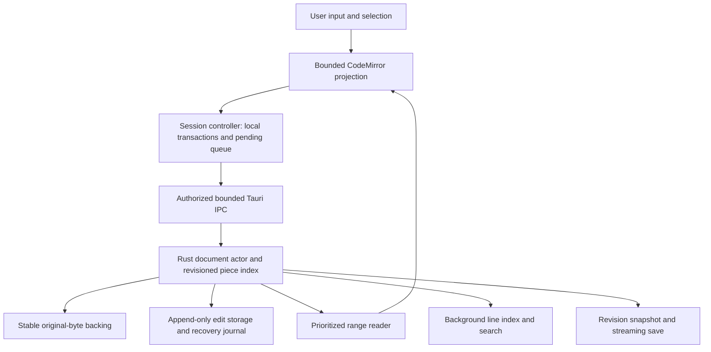

# Stack Browser Quick View Editor: Technical Research and Design Review

**Date:** 2026-09-07  
**Status:** Research complete; architecture proposal for advisor review, not implementation approval.  
**Audience:** Software engineering advisor and future implementation owners.  
**Scope:** Research and documentation only. No application code, dependencies, configuration, or tests changed.  
**Author:** JasonShell research pass, with independent frontend/lifecycle, storage/safety, and editor-engine investigations.

**Reading guide**

- **Recommendation and feasibility:** Sections [1](#1-executive-recommendation), [5](#5-what-immediate-and-non-blocking-can-mean), and [6](#6-editor-engine-and-data-structure-investigation).
- **Storage, input, and save architecture:** Sections [7](#7-architecture-and-data-models) through [10](#10-safe-saves-source-changes-and-recovery).
- **Application fit and accessibility:** Sections [11](#11-workbench-ux-and-application-design-fidelity) and [12](#12-accessibility-and-reflow-design-review).
- **Contracts, budgets, and proof:** Sections [13](#13-api-contracts) through [16](#16-acceptance-criteria-and-validation-plan).
- **Grade the proposal:** Section [18](#18-proposed-execution-plan-risks-and-advisor-decisions) contains the decisions and go/no-go gates; Sections [19](#19-sources-and-claim-traceability) and [20](#20-research-handoff-and-verification-record) provide evidence and verification limits.

## 1. Executive recommendation

Build a **Quick Edit workbench inside the existing Stack Browser**, in the same in-flow region that currently switches between the file grid and Git. Do not introduce another window, overlay the file list, adopt VS Code's application chrome, or change ordinary file activation implicitly.

For the requested scale, the key decision is not Monaco versus CodeMirror. It is **whether the editor owns a complete in-memory document or a genuinely paged, file-backed document**.

Recommended architecture to investigate first:

1. **Rust owns the complete logical document:** immutable original-byte backing, a disk-backed added-text store, a balanced piece index, sparse line/encoding metadata, revisioned edits, global undo/redo, search, recovery, and streaming save.
2. **The webview owns only a bounded working region:** visible text plus limited overscan, caret/selection presentation, input/composition handling, and JasonShell workbench chrome.
3. **CodeMirror 6 is the preferred input/view candidate, not the full-file storage engine.** Use its supported APIs over a real, bounded text projection. A projection controller must supply global semantics that CodeMirror cannot infer from that region.
4. **First paint and local editing must not depend on EOF, a complete line index, a full snapshot copy, or syntax parsing.** Background work enriches an already usable surface.
5. **Prototype the difficult adapter and Windows save semantics before committing to this architecture.** Cross-window undo, IME at paging boundaries, very long lines, global selection, and accessibility are architectural acceptance gates—not polish tasks.

**Important qualification:** A paged CodeMirror projection is substantial editor engineering. It is not a configuration option, a custom asynchronous `Text` provider, or a small wrapper. If it cannot pass the acceptance gates, the honest alternatives are a purpose-built paged editor view or an explicitly narrower product requirement. Shipping a large-file viewer that becomes editable only after loading would not fulfill this request.

### Recommendation confidence

| Decision | Confidence | Basis and remaining uncertainty |
|---|---:|---|
| Reuse the existing Git/file-grid slot | 95% | Directly supported by current layout and lifecycle source. |
| Keep file-sized work outside the renderer | 95% | Established browser/IPC constraints and upstream editor architectures. |
| Use a file-backed piece model rather than a resident rope for arbitrary-size editing | 90% | Fits bounded-memory insert/delete/save semantics; implementation remains nontrivial. |
| Use CodeMirror as the bounded editing view | 70% | Good input, extensibility, and theme fit; transparent cross-projection behavior is unproven. |
| Meet proposed latency targets in packaged WebView2 | Unmeasured | No editor implementation or runtime benchmark was created for this research. |
| Provide universally race-free in-place save against arbitrary Windows writers | Not established | Path-based replacement is not compare-and-swap; see Section 10. |

These confidence values are engineering judgments, not statistical measurements. Overall architecture confidence is **75%**: sufficient to recommend targeted feasibility experiments, not to promise a finished implementation.

## 2. Context, methodology, and evidence boundaries

### User need

A user should be able to make a small text change without leaving Stack Browser for Notepad or VS Code. The experience should include line numbers, predictable editing commands, immediate key feedback, dynamically loaded content, and styling consistent with JasonShell. The request explicitly includes large text files and asks for design investigation rather than code.

### Work performed

- Read the canonical `master_spec.md`, repository/global instructions, dependency manifests, changelog policy, and existing research-document conventions.
- Inspected actual Stack Browser/Git components, popup lifecycle and shortcut handling, theme tokens, IPC authorization, file operations, path normalization, clipboard, and recovery patterns.
- Ran independent read-only research slices for surface integration, backend safety, and editor-engine feasibility; reconciled their recommendations rather than adopting them indiscriminately.
- Read official CodeMirror, VS Code, Tauri, Tokio, Rust library, Microsoft Windows, and Unicode documentation/source. References are listed in Section 19.
- No memory-bank directory was found by the repository memory-bank lookup. `master_spec.md` remains the project authority.
- Context7 was not exposed in this session. Current framework evidence came directly from official documentation/source instead.

### Evidence labels

- **FACT:** Observed in repository source or cited upstream documentation.
- **INFERENCE:** Engineering deduction from those facts, not an observed runtime result.
- **PROPOSAL:** Recommended behavior, architecture, or target for approval.
- **OPEN GATE:** Requires an experiment or product decision before implementation acceptance.

All performance budgets below are **proposed targets**, not results. No application launch, browser smoke test, benchmark, profiler capture, or feature test was run. Upstream `main`, `master`, and `latest` links are moving references inspected for this pass; pin exact releases/commits before implementing. Historical VS Code benchmark numbers must not be treated as JasonShell/WebView2 measurements.

### Documentation truth boundary

This document describes a possible future feature. It does not add editor functionality to the current architecture spec. Some older `master_spec.md` passages describe Git as a resizable dialog while the current functional section and source describe an in-flow panel. Another older known-risk passage says History/Stashes lack historical patch content, whereas newer spec entries describe nested historical diff drawers. This research uses the current replacement-slot source for placement and does not treat the old dialog language as permission to add an overlay.

## 3. Repository integration map

Line references identify the inspected working-tree source, not an immutable release.

| Existing surface or contract | Evidence | Design implication |
|---|---|---|
| Git replaces the normal details grid | `src/components/StackPopupSurface.svelte:2354-2364`; `master_spec.md:620-622` | Add an editor alternative at this boundary. File grid, Git, and editor must be mutually exclusive presentations. |
| Popup root has four grid rows and owns its interior sizing | `src/components/StackPopupSurface.css:1-14` | Retain toolbar/path/status arrangement; editor occupies remaining height with `min-height: 0`. |
| Ordinary files open through OS default application | `src/components/StackPopupSurface.svelte:876-885,2044-2046` | Quick Edit should be an explicit new action unless activation changes are separately approved. |
| Existing “inline editor” is rename/new-folder input | `src/components/StackPopupSurface.svelte:2330-2352` | Do not mistake it for existing text-content editing infrastructure. |
| Popup webview is created hidden and reused | `src-tauri/src/shell_windows.rs:290-304`; `master_spec.md:604-606` | Lazily load the editor only in this webview; session lifetime must not equal component visibility. |
| Native blur can hide the popup before renderer intervention | `src-tauri/src/main.rs:281-297` | Hide must preserve edits without waiting for a JavaScript confirmation. |
| Ctrl+Space and Alt+1 have capture handlers before the editable-target guard | `src/components/StackPopupSurface.svelte:1987-2025`; `src-tauri/src/windows_key_hook.rs` | Editor `stopPropagation()` alone cannot override native/global shortcut ownership. |
| HTML/native drops currently invoke filesystem paste | `src/components/StackPopupSurface.svelte:246-262,1911-1930` | Editor text drops and file-open drops need explicit routing; never fall through to folder copy/move. |
| Shared button/tooltip primitive exists | `src/components/melt/MeltActionButton.svelte:1-112` | Reuse it for direct workbench actions; use existing Melt patterns for actual composite controls. |
| Git has its own native direct-action controls and scoped styling | `src/components/StackGitPanel.svelte:1399-1475,1819-1887` | Reuse visual hierarchy, not incidental Git state or a second button framework. |
| Theme/density/focus preferences are renderer-owned | `src/app.css:58-127,1184-1275`; `src/lib/themes.ts`; `src/lib/shellPreferences.ts` | Live theme changes must not recreate the document or move the caret. |
| No editor dependency is installed | `package.json:20-43`; `src-tauri/Cargo.toml:11-23` | Monaco, CodeMirror, a rope, or a decoder would be new dependencies—not existing capabilities. |
| File wrappers are metadata and filesystem operations | `src/lib/stackPopup.ts:379-550` | Folder paging is not file-content paging; new document contracts are required. |
| Stack custom-command authorization is explicit Rust logic | `src-tauri/src/stack_popup/auth.rs:42-62`; `src-tauri/capabilities/stack-popup.json` | Every document command must authorize caller and session ownership before file work. |
| Existing path normalization canonicalizes and strips display prefixes | `src-tauri/src/stack_popup/paths.rs:13-40` | Separate display path from authoritative handle identity; do not copy normalization blindly into save logic. |
| Native clipboard stores files, not text | `src-tauri/src/stack_popup/clipboard.rs:124-255,285-455` | Editor Ctrl+C/X/V must never invoke the CF_HDROP file-copy path. |
| Existing recovery journal covers paste copy/cut | `src-tauri/src/stack_popup/recovery_journal.rs:16-70,177-213` | Reuse design principles, not its operation schema or implied recovery guarantees. |
| No long-lived filesystem watcher is part of Stack Browser | `master_spec.md:748-750` | Add narrowly scoped document change detection only if justified; always revalidate at save. |

**Integration caution:** `read_stack_folder` at `src-tauri/src/stack_popup.rs:369-387` is a synchronous command without the caller parameter used by guarded mutation commands. That is not a suitable template for a privileged, long-running editor read API. This is an integration observation, not a claim that this research repaired existing authorization or scheduling behavior.

## 4. Functional Requirements

The following EARS-style requirements translate the request into a reviewable contract. They are proposed implementation acceptance criteria, not statements about today's application.

| ID | Requirement |
|---|---|
| FR-1 | WHEN the user invokes Quick Edit on a supported text file, THE SYSTEM SHALL open its editor in the same in-flow content region as Git, without launching another application. |
| FR-2 | WHEN opening a file, THE SYSTEM SHALL display the first available bounded region and allow local editing without waiting for EOF, complete indexing, full snapshot creation, or syntax analysis. |
| FR-3 | WHILE additional content is loading, THE SYSTEM SHALL preserve existing text, caret, selection, and accepted edits, and SHALL keep the surrounding shell responsive. |
| FR-4 | WHEN displaying indexed text, THE SYSTEM SHALL show exact one-based logical line numbers; unindexed positions SHALL be explicitly identified rather than assigned invented line numbers. |
| FR-5 | WHEN editing, THE SYSTEM SHALL support text selection, insert/delete, newline, navigation, undo/redo, copy/cut/paste, select-all, find, and save with document-wide semantics where the action denotes the entire document. |
| FR-6 | WHEN the working region moves or background metadata arrives, THE SYSTEM SHALL preserve the meaning of edits, global selections, undo history, and active IME composition. |
| FR-7 | WHEN saving, THE SYSTEM SHALL serialize the requested document revision, including unread original ranges, without truncating the document to the visible region. |
| FR-8 | IF save fails or a conflicting external change is detected, THE SYSTEM SHALL retain edits and actionable recovery information, and SHALL NOT silently overwrite through a retry. |
| FR-9 | WHEN the popup hides or another workbench is shown, THE SYSTEM SHALL retain the dirty session; WHEN that session is explicitly discarded/replaced, THE SYSTEM SHALL require an explicit disposition. |
| FR-10 | WHEN an unchanged range is saved, THE SYSTEM SHALL preserve its original bytes; encoding, BOM, newline, or final-newline conversion SHALL require an explicit user action. |
| FR-11 | WHEN editor focus receives a command, THE SYSTEM SHALL apply the documented editor/shell precedence and SHALL NOT accidentally execute file-grid deletion, selection, or filesystem paste. |
| FR-12 | WHEN shell appearance changes, THE SYSTEM SHALL update editor presentation using the application design system without reconstructing the document. |

FR-4 is an explicit reconciliation proposal for a physical limitation: exact line numbers at an unscanned far-away byte position cannot be known immediately. If exact numbers everywhere from the first instant are mandatory, random seeks must wait for indexing. This tradeoff needs advisor approval; it is not a silent reduction of the request.

## 5. What “immediate” and “non-blocking” can mean

### 5.1 Three independent kinds of virtualization

| Kind | Avoids | Does not solve |
|---|---|---|
| DOM/view virtualization | Millions of mounted rows/glyph nodes | Full file read, decode, resident text model, undo memory |
| Document/storage virtualization | File-sized RAM and full-load gate | Input/IME, layout, global selection, safe save |
| Background execution | Long synchronous work on UI/async command threads | Excess work, queued IPC, memory pressure, stale results, disk contention |

All three are needed. Reading in chunks but appending every chunk to the same resident editor eventually remains **O(file size) memory**. Marking a function `async`, adding `requestAnimationFrame`, or moving a rope to WASM on the main thread does not make the work preemptible.

### 5.2 Physical lower bounds

Let `N` be original bytes, `W` the requested working region, `B` effective storage bandwidth, `P` live pieces, and `I` inserted/deleted payload size.

- First visible text can approach `open latency + O(W/B) + bounded decode/render`; it need not depend on `N`.
- Reading every byte, exact whole-file newline counting, whole-file validation, and a full search have an **Omega(N)** input cost without a valid prior index.
- Inserting near the start normally changes the length/layout of the remainder. Safe replacement usually emits **O(N + net edits)** bytes, even for a one-character edit.
- Local indexed edits can be approximately `O(log P + I)`, excluding cache misses and storage synchronization. A cold index page still costs I/O.
- Clipboard export of `K` characters takes at least `O(K)` conversion/transfer work. Delayed rendering only moves that cost; it does not eliminate it.
- DOM input, focus, browser composition, layout measurement, and paint cannot all run in a Web Worker. MDN explicitly excludes direct DOM manipulation from workers [S5].

**Illustration, not measurement:** scanning 100 GiB at a sustained 1 GiB/s takes at least 100 seconds before decoding/index overhead. This does not prevent displaying and editing its first few KiB quickly.

The defensible promise is **bounded foreground work and no file-sized prerequisite for local editing**, not zero main-thread execution, instantaneous remote storage, or infinite resource capacity.

### 5.3 Explicit service boundary

- Ordinary local text, a many-million-line file, and a multi-GiB single line are different workloads and must be tested separately.
- An unavailable SMB share, cloud recall, removable-media failure, or Windows sharing denial cannot supply nonexistent bytes immediately. Keep loaded text and controls available; show the specific pending/error state.
- A user typing faster than the backend can durably record indefinitely cannot be supported with finite RAM. Bound pending work, prioritize edits, and expose pressure before accepting more destructive operations. Never silently drop input.
- Resource limits must affect the offending operation, not discard the document. A large-file read-only fallback is a safety outcome for an unsupported case, **not proof of satisfying arbitrary-size editing**.

## 6. Editor-engine and data-structure investigation

### 6.1 Decision matrix

| Candidate | Strengths | Mismatch with this request | Verdict |
|---|---|---|---|
| **CodeMirror 6, full document** | Modular DOM view, transactions, selection, history, line numbers, language extensions; flexible CSS; MIT [S1,S2,S16] | `Text` represents actual complete text through synchronous methods. Viewport rendering does not make the backing model lazy. Standard history/search operate on that model. | Best web input/view candidate; not sufficient as full-file storage. |
| **Monaco, full document** | Closest stock VS Code editing behavior; mature commands and language ecosystem | Resident text model; workers do not move every edit/layout off the UI thread. Large-file optimizations disable features, not provide out-of-core editing. Additional workbench/worker/theme integration. | Good alternative if VS Code parity outranks footprint and arbitrary-size requirements are explicitly narrowed. |
| **Scintilla native control** | Mature native editor, chunk-loading APIs, established editing facilities | Native HWND/DLL integration does not share Svelte layout/accessibility/theme plumbing. Document storage is still resident; loader APIs are not evidence of editing an incomplete disk-backed file. Native painting/input threading remains an issue. | Evaluate only if web input/view gates fail and a native integration is approved. Not a free large-file solution. |
| **Ropey / crop / xi-rope** | Useful balanced text structures; efficient edits and metrics | These are data structures, not editor UIs or automatically paged files. Ropey explicitly states it is in-memory and not suited to texts larger than available RAM [S7]. | Useful within bounded buffers or as design references. Do not label a resident rope “streaming.” |
| **Textarea / hand-built contenteditable** | Small integration surface for small strings | Whole-value costs, native selection behavior, line numbering, long lines, undo, and IME complexity remain. | Reject as the universal editor. |
| **Custom disk-backed piece model + bounded web input/view** | First-region editing before EOF; bounded caches; original-byte retention; global commands independent of DOM | Highest engineering risk at projection/input/selection boundaries; new save/recovery infrastructure | Preferred architectural direction for the actual requirement, conditional on feasibility gates. |

No bundle-size, launch-time, or latency ranking is claimed without measurement. “CodeMirror is modular” is supported; a specific KB advantage in this application is not yet measured.

### 6.2 Why CodeMirror cannot simply request missing lines

CodeMirror's guide describes immutable text/state, synchronous transactions, UTF-16 document offsets, and a view rendered from `EditorState` [S1]. Its synchronous `line`, `lineAt`, slicing, and change APIs expect real content. Its viewport tracks geometry for the represented document even when most DOM nodes are absent [S2].

Returning a Promise from a text accessor would violate that interface. Returning empty strings or spaces for unloaded content would corrupt document length, navigation, search, undo inversion, and save semantics. A plugin cannot fix those problems just by repainting later.

Appending asynchronously fetched text is valid for an intentionally growing document, but background file hydration is **not a user edit**. It must not change dirty state or pollute undo. Moving the projection is also not an undoable edit. Even `addToHistory: false` is not, by itself, sufficient to preserve a document-wide history across region replacement.

### 6.3 What Monaco's large-file support actually proves

The inspected VS Code `TextModel` source declares a 20 MiB large-file size threshold, 300,000-line threshold, 50 MiB model-sync limit, and a 256 Mi-character heap-operation threshold [S3]. These are internal policy thresholds, not a universal maximum file size or a promise that all files below them are responsive. The size variable is derived from the text model; do not casually equate it with every encoding's on-disk bytes.

VS Code's piece-tree article explicitly describes resident original buffers and explains both string/line-array allocation problems and native-boundary overhead [S4]. It is excellent evidence for a piece model and batching—not evidence that the stock editor pages arbitrary disk files.

Disabling tokenization, minimap, folding, and semantic services may improve Monaco substantially, but it does not meet the full requirement by itself. Setting larger limits postpones exhaustion; it does not remove file-sized work.

### 6.4 Selection decision

**Investigate one bounded projection architecture first**, using CodeMirror's real input/view over the loaded region. When a small document fits entirely inside the measured projection budget, that projection naturally is the whole document. This avoids designing two unrelated editing command systems from the outset.

An optimized resident-document path can be considered later, but only if it preserves the same session/history/save contracts and its model-construction and edit costs pass the foreground budget. Do not choose a nominal 5/10/50 MiB cutoff and assume construction at that size cannot stall.

Keep the engine adapter thin and specific. A universal pluggable editor framework, LSP host, extension platform, or cross-editor compatibility layer is not needed for this feature.

### 6.5 Packaging, startup, and dependency cost

Load the editor component/engine on explicit Quick Edit intent inside `stack-popup`, not at application startup in every persistent webview. Lazy import reduces idle cost but moves module fetch/parse/evaluation into first open; the first-edit benchmark must include it. A small intent prefetch may be investigated, but indiscriminate hidden-window prewarming would defeat that goal. Language packages and optional workers load only after plain-text editing is usable.

Bundle assets locally through Vite; do not fetch editor scripts, language grammars, or themes from a CDN when opening a file. Verify worker URLs in the packaged Tauri origin, not only the Vite dev server. `src-tauri/tauri.conf.json:13-15` has a production `script-src 'self'` policy and no explicit `worker-src`. Prefer local module workers compatible with that policy. Do not add wildcard script sources, `unsafe-eval`, or a broad CSP relaxation to make an engine start; any necessary narrowly scoped worker policy requires review.

CodeMirror and Monaco are MIT-licensed [S16,S25]. Scintilla uses its own permissive notice-preservation license [S26]. Include transitive dependencies, language packages, fonts, and license notices in the selection review; do not assume the engine's license covers every optional package. Pin actual versions, inspect maintenance/release activity and known advisories before adoption, and measure packaged code size, first import, idle CPU, and retained memory rather than repeating upstream marketing numbers.

## 7. Architecture and Data Models

### 7.1 Ownership and data flow



| Owner | Responsibilities | Must not do |
|---|---|---|
| Svelte workbench | Header, status, dialogs, active presentation, theme bridge | Bind the entire file to reactive state; rerender the engine per keystroke |
| Editor view/controller | Immediate local edits, composition, projected caret, pending edit queue, mapping | Synchronously fetch missing text; pretend local offsets are global offsets |
| Rust document actor | Ordered revisions, piece edits, stable anchors, global history, source identity | Hold a shared shell mutex during scans, I/O, save, or IPC emission |
| Bounded I/O workers | Range reads, backing-store creation, streaming output | Spawn unbounded workers or queue unlimited obsolete view requests |
| Index/search workers | Sparse metadata, literal search, future bounded parsing | Publish unversioned results into a newer edit generation |
| Disk stores | Original bytes, added bytes, evicted index/history blocks, recovery records | Depend on a mutable external file without a defined consistency policy |

The actor serializes **short metadata transactions**, not entire scans. Reads/search/save take a revision snapshot and execute outside the actor, then submit bounded/versioned results. Otherwise moving work to Rust only creates a new head-of-line blocking point.

### 7.2 Data models

These are design shapes, not implemented structs.

| Entity | Fields | Invariants |
|---|---|---|
| DocumentSession | opaque session ID, owner surface, file identity, source generation, document revision, clean revision, durability revision, encoding policy, backing strategy | Backend owns authority; hidden sessions remain alive; dirty sessions are not LRU-evicted. |
| SourceIdentity | original display path, authoritative opened target, volume/file ID where supported, size, timestamps, link/reparse/stream metadata, baseline verification state | File ID is not content revision. Size/mtime alone are not proof of unchanged bytes. |
| Piece | original/add store ID, byte start, byte length, optional decoded/newline metrics | References immutable byte ranges. Unknown metrics are explicitly unknown, never zero. |
| PieceIndex | balanced tree/B-tree of piece extents with aggregate known metrics and unknown-region flags | Edits update affected ancestors, not every subsequent absolute line number. |
| DecodeCheckpoint | source offset, decoder state where necessary, newline-prefix count, UTF-16 prefix metadata, boundary state | Valid only for that immutable source generation and encoding. |
| ViewLease | view ID/generation, revision, source-to-local segment mapping, local text length, index certainty | Bounded local UTF-16 offsets resolve only through the lease that produced them. |
| EditTransaction | sequence/operation ID, expected revision, source/view anchors, replacement payload, grouping metadata | Ordered, idempotent; history excludes file hydration and background index updates. |
| Selection | stable anchor/head, direction, affinity, optional additional ranges | Survives paging and insertions at its boundaries; not restricted to mounted DOM. |
| SaveJob | session ID, frozen revision/root, expected source identity, staging/backup paths, publication phase | Saves exactly its snapshot; later typing remains dirty. |
| RecoveryRecord | schema, session identity, backing references, durable edit sequence, integrity metadata, save phase | A journal referencing a missing/mutated original is not a complete recovery guarantee. |

### 7.3 Coordinate systems

Use distinct types and names for:

1. **Original/store byte offsets:** unsigned 64-bit backend values.
2. **Logical document byte positions or stable anchors:** revision-dependent, spanning pieces.
3. **Local editor offsets:** bounded JavaScript UTF-16 code-unit offsets.
4. **Logical line numbers:** one-based, exact only where enough prefix metadata is known.
5. **Display columns:** dependent on tabs, glyph shaping, graphemes, and bidirectional layout.

Do not send a `u64` through an unconstrained JSON number. Use decimal strings or a specified binary encoding for file/global quantities; local offsets can remain safe bounded numbers. Reject overflow and invalid conversions on both sides.

CodeMirror counts each logical newline as one offset unit even when serialization uses CRLF [S1]. Therefore `fileByteStart + localOffset` is wrong for CRLF, UTF-8 multibyte text, UTF-16, and non-BMP characters. Use per-segment decoding maps and immutable source anchors.

Boundary metadata must handle a CR at the end of one piece and LF at the start of the next. Counts are not always the naive sum of each piece's independent counts. Splitting/joining edits must preserve the selected newline policy.

## 8. Loading, line numbers, and storage

### 8.1 Open sequence

1. Show editor chrome and a non-covering status immediately; retain the prior surface until the new session identity is established. Never label stale file A text as file B.
2. Authorize the caller and selected path. On an I/O worker, classify the target and establish the chosen source-consistency strategy.
3. Read a small bounded prefix. Detect a BOM, make a provisional encoding assessment, and decode only the first display region. Empty files immediately show editable line 1.
4. Return a session plus a bounded view lease. Paint and accept local edits. **Do not wait for a complete scan/copy.**
5. Prioritize reads around the viewport/caret, then directional prefetch. Build sparse index/backing state in the background using bounded buffers.
6. Attach indexing/search results to the immutable source generation. Reconcile their metrics through the current piece index; never apply stale original offsets directly to the edited view.

The first region must be byte-bounded as well as line-bounded. “Read 100 lines” can read 100 GiB when the file has one enormous line. Chunk boundaries are storage artifacts, not real newlines.

### 8.2 A stable original is a real requirement

A disk-backed piece model is only correct if its referenced original bytes remain stable. Holding a file handle does not, by itself, prevent another process from writing that file. Copying while writers run and comparing mtime afterward is not a guaranteed point-in-time snapshot.

| Strategy | Benefits | Costs / restrictions |
|---|---|---|
| Stable read handle, deny incompatible write/delete access during session | First-region edit without full copy; low extra disk use | Can block Git/tools; cannot be acquired against incompatible existing writers; not a durable snapshot after crash |
| Stable handle while creating a private background snapshot | First-region editing from protected source; release source restriction after snapshot completes | O(N) temporary disk and background I/O; restrictions last for the copy; recovery incomplete until backing is secured |
| Cooperative live read with identity/change checks | Least disruption for log producers/external editors | Not an immutable base; suitable for a clearly labeled live preview, not transparent strong-consistency editing |
| Filesystem snapshot/clone fast path | Can reduce copy time and preserve a base | Filesystem/volume/permission dependent; never assume NTFS/SMB universally supplies it |

**Preferred safety baseline to prove:** a successfully protected original while a private snapshot is built in the background; first-region editing starts before that copy completes. Release source protection once the snapshot is verified. If the stable source cannot be acquired, show readable available content with an explicit conflict/live-file state; do not secretly enter mutable-base editing.

This baseline has a substantial cost for huge files. An explicit low-disk “protected source” mode may be preferable on some machines, but its external-tool interference and crash-recovery limitations must be visible. Neither policy should be silently selected while claiming the same guarantee.

**OPEN GATE:** validate Windows sharing/oplock/mapped-writer behavior and supported filesystems. Share modes coordinate ordinary opens [S9]; byte-range locking is not a universal substitute, particularly with mapped access. If the required stability cannot be established, limit destructive actions rather than invent consistency. Resource/consistency exceptions require advisor agreement.

### 8.3 Sparse index design

Build fixed-byte-block metadata and sparse newline checkpoints, not one heap object per line. Keep detailed offsets for hot blocks; page cold metadata to disk. A balanced metric index supports byte lookup immediately and line lookup as index coverage becomes available.

For illustration, 100 GiB divided into 256 KiB blocks yields 409,600 blocks. At a hypothetical 32-byte summary per block, raw summaries alone use 12.5 MiB before tree/cache overhead. A naive 8-byte offset per line for one billion lines uses roughly 7.45 GiB. These are arithmetic examples, not chosen production allocations.

An in-memory sparse array still grows with file size. Strictly bounded RAM eventually requires paging the index itself, as well as edit/history metadata. State the disk requirement separately from the RAM budget.

### 8.4 Truthful global navigation

- From the beginning, logical line numbers are exact for the decoded/indexed prefix.
- Seeking into a previously indexed region uses checkpoints plus bounded local scanning.
- Seeking to byte 90% in a cold file can display text near that offset before its global line number is known. Show “Line indexing… · byte …”, not an estimated number presented as exact.
- Go to line beyond indexed coverage is an asynchronous operation with progress/cancel. Do not block current-region typing while finding it.
- End-of-file access can use a tail read, but finding the start of an extremely long final line may require additional scans. Preserve a byte-anchor representation meanwhile.
- Do not set a CSS spacer to `lineCount × lineHeight` for billions of lines. Browser scroll geometry has finite range/precision. Use a bounded physical scroll window mapped to a logical position, preserve the top-visible anchor when estimates change, and supply keyboard/page/go-to controls.
- Until line counts are known, a byte-progress scrollbar must explicitly represent approximate document position. When transitioning to line-based navigation, keep the anchor stable so the visible text does not jump.

### 8.5 Very long lines

This is a required adversarial case, not an optional optimization.

- Limit decoded segment size even when no newline exists.
- Virtualize horizontally or present explicitly marked continuation segments without inserting real newlines.
- Maintain one logical line number; continuation marks are presentation only and must not enter copy/save/search.
- Word wrap must be viewport-local and cancellable for expensive content; never measure/wrap the entire giant line before painting its prefix.
- Window boundaries must respect encoding and composition safety. Grapheme clusters can have arbitrarily long combining sequences; a fixed four-byte overlap is not a general grapheme/shaping solution [S11].
- Bidirectional layout can depend on paragraph-wide context. A bounded segment cannot blindly claim exact full-paragraph visual ordering. Carry verified context or label a deliberately simplified display mode; do not silently alter text order in storage.

**OPEN GATE:** CodeMirror projection must prove long-line segment continuation, caret motion, selection, grapheme behavior, and screen-reader continuity. A canvas-only rendering fallback without an accessible input/text model is not acceptable.

## 9. Editing semantics and foreground responsiveness

### 9.1 Local echo, backend authority

Keystrokes update the bounded local editor immediately. They do **not** await Tauri or disk flush before showing the character. The controller records an ordered pending transaction and submits a small batch to Rust.

There is one logical editor writer per session. Backend acknowledgement advances the accepted revision and returns normalized anchors. A lost response may be retried with the same operation ID, yielding the same acknowledgement—not a duplicate insertion. Out-of-order or unknown-base edits are rejected without dropping the local pending text.

Keep three notions distinct:

- **Visible:** locally applied and still possibly pending.
- **Accepted:** part of the authoritative backend document revision.
- **Durable:** enough recovery data has actually been flushed.

“Saved” is a fourth state: the requested revision was successfully published to the target file. A resolved IPC promise alone does not imply durability or save completion.

### 9.2 Ordering and projection replacement

Each view lease has an immutable base revision. Local transactions are ordered in the evolving local document; the adapter composes/maps them before converting to backend anchors. Use one in-flight edit batch initially; subsequent local edits remain queued and are translated against the acknowledged chain. A new projection is not installed until pending edits affecting its mapping are reconciled.

Do not send every local keystroke against the same stale `baseRevision`, and do not interpret local offsets against a newly loaded view. During IME composition, pin the composing span and necessary context; defer region rebasing until composition ends. Browser composition transactions must be grouped into sensible undo units.

On backend rejection or worker failure, retain the projected text and pending operations, enter a recoverable state, and offer recovery/export/retry where safe. Never “fix” a mismatch by resetting the view from disk.

### 9.3 Global undo/redo and selection

Rust owns session-wide undo/redo over piece roots or inverse operations. Deleted original ranges stay referencable; inserted bytes remain in the added store while history needs them. Group normal typing and IME commits sensibly; paste and Replace All are deliberate undo units.

A CodeMirror region's native history alone is insufficient. Avoid two competing histories. Route undo/redo to the session controller, with an optimistic, bounded local path for recent transactions and asynchronous restoration when historical text is cold. Hydration and viewport rebasing never become undo entries.

Selection anchors can span unloaded text. Ctrl+A means the complete logical document, not the visible projection. Rendering only paints its intersection with the viewport. Cross-boundary Shift+Arrow/PageDown, mouse autoscroll, word selection, and selection reversal must preserve anchor/head semantics.

Memory reclamation must account for shared history roots and in-flight saves. A saved document can still need its pre-save original backing for Undo. Do not delete backing files merely because Save succeeded.

### 9.4 Copy, cut, paste, and drag/drop

- Ordinary small selections should use familiar text clipboard behavior with low latency.
- For cross-projection or large selections, resolve the range against a frozen document revision, then materialize on a worker/native clipboard path with progress. Do not build a multi-GiB JavaScript string.
- Windows `CF_UNICODETEXT` is a NUL-terminated Unicode text object with CRLF line conventions [S12]; exporting text may normalize clipboard line endings without changing stored file bytes. Embedded NUL requires explicit handling, not silent truncation.
- Clipboard publication transfers ownership of an allocated object to Windows [S13]. It has a finite memory cost. Delayed rendering can block the receiving application and is not a limitless streaming clipboard.
- A failed Copy leaves the document unchanged. Cut removes text **only after** the intended selection has been published successfully; if the document revision changed meanwhile, revalidate or cancel the cut.
- Very large copy/paste needs a documented size/resource policy and an “Export selection” or explicit large-transfer option. Do not claim an unlimited clipboard guarantee.
- Large paste should spool to backend storage, validate/decode, and publish one document transaction. Avoid a large synchronous `clipboardData.getData()`/editor insertion path. Native versus browser clipboard/IME behavior must be measured in WebView2.
- Text drops insert text. File drops request opening a file; folder drops request returning to folder browsing. Neither must accidentally invoke the existing folder copy/move handler. Preserve HTML/native duplicate-drop suppression.

### 9.5 Find, replace, and optional language features

**Core:** literal find, next/previous, match case, selection-only search, and Replace/Replace All with explicit scope. Search starts near the caret for useful first results, then scans the document snapshot in bounded tasks. Display searched coverage and partial result counts until completion. Search the edited logical document, not just disk bytes or the current projection.

A literal matcher must carry enough state across chunks/pieces to find boundary-spanning matches. Unicode-insensitive search can change lengths during folding; maintain offset maps and document semantics rather than lowercasing arbitrary byte chunks.

Replace All should compute against a fixed revision and install the result as one logical transaction. If edits intervened, ask to recompute or use a defined rebase—not stale offsets. Store large match/edit results on disk; cap the displayed results list, not silently the transformation's scope.

**Optional:** regular expressions. Rust's `regex` avoids backreferences/look-around and documents `O(m × n)` single-search bounds [S14]. That does not make arbitrary multiline regex matching a fixed-overlap streaming algorithm; unbounded matches, capture offsets, empty matches, and all-match iteration need a separate design. Reject unsupported semantics clearly.

**Optional:** syntax highlighting, matching brackets, visible whitespace, indentation guides. Plain text renders first. Stateful syntax cannot safely start from an arbitrary chunk with no lexical context: use known checkpoints or explicitly plain text until context is available. Expensive highlighting must never gate editing. Minimap, folding over the entire file, semantic diagnostics, format-on-save, LSP, completion, and extensions are not core requirements here.

## 10. Safe saves, source changes, and recovery

### 10.1 Streaming save protocol

1. Establish an edit barrier so all user edits included by the Save action have a known accepted revision.
2. Freeze that revision's piece root and encoding policy. Continue accepting newer edits separately.
3. Validate target policy/identity and available staging resources. Readonly or unsupported target classes offer Save As without changing source permissions.
4. Create a unique staging file on the target volume with deliberate permissions. Stream unchanged original bytes and encoded inserted pieces using bounded buffers. Never serialize only the viewport.
5. Flush staging data and close handles as required by publication. Preserve a durable save-phase record and a uniquely named original backup strategy.
6. Revalidate the target immediately before publication. Coordinate all JasonShell sessions targeting the same file identity.
7. Publish using a Windows-aware replacement strategy, initially investigating `ReplaceFileW` with a backup [S8]. Do not implement delete-original-then-rename as a fallback.
8. Inspect the actual result, reconcile new identity, and mark the frozen revision saved. If the current document has advanced, it remains dirty. Retain recovery assets until the outcome is verified and retention rules permit cleanup.

A save can read original regions not yet indexed: copying unchanged byte extents does not require line numbers. If backing/source stability is not established for an extent, the save must wait for that prerequisite or fail safely—not omit it.

### 10.2 Windows details that change the design

`ReplaceFileW` is preferable to copying the tiny JSON persistence helper without review. Microsoft documents preservation of creation time, object identifier, DACLs, encryption, compression, and named streams absent from the replacement. It also documents that the resulting **file ID is the replacement file's ID**, requires the relevant files on the same volume, and states `REPLACEFILE_WRITE_THROUGH` is unsupported [S8].

Consequences:

- Same-volume replacement is a publication mechanism, not an unconditional durability guarantee on every storage device/filesystem.
- Preserve security metadata deliberately. Do not set flags that ignore ACL/merge failures merely to report success.
- Existing handles may continue referring to the prior file object; replacement does not update all readers in place.
- Hard links require explicit policy: replacing one directory entry does not mean all aliases receive the new content. Default to a warning/Save As rather than silently breaking expected shared identity.
- A process that omitted delete sharing can prevent replacement. Show sharing failure and keep edits; never force-close another application's handle.
- Named streams, cloud placeholders, encryption/compression, sparse files, reparse targets, and network volumes require a support matrix. Preserve only what the selected API and verified platform actually guarantee.
- Failure codes can leave original/replacement/backup names in nontrivial states. A failed call does **not** justify blindly deleting staging or retrying publication.

Memory mapping is not the default reader. `memmap2` explicitly marks file-backed mapping unsafe because subsequent underlying modification can cause undefined behavior [S10]. A protected immutable backing file may make mapping an optimization later, but page faults still block the accessing thread and mapping does not replace scheduling or snapshot design.

### 10.3 External writers: the unsolved universal guarantee

Check file identity, size, timestamps, and source verification state before saving. Reopen/revalidate on resume and before destructive operations. A scoped watcher may improve notification latency, but watcher delivery is not the save authority.

**Do not claim metadata recheck + atomic replacement is race-free.** Another writer can modify or replace the path after the check. A full hash improves content verification at the time it is read but does not close that time-of-check/time-of-use gap. A named mutex only coordinates cooperating applications. File IDs identify an object, not its content revision [S15].

Recommended conflict policy:

- Detected conflict: keep our revision and external file; offer Compare, Reload with explicit discard, or Save As. No default Overwrite.
- Known actively written files: live preview or an explicitly established stable snapshot; no transparent overwrite semantics.
- Ordinary supported local save: coordinate JasonShell writers, perform strong available checks, preserve the replaced original through a backup, and report ambiguous results. This reduces data-loss risk but is not a filesystem compare-and-swap contract.
- Strict requirement to prevent any competing publication from being overwritten: **OPEN GATE.** Prove an appropriate OS/filesystem exclusion/publication protocol or use Save As where it cannot be established. Do not advertise the stronger guarantee before that proof.

This limitation should be graded as an exposed platform constraint, not hidden behind “atomic save.”

### 10.4 Recovery and privacy

A hidden popup is not a recovery system. Keep dirty sessions in Rust independently of the mounted editor; maintain a private, versioned edit log and sufficient immutable backing to reconstruct the document.

- Distinguish visible, accepted, and durable revisions. A proposed 250 ms flush cadence leaves a crash-loss window; never describe it as lossless keystroke persistence.
- Recovery cannot reconstruct unread original bytes from a patch log if the original later disappears. Full recoverability requires a complete immutable snapshot or another durable stable source.
- Retain pending local operations on renderer errors; app/renderer crash can still lose unacknowledged input. Report the durability boundary.
- Snapshots, inserted text, backup files, search queries, and clipboard content can contain secrets. Do not place content in logs, diagnostics, `localStorage`, BroadcastChannel, or app-wide Tauri events.
- Private backing/journals need restrictive access and a deliberate encryption-at-rest policy, for example authenticated encryption with a user-bound protected key. Encryption must cover random-access chunks and integrity metadata; an encrypted journal beside a plaintext snapshot is insufficient.
- A same-directory save staging file contains plaintext unless the target storage encrypts it; private encrypted recovery does not protect that staging file automatically. Apply deliberate ACLs, minimize lifetime, and document inherited directory/cloud-sync exposure.
- Quotas and cleanup are explicit. Never evict unexported dirty work or delete an ambiguous save backup on a timer. Startup may classify interrupted jobs; it must not auto-overwrite user files to “repair” them.

## 11. Workbench UX and application design fidelity

### 11.1 Entry and exit

**Default proposal:** add visibly named **Quick Edit** in the file row context menu and a selection-aware toolbar action. Consider `Ctrl+Enter` when a single file row is selected, after checking shortcut conflicts. Keep Enter/double-click and existing Open/Open With behavior unchanged initially. A future “Open text files in Quick Edit” preference can be separately approved.

One active document is the simplest initial interaction model, but its dirty session must survive Files/Git presentation switches. Opening a different file while the single dirty slot is occupied requires Save / Discard / Cancel. Multi-file tabs are optional expansion, not an excuse to lose the previous draft.

```text
Existing Stack Browser path and shell toolbar
------------------------------------------------------------
Quick Edit   relative/path/config.toml   Unsaved changes
Save   Find   Go to line   More   Back to files
------------------------------------------------------------
  1 | [bounded editable text region]
  2 | [line numbers, caret, selection]
    | [prefetch runs without covering readable text]
------------------------------------------------------------
Ln 2, Col 5   UTF-8   CRLF   Indexing 18%   Recovery pending
```

This diagram describes hierarchy, not final pixel design. Use the existing panel edges, flat controls, compact density, and opaque workbench body. Do not add decorative cards, gradients, floating toolbars, AI controls, or VS Code's activity bar.

### 11.2 Hide is not discard

| Action | Recommended behavior |
|---|---|
| Ordinary click-away / native blur | Preserve current JasonShell hide behavior; retain session and pending edits. No focus-stealing save prompt merely because the user switched apps. |
| Alt+1 / outer popup close | Hide, not discard. Reopening restores active workbench and caret. This requires auditing existing close/reset paths. |
| Back to files / show Git | Suspend editor view while retaining dirty session; expose a compact “Resume edit — unsaved” affordance. |
| Explicit Close document / open another file | If dirty, Save / Discard / Cancel; default focus on non-destructive choice. |
| Reload from disk | Dirty confirmation; replace only after successful new load; keep old draft until then. |
| Open in external editor | Do not imply unsaved text was written. Offer Save and Open, Open disk version, or Cancel where dirty. Release incompatible source restrictions first. |
| Graceful app exit | Attempt bounded recovery flush and explicit disposition; do not promise dialogs during forced OS shutdown. |

Do not hold the existing delete focus-loss counter for the lifetime of a dirty editor. It can prevent expected dismissal and restore focus unexpectedly. A session/presentation state machine is different from a short-lived native-dialog focus hold.

Changing the current close path to preserve an editor session is future integration work, not a behavior already supplied by the persistent webview.

### 11.3 Keyboard precedence

Recommended priority: native reserved shell chords → active modal/composition → editor auxiliary UI → editor text commands → file-grid commands only when the grid owns focus.

| Keys | Behavior |
|---|---|
| Ctrl+C / X / V / A | Text operations while editor owns focus; never file-copy/paste/select-all. |
| Ctrl+Z / Ctrl+Y / Ctrl+Shift+Z | Session undo/redo, including edits before paging. |
| Ctrl+S | Save requested revision; repeated presses coalesce to a later explicit snapshot, not concurrent writes. |
| Ctrl+F / Ctrl+H / Ctrl+G | Labeled find, replace, go-to-line UI. Escape returns focus to editor. |
| Arrow/Home/End/Page and modifiers | Familiar text navigation; unloaded destinations resolve asynchronously. |
| Ctrl+W | Request Close document, not close native shell window. |
| Escape | Dismiss editor menu/find/help first; otherwise keep editor focus and allow Tab escape. Use explicit Back to files for departure. |
| Tab / Shift+Tab | Code indentation only with a documented escape mechanism; Ctrl+M toggles focus mode; Escape then Tab exits [S17]. |
| Ctrl+Space | Preserve global JasonShell search initially; completion is not a core requirement. Show this conflict in shortcut help. |
| Alt+1 | Preserve Stack Browser visibility toggle; never discard document. |
| AltGr / dead keys / IME | Never misclassify as shell commands or synthesize text from keydown alone. |

Preserving Ctrl+Space and Alt+1 avoids gratuitous native hook changes. If editor completion later requires Ctrl+Space, both native classification and renderer capture routing must become context-aware; DOM event cancellation alone is insufficient.

### Editing feel: details worth measuring

“Like VS Code” should describe familiar precision rather than copied chrome: stable caret and preferred column during vertical movement; Ctrl+Arrow word motion and Ctrl+Backspace/Delete; Home/End behavior; Shift selection; deterministic indent/outdent and newline indentation; double/triple-click selection; selection autoscroll; and predictable undo grouping. Choose and document the exact keymap rather than assuming CodeMirror defaults match VS Code.

Default to a familiar monospace stack already used by the application, with no delayed font swap that moves the caret. Respect display scaling and zoom; preserve scroll anchor during glyph remeasurement. Avoid smooth-scrolling or animated-caret behavior that lags behind input. Matching brackets and auto-closing pairs are optional, bounded conveniences and must not unexpectedly rewrite plain text. Verify these details with typing, pointer, keyboard-only, and IME tasks—not a screenshot alone.

### 11.4 Visual token mapping

| Editor element | Existing design source / policy |
|---|---|
| Surface/header/input backgrounds | `--js-bg-surface`, `--js-bg-bar`, `--js-bg-control`; use existing final theme tokens |
| Text and labels | `--js-color-text`, `--js-color-text-strong`; muted colors only after contrast verification |
| Selection/current line | Existing selected/active tokens with tested foreground contrast; distinguish caret from selection |
| Borders, spacing, radii | `--js-color-border`, `--js-space-*`, `--js-radius-*` |
| Focus | Existing focus preference plus a real visible outline for forced colors |
| Icons | Shared Material Symbols component, decorative icon hidden, inherits `currentColor` |
| Typography | Shell-selected UI font for chrome; existing code/terminal monospace family choices for text |
| Status | Existing `.surface-state` family and semantic tokens; visible state text |
| Motion | No animation on typing/paging; respect reduced motion for remaining UI transitions |

Do not invent a nonexistent `--js-font-mono` contract. If the editor needs a dedicated code-font or opaque syntax palette, introduce it through the existing theme/preferences system after approval. Syntax roles should have a small validated token set, not a copied hardcoded Monaco/VS Code theme.

**Observed caution:** early theme declarations contain alpha-valued muted text/focus colors, and global forced-colors handling relies on a shadow-only focus ring (`src/app.css:1185-1188,1247-1275`). Reusing tokens is not proof of contrast/focus compliance. Check final computed theme values; use approved opaque foregrounds and an actual outline where necessary. Fixing unrelated global styling is not part of this research.

## 12. Accessibility and reflow design review

The target is WCAG 2.2 AA, with real WebView2 assistive-technology verification—not an assertion that an editor library guarantees conformance.

| Area | Required design and verification |
|---|---|
| Structure | One page-topic heading/main landmark in the popup; Quick Edit is a labeled section beneath it. Do not add duplicate `main`/`h1` landmarks in a nested component. A first-focusable skip link reaches main content. |
| Text semantics | Engine exposes named multiline textbox semantics and correct readonly state. Decorative gutter is hidden from accessibility, while current logical line/position remains available. |
| Keyboard | All commands available without pointer; documented Tab escape; no Escape handler destroys focus before CodeMirror's escape hatch can work. No hidden workbench controls remain focusable. |
| Focus | Stable restoration after dialogs, find, save errors, and Back to files. Visible outline at least 3:1 against adjacent colors; not shadow-only. |
| Controls | Every action has a visible label, persistent in its menu when collapsed. Accessible name contains visible text. Do not rely solely on tooltips for essential commands. |
| Forms | Visible labels for Find, Replace, Go to line, Save As. Required status where applicable; `aria-invalid` and linked error text; focus first invalid field. |
| Announcements | One polite status region announces meaningful transitions, not every chunk, line, or caret movement. Do not mark the entire editor busy/inert while indexing. |
| Contrast | Normal text/syntax/gutter at least 4.5:1; large text 3:1; focus and essential boundaries 3:1. Dirty/error/read-only state has text, not just color. |
| Forced colors | Canvas/CanvasText, Highlight/HighlightText, ButtonText/ButtonBorder as appropriate; visible caret/selection/focus. Do not disable forced-color adjustment globally. |
| Reflow | At 320 CSS px, header, path, status, and forms wrap/stack without page-level horizontal scrolling. Full paths/actions stay reachable. |
| Text wrapping | Provide usable soft wrap for prose and narrow layouts. Code may use component-local horizontal scrolling where two-dimensional layout is meaningful; do not declare all plain text exempt from reflow. |
| Graphics | Icons adapt to text color; decorative icons/gutter marks hidden. Informative markers have text alternatives. |
| Tables/grids | Editor text is not an ARIA grid. Any data table uses header cells. Preserve existing file-grid row/cell semantics outside the editor. |
| Projection continuity | NVDA/Narrator read, select, and navigate across region boundaries without duplicated/skipped text or surprise focus reset. Never build a hidden whole-file textarea as the accessibility workaround. |

**Verification status for this pass:** all checklist areas are explicitly addressed at design level. Actual contrast ratios, keyboard behavior, 320px reflow, IME, and screen-reader continuity remain unverified until a real surface exists. Manual accessibility review remains necessary.

## 13. API Contracts

Proposed names follow the existing Stack Browser command family. These are conceptual contracts, not added APIs. Error serialization must fit the project's `Result<T, String>` convention or introduce a deliberately scoped structured editor error wrapper; do not change every existing command.

### 13.1 Control/data plane

| Command | Request essentials | Response / behavior |
|---|---|---|
| `open_stack_text_document` | selected path, open request ID, intended access policy | Fast session identity and status; first range arrives separately if I/O is pending. Opening work is off command/UI threads. |
| `read_stack_text_window` | session ID, expected revision, view generation, byte/line/anchor target, byte and row budgets | Bounded text/segment map, view lease, exact/unknown line metadata, source status; no giant “line” payload. |
| `apply_stack_text_edits` | session ID, lease/base revision, operation ID, ordered local transaction batch or validated global anchors | Accepted revision/anchors or explicit conflict; duplicate operation ID returns original result. |
| `undo_stack_text_edit` / `redo_stack_text_edit` | session ID, expected revision, operation ID | New revision and bounded affected-view update; works beyond current projection. |
| `search_stack_text_document` | session ID/revision, query, scope, direction, job ID | Versioned bounded result batches and coverage; errors distinguish unsupported patterns. |
| `replace_stack_text_matches` | session ID, search/snapshot revision, replacement, explicit scope | Atomic logical transformation or stale-revision conflict; large plans stored outside renderer. |
| `save_stack_text_document` | session ID, accepted revision, expected source generation, operation ID | Save job ID; progress/publication outcome and saved revision. Source path comes from session. |
| `save_stack_text_document_as` | session ID/revision plus explicitly selected destination | Separate authorization/name/collision checks; never a hidden arbitrary path override on normal Save. |
| `get_stack_text_session` | session ID | Accepted/durable/saved revisions and job status for reattachment after missed messages. |
| `close_stack_text_document` | session ID, explicit disposition and expected revision | Dirty-aware release; not called merely because the popup hid. |
| `cancel_stack_text_job` | owned job/session ID | Cancels queued/cooperative work; reports whether publication is already non-cancellable. |

A small authorized text-clipboard/export contract may be required for global selections. Keep it distinct from `copy_stack_items` and its file clipboard. Native clipboard operations need their own bounded work and error semantics.

### 13.2 Wire fields and error taxonomy

- All messages carry session identity and the relevant document/source/view generation; no content-bearing broadcast.
- CamelCase wire fields follow existing Rust serde conventions.
- `byteOffset`, global length/count fields, and large revision counters use defined lossless encodings. Local offsets are checked integers within the bounded view.
- Error classes should include `Unauthorized`, `UnsupportedTarget`, `EncodingRequired`, `InvalidTextBoundary`, `StaleRevision`, `SourceChanged`, `SharingViolation`, `Readonly`, `ResourceLimit`, `Cancelled`, `IoFailure`, and `PublicationAmbiguous`, with actionable safe text and retryability.
- “Cancelled” and “AlreadyPublished” must be distinguishable. A cancellation request cannot retroactively undo a successful save.
- Use `tauri::ipc::Response` for bounded raw byte replies when useful; ordinary serialized responses become JSON and can be expensive for bulk data [S6].
- Use ordered channels for progress/streams rather than high-rate app-wide events [S18]. **Channels do not automatically provide bounded application backpressure.** Add credits or demand-driven reads, bounded queues, cancellation, and generation rejection.
- Worker `postMessage` transferables may avoid an additional JS-side copy, but they do not prove zero-copy Rust → WebView transport. Do not assume Tauri APIs can be called directly inside a Worker; use a verified bridge.

### 13.3 Future integration files

Keep `StackPopupSurface.svelte` as orchestration. A future dedicated editor component and `src/features/stack-browser/` controller own the view. Backend document code belongs under the existing `src-tauri/src/stack_popup/` module boundary, extracted by coherent responsibility rather than growing the command hub.

Register any implemented command consistently in:

- `src-tauri/src/main.rs` command handler;
- `src-tauri/src/contracts.rs` constants and aggregate registry;
- `src-tauri/src/stack_popup/auth.rs` caller policy plus session-owner validation;
- `src/ipc/commands.ts` and the established frontend wrapper boundary;
- capability/permission files only where the actual Tauri permission architecture requires them.

These filenames are integration guidance, not scaffolding created by this pass.

### 13.4 Content and target security

Treat every opened file as inert, untrusted text, including HTML, SVG, scripts, Markdown links, modelines, and embedded control characters. Never insert raw file content as HTML, execute file-provided commands/settings, auto-fetch URLs, or enable an extension merely because the file asks for it. Open links only through an explicit user action and the existing validated external-opener policy.

Caller-label authorization is necessary but not the entire security boundary. Validate session ownership, job ownership, ranges, payload sizes, target kind, and save destination in Rust. Preserve authoritative handle/path identity separately from display normalization. Reparse checks must consider ancestor junctions and path replacement races, not just the final component; opening with a no-follow flag on the leaf alone does not prove the full path safe. No elevation or permission changes occur implicitly. Symlink/junction editing, if approved later, needs a visible target policy and a handle-based validation design.

## 14. Non-Functional Requirements and resource budgets

### 14.1 Proposed responsiveness targets

Measure packaged/release WebView2, on declared hardware, separately for warm cache, cold cache, and unavailable/remote storage. Measure both the webview renderer and the native shell. A responsive editor must not starve taskbar/search/terminal activity elsewhere.

| ID | Metric | Initial target / interpretation |
|---|---|---|
| NFR-1 | Input-to-visible-paint, loaded region | p95 <= 16 ms, p99 <= 32 ms at 60 Hz; no wait for IPC acknowledgement. Record max and all >50 ms stalls. |
| NFR-2 | Editor-controlled foreground tasks | Target <= 4 ms per scheduled slice; no intentional file-sized synchronous tasks. Engine transaction/layout/GC costs must be captured, not excluded. |
| NFR-3 | First readable/editable prefix | p95 <= 100 ms warm, <= 250 ms cold local SSD under declared conditions. Count from Quick Edit invocation, including lazy import; report first paint and first accepted edit separately. |
| NFR-4 | Loaded-region scroll | p95 frame interval <= 16.7 ms at 60 Hz; no blank replacement of already displayed text. Report missed frames and long-line behavior. |
| NFR-5 | Cancel UI response | <= 50 ms acknowledgement; queued work removed promptly. Actual kernel I/O cancellation is separately reported, not falsely guaranteed. |
| NFR-6 | RAM scaling | Fixed configurable cache/queue budgets; increasing original file size 10× must not cause proportional renderer heap or backend resident-text growth. Index/history spill to disk. |
| NFR-7 | Data integrity | Unchanged bytes preserved; no silent dropped/duplicated edits, partial-save truncation, or lost dirty state on hide/reopen. |
| NFR-8 | Accessibility/design | Section 12 checklist and application theme/density/keyboard contracts pass on the real surface. |
| NFR-9 | Security | Every content/save command verifies caller and session; file text is inert; recovery content is private; unsupported targets fail before destructive work. |

These are starting service objectives, not universal real-time deadlines on a general-purpose OS. If experiments fail, redesign first; changing budgets or weakening behavior requires explicit review.

### 14.2 Initial allocation hypotheses

Tune through measurements, not file extensions alone.

| Resource | Starting hypothesis | Important qualification |
|---|---|---|
| First read | 32-64 KiB bytes | Smaller output if decoding/view construction exceeds foreground budget. |
| I/O block | 64-256 KiB | Sequential scan may batch larger reads off-thread; still yields to demand. |
| Projection | Up to 128 Ki UTF-16 units with row/line-segment limits | A ceiling, not a recommended single synchronous insertion; pathological text may need much less. |
| Visible overscan | Approximately 1-2 screens each direction | Pin caret/composition context; cap by bytes as well as rows. |
| Demand concurrency | 1-2 reads; one latest pending seek | Coalesce obsolete scrolling rather than queue every wheel event. |
| Background concurrency | One scan per active backing; tightly limited search/save workers | Low priority; avoid saturating storage and CPU. |
| Content transport | At most 4 bounded in-flight range payloads | Credit-based or pull-based; release credits when consumed/discarded. |
| Resident caches | Example 32 MiB decoded/raw hot cache + 16 MiB index cache | Include mapping tables, pending buffers, view engine, GC, and history separately. |
| Pending edit bytes | Example 1 MiB high-water mark | Spool bulk paste; do not make this a silent text limit. Expose failure/backpressure explicitly. |
| Active documents | One active view; initially one retained editable session | Multi-session support needs global quotas and dirty-safe eviction policy. |

Track native private bytes/working set, webview JS heap, process-wide memory, disk consumption, handle count, IPC bytes/rate, queue depth, and scan interference. WebView2 process sharing means naive before/after RAM subtraction is noisy; record process attribution and a control workload.

### 14.3 Scheduler and cancellation

Interactive edits/range reads outrank prefetch, indexing, search, and compaction. A full save must stream outside the document actor. Coalesce progress to a modest frequency and avoid per-byte/per-line events.

Tokio documents that a started `spawn_blocking` task cannot be aborted through ordinary task abort [S19]. Use bounded tasks with cooperative checks or dedicated workers; long-lived blocking loops should not occupy the shared pool indefinitely. On Windows, cancellation is driver-dependent and `ReplaceFile` is among operations not cancelled by `CancelIoEx` [S20]. Do not wait synchronously in the UI for cancellation acknowledgement from a hung device.

A latest-request token prevents stale display but does not cancel the underlying work. Both mechanisms are required. Repeated requests to a hung share must not exhaust every worker slot needed by local editing.

## 15. Edge Cases and failure matrix

| ID | Scenario | Required response / testable invariant |
|---|---|---|
| EC-1 | Empty file; no final newline | Show line 1; first insertion works; no unsolicited final newline. |
| EC-2 | CRLF split across chunks/pieces; mixed line endings | Correct logical counts and cursor mapping; unchanged bytes round-trip exactly. |
| EC-3 | UTF-8 sequence or UTF-16 surrogate split at read boundary | Carry decode state; no replacement-character corruption. |
| EC-4 | Invalid encoding appears far beyond initial sample | Keep raw bytes; mark the affected region; require encoding/repair decision before destructive reinterpretation. |
| EC-5 | One multi-GiB logical line; long combining/RTL sequence | Bounded allocation/rendering; explicit continuation/context limits; no fabricated newlines. |
| EC-6 | Hundreds of millions of short lines | No per-line JS object array; paged index; stable scroll anchors. |
| EC-7 | Edit prefix while indexer scans later data | Index data remains attached to immutable original; logical line numbers incorporate edit deltas. |
| EC-8 | Scroll/file switch replies arrive out of order | Old data never replaces new session/view or restores a closed document. |
| EC-9 | IME composition crosses projection edge | No composition cancellation, duplicated text, or unintended undo grouping. |
| EC-10 | Selection/undo spans unloaded ranges | Global semantics preserved; asynchronous fetch allowed without losing current view. |
| EC-11 | External writer appends, truncates, renames, replaces, or preserves mtime | No assumed stable base; explicit conflict policy; retain ours and recovery assets. |
| EC-12 | Save revision R completes after edits R+1 | R is saved; current document stays dirty; newer edits remain visible. |
| EC-13 | Disk full during snapshot/add-store/save/journal | Preserve viable backing and draft; explain failing resource; no source truncation. |
| EC-14 | Sharing violation, readonly ACL, antivirus lock | No permission/elevation bypass; actionable error and Save As. |
| EC-15 | Crash or cancellation during each save phase | Distinguish staging, publication, and ambiguous result; no blind retry or unsafe cleanup. |
| EC-16 | ZIP virtual entry, ADS, device path, reparse/junction, hard link | Explicit target policy; no use of display path as write authority. |
| EC-17 | Offline SMB, cloud placeholder, unplugged device | Loaded region stays usable; cancellation/status remain responsive; bounded workers. |
| EC-18 | Huge paste/copy, clipboard busy, embedded NUL | No full JS materialization, silent truncation, or cut-before-copy success. |
| EC-19 | Hide, Git switch, different pin, Alt+1, graceful/forced exit | No implicit draft discard; lifecycle rules in Section 11 apply consistently. |
| EC-20 | Search crosses chunk/piece boundary; replacement grows file massively | Correct global matches and revision scope; bounded result UI; staged atomic logical replacement. |
| EC-21 | Forged session/revision/range, overflow, cross-webview invocation | Reject before I/O/mutation; bounded error text; no capability escalation. |
| EC-22 | Theme/font/DPI change while composing or scrolling | Preserve text, selection, anchors; invalidate only necessary geometry; no whole-document rerender. |
| EC-23 | Screen reader or keyboard moves beyond mounted content | Load correct region without focus loss or an inaccessible hard boundary. |
| EC-24 | Snapshot cache filled by multiple large files or extensive undo | No dirty eviction; quotas report honest limits; retained revisions remain reconstructable. |

### Encoding policy details

First-class candidates are UTF-8 with/without BOM and UTF-16LE/BE with explicit endianness/BOM handling. No BOM is not proof of UTF-8; a prefix that decodes successfully does not validate unread bytes. Binary detection is heuristic and must not reject UTF-16 simply because it contains zero bytes.

Offer explicit reopen-with-encoding for common legacy encodings only if lossless save is implemented. Stateful legacy encodings complicate random access and original-byte splicing; require checkpoints or a deliberate full conversion. Never silently normalize Unicode to make an encoder succeed.

`encoding_rs` is a useful streaming decoder candidate, but its documentation explicitly says it does **not** provide UTF-16LE/BE encoders or UTF-32 support [S21]. A Windows text editor must supply correct UTF-16 serialization separately if those files are writable. Do not infer encoder coverage from decoder support.

## 16. Acceptance Criteria and validation plan

These scenarios are future experiments/tests. None are claimed to have passed in this documentation-only task.

| ID | Given / When / Then | Trace |
|---|---|---|
| AC-1 | Given a selected supported file, when Quick Edit is invoked, then only the normal content slot changes and no external process launches; Back restores the selected row and scroll. | FR-1, FR-12 |
| AC-2 | Given a multi-GiB file whose remainder reads are deliberately delayed, when its prefix arrives, then that prefix is readable/editable before EOF, and new text survives later loading and Save. | FR-2, FR-3, FR-7; NFR-1, NFR-3 |
| AC-3 | Given edits before and after a paging boundary, when the viewport moves and undo/redo runs, then the complete document matches a simple reference editor and history excludes hydration. | FR-5, FR-6; NFR-7 |
| AC-4 | Given a cold far-away seek, when text is displayed before prefix indexing completes, then line uncertainty is visible; after indexing, exact line numbers appear without changing text/caret anchors. | FR-4 |
| AC-5 | Given non-ASCII, mixed newline, BOM, and no-final-newline fixtures, when a local change is saved, then unaffected byte ranges are identical and inserted content follows explicit policy. | FR-7, FR-10; NFR-7 |
| AC-6 | Given an external modification or save failure, when Save is attempted, then the defined conflict/error path retains edits; injected publication races are reported according to the actual supported guarantee. | FR-8; NFR-7, NFR-9 |
| AC-7 | Given a dirty session, when blur, Alt+1, Git, pin navigation, and explicit close paths are exercised, then hide/suspend retains it and destructive replacement requires disposition. | FR-9, FR-11 |
| AC-8 | Given full-document selection across unloaded content, when Copy/Cut/Paste executes, then global text semantics hold and copy failure cannot delete the source selection. | FR-5, FR-6; NFR-7 |
| AC-9 | Given a very long line, when typing, scrolling, wrapping, searching, and IME input cross segment boundaries, then foreground budgets hold without text corruption or synthetic-newline leakage. | FR-2, FR-3, FR-5, FR-6; NFR-1, NFR-2, NFR-4 |
| AC-10 | Given light/dark/forced-color themes and 320px width, when keyboard and screen-reader workflows run, then every Section 12 criterion is satisfied and focus/text survive reconfiguration. | FR-11, FR-12; NFR-8 |
| AC-11 | Given open/edit/save/search requests with forged ownership, stale IDs, oversized payloads, or overflow, when sent from an unauthorized surface, then they fail without file disclosure/mutation. | NFR-9 |
| AC-12 | Given input during scan/search/save/cancel and a 10× larger original, when profiling release builds, then latency, bounded-memory, and cancellation targets hold; failures retain visible content. | FR-3; NFR-1 through NFR-6 |

### Corpus and measurement protocol

Cover small config files, 1 MiB, 100 MiB, 1 GiB, 10 GiB, and a file larger than available RAM; add sparse/logical-size and actual populated-byte cases separately. Include high-line-count data, a giant no-newline file, minified JSON, CSV quoted multiline fields, mixed scripts, malformed tails, and realistic source files. Compressed/archive size is not a substitute for actual editable bytes.

Record:

- Windows build, WebView2 version, CPU/RAM/storage, refresh rate, DPI, theme, and release build/dependency versions.
- Warm-cache versus cold-cache procedure; do not claim “cold” merely because the component was remounted.
- At least 30 independent opens per representative local case; repeated sustained typing/scroll trials with p50/p95/p99/max and >50 ms event counts.
- First UI response, first glyph paint, first editable transaction, backend acceptance, full indexing, durable recovery, and save publication as separate timestamps.
- Renderer long tasks, frame gaps, JS heap/GC, native allocations, queue depth, IPC throughput, file bytes read/written, and disk temp usage.
- A control run without editor activity to quantify interference with existing shell surfaces.

Use actual packaged Tauri/WebView2 for acceptance; a browser-only CodeMirror demo cannot prove native focus, clipboard, file I/O, IPC, or multi-webview behavior. Repeat on constrained hardware, not only the development workstation.

### Correctness strategy

Use property-based differential checks against a simple in-memory byte/text oracle on small randomized documents: edit, page, undo, redo, save, reopen. Randomize chunk splits and asynchronous completion order. This proves semantics without requiring huge fixtures for every case.

Keep deterministic regression tests for plausible bugs: CRLF split/join, Unicode boundary conversion, save R while editing R+1, duplicate operation acknowledgement, cut failure, stale view reply, dirty hide/reopen, and interrupted publication recovery. Do not pin incidental source text or component wiring as a substitute for behavior.

## 17. Brainstorming: additional features and deliberate exclusions

### High-value additions consistent with quick editing

| Feature | Value | Cost / sequencing |
|---|---|---|
| Save / Save As / Reload, explicit dirty status | Trustworthy basic editing | Core, not optional polish |
| Find/replace and Go to line/byte | Makes large files usable | Core navigation; honest indexing status required |
| Reopen with encoding; newline/BOM indicator | Avoids accidental configuration corruption | Core safety before broad encoding support |
| Wrap toggle, font zoom, whitespace display | Comfortable quick edits and narrow layouts | Local view features; verify long-line cost |
| Resume last dirty edit | Fits persistent popup workflow | Session ownership/recovery prerequisite |
| Open in external editor; reveal file | Graceful escape without abandoning convenience | Must distinguish disk version from unsaved draft |
| Git “Edit working-tree file” action | Natural adjacent workflow | Only actual working-tree content; historical/index/stash blobs must not be edited as if they were the same file |
| Lightweight change markers / revert current edit | Helps review small modifications | Derive from edit history, not full-file diff per keystroke |
| Read-only tail/follow mode for logs | Strong fit for huge changing files | Separate live-view mode; entering edit mode must establish a stable base |
| Diff before save or against external version | Helps resolve trust/conflicts | Bound rendering; never assume existing capped Git diff is a universal large-file diff engine |

### Out of Scope for the initial proposal

These exclusions are recommendations for review, not changes to the user's requested core editing scope:

- Full IDE workbench, language-server workspace indexing, debugging, terminal embedding, extension execution, AI generation, and remote plugin installation.
- Automatic formatting, autosave to the original, encoding conversion, newline normalization, or default-application reassociation.
- Writable archive members through synthetic `archive.zip\\entry` paths. Archive editing needs separate bounded extraction/repack, zip-slip/bomb defenses, and atomic archive publication.
- Writable binary/hex editing, Windows device namespaces, arbitrary ADS editing, silent symlink traversal, and automatic privilege elevation.
- Global folder watcher or repository-wide editor service merely to support one active file.

Multiple cursors, rectangular selection, regex replace, folding, and minimap are useful but should follow demonstrated core correctness. Large-file support must not be postponed behind those additions.

## 18. Proposed execution plan, risks, and advisor decisions

No implementation is authorized by this document. The following plan describes what to prove next if the advisor approves investigation.

### Dependency-ordered gates

| Gate | Objective / expected outcome | Dependencies | Stop condition |
|---|---|---|---|
| G1: Product semantics | Approve entry, hide/discard, line-number uncertainty, encoding/target support, and clipboard limits | This review | Any unacknowledged mismatch with “immediate, any size” |
| G2: Input/view feasibility | CodeMirror bounded projection proves IME, global selection, cross-window undo, long-line continuation, screen-reader continuity | G1 semantics | Requires fake unloaded text, whole-file model, hidden full-file accessibility buffer, or unsustainable fork |
| G3: Native storage feasibility | Stable source before EOF; bounded piece/index storage; byte-preserving edits; concurrent snapshot/index | G1 target policy; can run alongside G2 | Full copy/index required before first edit; mutable original treated as stable |
| G4: Save/recovery feasibility | Failure-injected Windows replacement, external changes, identity/metadata behavior, crash phases | G3 | Source corruption, silent conflict overwrite, or ambiguous recovery presented as success |
| G5: Integrated release proof | Real Stack Browser slot, lifecycle, theme, keyboard/clipboard and responsiveness | G2-G4 | Any core AC fails or shell surfaces stall |
| G6: Optional features | Add only justified conveniences while retaining measured budgets | G5 | Feature invalidates core latency, fidelity, or safety contract |

G2 and G3 are independently useful experiments. Their shared contract is the bounded view lease/revision/anchor interface, not a dependency on a particular storage crate. Failed gates should trigger architecture revision, not a hidden small-file-only release advertised as complete.

### Principal risks

| Risk | Severity | Mitigation / ownership |
|---|---|---|
| Projection adapter quietly becomes a second editor engine | High | Frontend owner proves G2 first; restrict extension scope; inspect maintenance/fork burden. |
| Full-file input sneaks into a convenience API | High | Trace allocations and bytes; reject `read_to_string`, whole-model construction, whole-file regex/copy paths in scale-critical flow. |
| Concurrent writer invalidates original or save target | Critical | Storage owner establishes explicit consistency policy and G4 race/failure evidence. |
| Recovery requires more disk than anticipated | High | Account for original snapshot + edits + staging + backups; quotas and privacy policy before enablement. |
| Long-line/Unicode/accessibility behavior fails | High | Dedicated adversarial corpus and manual AT tests; no canvas-only escape. |
| Background indexing starves shell or input | High | Bounded scheduling, demand priority, cancellation, process-wide measurements. |
| Theme fidelity mistaken for accessible contrast | Medium | Inspect computed colors and forced-color focus in every shipped theme. |
| New dependency/API assumptions drift | Medium | Pin versions, review licenses/security advisories, record validated API contracts. |

### Advisor decision sheet

1. **Approve bounded-work interpretation?** Recommend no EOF prerequisite, responsive loaded text, honest I/O waits; reject literal infinite-speed/unbounded-resource promises.
2. **Approve CodeMirror projection feasibility work?** Recommend yes, with G2 as a hard gate; no presumption that the adapter is simple.
3. **Approve uncertain line-number UI for unindexed random seeks?** Recommend exact indexed lines plus explicit byte/indexing status. Alternative: delay far-line navigation until exact indexing.
4. **Choose source stability policy.** Recommend protected source + background snapshot as initial safety baseline; assess O(N) disk cost and temporary writer interference. Alternative protected-source mode needs clear recovery limitations.
5. **Approve hide-with-draft-retention?** Recommend preserve existing click-away/Alt+1 behavior; prompt only on explicit draft disposal, not every loss of focus.
6. **Approve conservative entry?** Recommend Quick Edit action first; no unrequested change to double-click/default Open.
7. **Define target/encoding support and unsupported outcomes.** Recommend local regular UTF-8/UTF-16 text first, explicit unsupported states for archives/devices/unsafe targets; network/live files require separate guarantees.
8. **Define save concurrency guarantee.** Recommend explicit supported-filesystem policy and retained backups; stronger no-competing-writer-overwrite promise requires a proven exclusion protocol.
9. **Approve resource/privacy policy.** Decide recovery encryption, temp placement, retention, large clipboard behavior, and user-facing disk-pressure handling before coding.

**Final position:** the desired experience is architecturally plausible for supported files with bounded foreground work. It is not delivered by embedding Monaco and reading a file asynchronously. The correct investment is a paged document/session boundary with a proven input view, honest indexing semantics, and Windows-aware save/recovery behavior.

## 19. Sources and claim traceability

All links below were used as primary references in this research. Repository references are in Section 3. Access context: 2026-09-07; moving-source versions must be pinned again before implementation.

| ID | Primary source | Supports |
|---|---|---|
| S1 | [CodeMirror system guide](https://codemirror.net/docs/guide/) | Immutable state, transactions, UTF-16 positions, newline units, real text model |
| S2 | [CodeMirror reference manual](https://codemirror.net/docs/ref/) and [view/viewport guide](https://codemirror.net/docs/guide/#viewport) | Synchronous text operations, viewport versus visible ranges, view update/layout |
| S3 | [VS Code TextModel source](https://github.com/microsoft/vscode/blob/main/src/vs/editor/common/model/textModel.ts) | Internal large-file size/line/sync/heap policies, not an out-of-core guarantee |
| S4 | [VS Code text-buffer reimplementation](https://code.visualstudio.com/blogs/2018/03/23/text-buffer-reimplementation) | Piece-tree design, line-array overhead, CRLF issues, native-boundary cost; historical evidence |
| S5 | [MDN: Using Web Workers](https://developer.mozilla.org/en-US/docs/Web/API/Web_Workers_API/Using_web_workers) | Worker/DOM separation and copied/transferred messages |
| S6 | [Tauri: Calling Rust](https://v2.tauri.app/develop/calling-rust/) | Async command interface, JSON transport costs, raw response buffers |
| S7 | [Ropey README](https://github.com/cessen/ropey/blob/master/README.md) | Explicit in-memory scope and MIT license |
| S8 | [Microsoft: ReplaceFileW](https://learn.microsoft.com/en-us/windows/win32/api/winbase/nf-winbase-replacefilew) | Metadata preservation, changed file ID, same-volume restriction, unsupported write-through flag, failure states |
| S9 | [Microsoft: CreateFileW](https://learn.microsoft.com/en-us/windows/win32/api/fileapi/nf-fileapi-createfilew) | Sharing compatibility and path/handle opening behavior |
| S10 | [memmap2 MmapOptions safety](https://docs.rs/memmap2/latest/memmap2/struct.MmapOptions.html) | Unsafe file-backed mapping under external modification |
| S11 | [Unicode UAX #29](https://www.unicode.org/reports/tr29/) | Grapheme/word segmentation; code point is not necessarily a user-perceived character |
| S12 | [Microsoft: Standard Clipboard Formats](https://learn.microsoft.com/en-us/windows/win32/dataxchg/standard-clipboard-formats) | CF_UNICODETEXT versus CF_HDROP, NUL and newline conventions |
| S13 | [Microsoft: SetClipboardData](https://learn.microsoft.com/en-us/windows/win32/api/winuser/nf-winuser-setclipboarddata) | Clipboard memory ownership and delayed rendering |
| S14 | [Rust regex documentation](https://docs.rs/regex/latest/regex/) | Syntax restrictions and complexity limits; not a general streaming-regex guarantee |
| S15 | [Microsoft: FILE_ID_INFO](https://learn.microsoft.com/en-us/windows/win32/api/winbase/ns-winbase-file_id_info) | Volume/file identity, distinct from content version |
| S16 | [CodeMirror MIT license](https://github.com/codemirror/dev/blob/main/LICENSE) | License obligations |
| S17 | [CodeMirror Tab handling](https://codemirror.net/examples/tab/) | No-keyboard-trap defaults, Escape then Tab, focus-mode command |
| S18 | [Tauri: Calling the frontend](https://v2.tauri.app/develop/calling-frontend/) | Ordered channels; events unsuitable for high-throughput/low-latency data |
| S19 | [Tokio spawn_blocking](https://docs.rs/tokio/latest/tokio/task/fn.spawn_blocking.html) | Started blocking-task cancellation limitations and bounded-worker guidance |
| S20 | [Microsoft: Canceling pending I/O](https://learn.microsoft.com/en-us/windows/win32/fileio/canceling-pending-i-o-operations) | Driver-dependent cancellation; non-cancellable replacement operation |
| S21 | [encoding_rs documentation](https://docs.rs/encoding_rs/latest/encoding_rs/) | Streaming decoding, no UTF-16 encoders, no UTF-32 support |
| S22 | [Scintilla documentation](https://www.scintilla.org/ScintillaDoc.html) | Document/loader APIs, native editor capabilities and integration surface |
| S23 | [Microsoft: Hard links and junctions](https://learn.microsoft.com/en-us/windows/win32/fileio/hard-links-and-junctions) | Multiple path entries and target identity considerations |
| S24 | [Microsoft: File streams](https://learn.microsoft.com/en-us/windows/win32/fileio/file-streams) | Named stream behavior and sharing considerations |
| S25 | [Monaco MIT license](https://github.com/microsoft/monaco-editor/blob/main/LICENSE.txt) | Engine licensing, separate from optional/transitive packages |
| S26 | [Scintilla license](https://www.scintilla.org/License.txt) | Permissive distribution and notice-preservation conditions |

## 20. Research handoff and verification record

### Research action record — 2026-09-07

**Objective:** Identify a design that matches Stack Browser and the requested large-file editing behavior.  
**Context:** Existing Git replacement region, persistent popup, no editor dependency/content-session API.  
**Decision:** Recommend paged Rust-owned document storage and a bounded CodeMirror input/view feasibility gate; preserve existing shell entry/hide behavior by default.  
**Execution:** Static repository investigation plus primary-source research; independent UI, engine, and storage slices; synthesis into this document.  
**Output:** Requirements, architecture, source map, API/data models, UX/accessibility policy, save/recovery analysis, resource targets, edge-case matrix, acceptance criteria, and advisor decisions.  
**Validation:** Source/documentation-backed research, not runtime feature verification. Proposed metrics and unproven guarantees are explicitly labeled.  
**Next:** Advisor grades the proposal and resolves Section 18 decisions before any code or experimental implementation.

### Document QA record — 2026-09-07

- Two independent read-only reviews examined platform/storage correctness and editor-experience/accessibility feasibility. Neither reported an actionable critical or important defect; both explicitly retained the document's unproven feasibility gates. This is review evidence, not runtime certification.
- Structural/traceability inspection found one document-title heading, 20 numbered top-level sections, balanced fenced blocks, 12 unique functional requirements, 9 non-functional targets, 12 acceptance scenarios, and 24 edge cases. Every functional requirement is referenced by acceptance criteria; no single-source citation refers to an undefined source ID.
- The installed `spec_validator.py --file docs/stack-browser-quick-view-editor-research.md --json` returned exit 2 / score 0, reporting eight missing sections. Inspection of its section patterns (`spec_validator.py:27-35`) shows they require exact unnumbered `## Context`, `## Functional Requirements`, etc.; they do not recognize this numbered research layout or nested Data Models/Out of Scope headings. That checker result is not a valid completeness grade for this artifact. The document was checked directly instead; neither the checker nor project code was changed to manufacture a passing score.
- No application tests, feature benchmarks, or visual accessibility checks were run, because no editor implementation was created. The advisor still owns approval of product tradeoffs and all future implementation gates.

### Decision record — 2026-09-07

**Decision:** Do not recommend a stock full-document editor as if it supplied out-of-core editing.  
**Options:** Resident CodeMirror/Monaco; native Scintilla; custom paged storage plus bounded input/view.  
**Rationale:** The user explicitly requires editing before whole-file loading and responsiveness independent of original file size. Renderer virtualization alone does not establish those properties.  
**Impact:** More storage/session and projection engineering, but honest alignment with the requested behavior; no automatic adoption of IDE features or new visual language.  
**Review:** Reassess after G2-G4 with packaged WebView2 input traces, memory evidence, and Windows save failure injection. If a gate fails, present the failed guarantee and alternative explicitly rather than quietly narrowing the feature.
